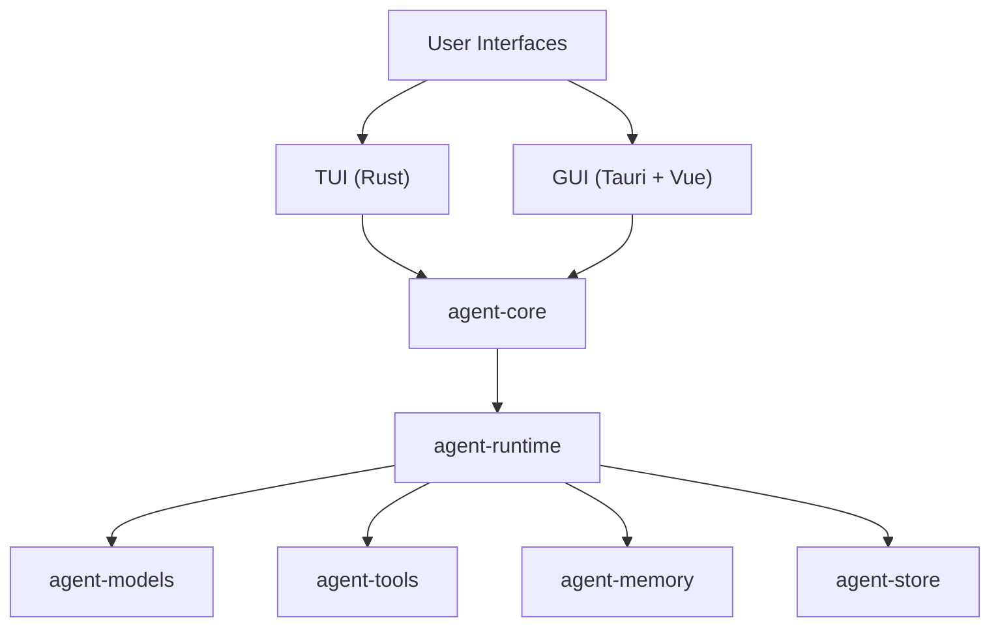

# Kairox


[](https://github.com/Z-Only/kairox/actions/workflows/ci.yml)
[](https://github.com/Z-Only/kairox/actions/workflows/release-build.yml)
[](https://github.com/Z-Only/kairox/blob/main/LICENSE)
[](https://github.com/Z-Only/kairox/releases)

Kairox is a local-first AI agent workbench built with a shared Rust core, a terminal UI, and a Tauri + Vue desktop GUI.


## Quick links

- [Latest release](https://github.com/Z-Only/kairox/releases/latest)
- [Roadmap](https://github.com/Z-Only/kairox/blob/main/ROADMAP.md)
- [Contributing](https://github.com/Z-Only/kairox/blob/main/CONTRIBUTING.md)
- [Security policy](https://github.com/Z-Only/kairox/blob/main/SECURITY.md)
- [Discussions](https://github.com/Z-Only/kairox/discussions)
- [Code of conduct](https://github.com/Z-Only/kairox/blob/main/CODE_OF_CONDUCT.md)
- [Release guide](https://github.com/Z-Only/kairox/blob/main/docs/releasing.md)

## Architecture



## Highlights

- Local-first architecture with a shared Rust core
- Two user surfaces: TUI and Tauri + Vue desktop GUI
- Structured runtime, memory, tools, and persistence layers
- Complete open-source repository baseline with CI, release automation, and community docs

## Features

- **Shared Rust core** for agent IDs, events, projections, manifests, memory, tools, and runtime orchestration
- **TUI application** for lightweight terminal-based interaction
- **GUI desktop shell** built with Tauri 2 + Vue 3
- **Local-first architecture** designed for offline-friendly workflows and explicit permission control
- **Unified quality gates** with Rust + frontend linting, formatting, commit hooks, and CI

## Repository layout

- `crates/agent-core` — shared domain types and application facade
- `crates/agent-runtime` — runtime orchestration and task graph
- `crates/agent-models` — model profile and provider boundaries
- `crates/agent-tools` — permission and tool abstractions
- `crates/agent-memory` — memory and context assembly
- `crates/agent-store` — SQLite-backed event store
- `crates/agent-tui` — terminal UI app
- `apps/agent-gui` — Vue frontend + Tauri desktop app

## Status

Kairox is in an early-stage but fully structured open-source state, with CI, release workflows, repository policies, and initial TUI/GUI packaging in place.

## Requirements

- Rust stable toolchain
- Node.js 22+
- pnpm 10+

For Tauri desktop packaging:

- macOS: Xcode Command Line Tools
- Linux: WebKitGTK and Tauri native dependencies (see `ci.yml` for the full list)
- Windows: WebView2 toolchain

## Demo

> Demo assets are not added yet. Recommended next step: add GUI screenshots or a short animated capture of the Tauri app here.

## Why Kairox?

Kairox aims to provide a local-first foundation for AI agent workflows with explicit boundaries between shared core logic, runtime orchestration, model integration, and user interfaces.

## Getting started

If you want to try Kairox quickly, start with the local setup and quality gates below, then run either the TUI or the GUI shell.

### Install dependencies

```bash
pnpm install
```

### Run quality gates

```bash
pnpm run format:check
pnpm run lint
cargo test --workspace --all-targets
```

### Run TUI

```bash
cargo run -p agent-tui
```

### Run GUI (Vite dev server)

```bash
pnpm --filter agent-gui run dev
```

### Run Tauri desktop app in development

```bash
pnpm --filter agent-gui run tauri:dev
```

This starts the Vite dev server and the native Tauri window together, providing hot-reload for both the frontend and the Rust backend.

### Build GUI web assets

```bash
pnpm --filter agent-gui run build
```

### Build Tauri desktop app

```bash
pnpm --filter agent-gui run tauri:build
```

## Tooling

Repository-level quality tooling includes:

- **Prettier** for frontend/docs formatting
- **ESLint** for Vue/TS linting
- **Stylelint** for styles and Vue style blocks
- **cargo fmt** for Rust formatting
- **cargo clippy** for Rust linting
- **Husky + lint-staged** for pre-commit enforcement
- **commitlint** for Conventional Commits on `commit-msg`

Useful commands:

```bash
pnpm run format
pnpm run format:check
pnpm run lint
```

## Releases and packaging

GitHub Actions are configured to:

- run CI checks on pushes and pull requests
- build TUI binaries
- build GUI web assets
- build Tauri desktop bundles on macOS, Linux, and Windows

See the [latest release](https://github.com/Z-Only/kairox/releases/latest) for downloadable assets.

## Contributing

1. Create a feature branch
2. Keep commits in Conventional Commit format
3. Run local checks before pushing
4. Open a pull request using the provided template

## Automation

This repository also includes:

- Dependabot for npm, Cargo, and GitHub Actions dependency updates
- GitHub Release Notes configuration via `.github/release.yml`
- Automatic GitHub Release publishing on `v*` tags
- GitHub Discussions for questions and design discussion

## Discussions

Use [GitHub Discussions](https://github.com/Z-Only/kairox/discussions) for questions, design ideas, and broader product conversations. Use Issues for actionable bugs and feature work.

## License

Apache License 2.0. See [LICENSE](https://github.com/Z-Only/kairox/blob/main/LICENSE).
