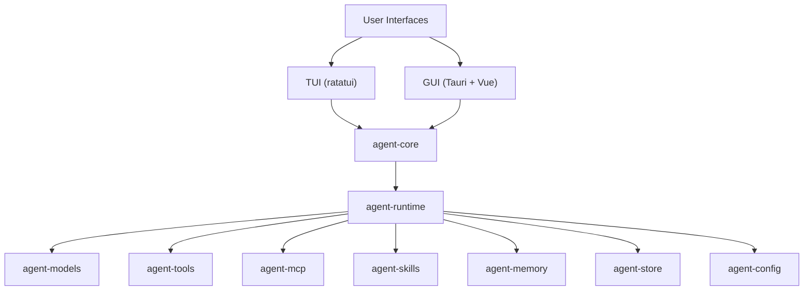

# Kairox


[](https://github.com/Z-Only/kairox/actions/workflows/ci.yml)
[](https://github.com/Z-Only/kairox/actions/workflows/release-build.yml)
[](https://github.com/Z-Only/kairox/blob/main/LICENSE)
[](https://github.com/Z-Only/kairox/releases)

Kairox is a local-first AI agent workbench built with a shared Rust core, a terminal UI, and a Tauri + Vue desktop GUI.

## Quick links

- [Latest release](https://github.com/Z-Only/kairox/releases/latest)
- [Roadmap](https://github.com/Z-Only/kairox/blob/main/ROADMAP.md)
- [Contributing](https://github.com/Z-Only/kairox/blob/main/CONTRIBUTING.md)
- [Security policy](https://github.com/Z-Only/kairox/blob/main/SECURITY.md)
- [Discussions](https://github.com/Z-Only/kairox/discussions)
- [Code of conduct](https://github.com/Z-Only/kairox/blob/main/CODE_OF_CONDUCT.md)
- [Release guide](https://github.com/Z-Only/kairox/blob/main/docs/releasing.md)

## Architecture



## Highlights

- Local-first architecture with a shared Rust core
- Two user surfaces: TUI and Tauri + Vue desktop GUI
- Context-aware runtime with per-model token budgets, compaction, and mid-session model switching
- Structured runtime, memory, tools, MCP, and persistence layers
- Real desktop and browser E2E coverage with CI, release automation, and community docs

## Features

- **Shared Rust core** — domain types, event-sourced runtime, facade trait, typed IDs
- **Memory system** — durable session/user/workspace-scoped memory with `<memory>` marker protocol, keyword retrieval, and context assembly
- **Context management** — per-model context windows, budget-driven prompt assembly, manual/automatic compaction, busy-state guards, and GUI context usage meter
- **Model adapters** — OpenAI, Anthropic, Ollama, and fake provider for testing, with mid-session model switching when profiles change
- **Tool system** — built-in tools (shell, search, patch, fs.read, fs.write, fs.list) with 5-level permission control and MCP (Model Context Protocol) integration
- **MCP marketplace** — built-in catalog plus remote sources with multi-source aggregation, one-click install, and runtime-missing hints (Phase 1 + 2)
- **Skills and instructions** — native skills for reusable prompt/tool/workflow capabilities plus user/project instruction settings with effective-preview support
- **Config discovery** — TOML config with profile management, env-variable API keys, and per-project `.kairox/` directory discovery
- **Workspace flows** — project workspace management in the GUI for organizing multiple working contexts
- **TUI application** — three-panel ratatui terminal UI with streaming chat, trace, and permission prompts
- **GUI desktop app** — Tauri 2 + Vue 3 with persistent sessions, session switching, trace visualization, memory browser, permission center, per-session permission mode selection, instructions/skills settings, and MCP marketplace UI
- **Auto-update** — Tauri 2 auto-update wired to GitHub Releases for the desktop app
- **Local-first architecture** — designed for offline-friendly workflows and explicit permission control
- **Quality gates** — parallel CI with aggregation `ci-success` job, type-sync checks, cargo clippy, oxlint, Stylelint, oxfmt, commitlint, tauri-pilot desktop E2E, and live model smoke tests
- **E2E testing** — Playwright frontend E2E specs, tauri-pilot real desktop scenarios, 7 TUI app-logic integration tests, 13 full-stack runtime tests, dedicated MCP integration tests, live GitHub Models smoke coverage, and DAG executor / AgentStrategy / GUI component coverage

## Repository layout

- `crates/agent-core` — shared domain types, events, IDs, projections, and application facade
- `crates/agent-runtime` — runtime orchestration, agent loop, DAG executor, multi-agent strategies, MCP server manager
- `crates/agent-models` — model client trait + OpenAI / Anthropic / Ollama / Fake adapters
- `crates/agent-tools` — tool registry, permission engine, built-in tools (shell, fs.read/write/list, patch, search), MCP tool adapter
- `crates/agent-mcp` — MCP (Model Context Protocol) client, stdio + SSE transports, server lifecycle, discovery cache, marketplace catalog (built-in + remote sources)
- `crates/agent-skills` — native skills system for reusable prompt, tool, and workflow capabilities with config-driven discovery
- `crates/agent-memory` — memory store, marker protocol, context assembly with tiktoken
- `crates/agent-store` — SQLite-backed event store + metadata tables
- `crates/agent-config` — TOML config loading, model profile discovery, MCP server config, skills config, API key resolution, `.kairox/` project config discovery
- `crates/agent-tui` — interactive ratatui terminal UI app
- `apps/agent-gui` — Vue 3 frontend + Tauri 2 desktop app (with auto-generated specta TypeScript bindings)

## Status

Kairox is in active development (current release `v0.21.0`) with a fully interactive TUI and a functional GUI featuring persistent session management, task graph visualization, trace timeline, memory browser, MCP server manager, MCP marketplace, context meter, skills system, instructions settings, project workspace flows, and per-session permission control. Sessions persist across restarts via SQLite storage. Streaming tool-call handling is robust for OpenAI-compatible and Anthropic providers, with JSON Schema parameters and `CancellationToken` support for streaming cancellation. The runtime tracks per-model context windows, assembles prompts against token budgets, supports manual and automatic context compaction, and allows mid-session model switching when profiles change. The GUI supports slash commands, file mentions, draft persistence, session cancellation, error notifications, code syntax highlighting, a real-time status bar, agent attribution, N-level task tree visualization, context usage feedback, and polished accessibility/test selectors validated by tauri-pilot scenarios. Phase 2 DAG execution with `AgentStrategy` enables multi-agent orchestration (planner / worker / reviewer), and the runtime has been refactored into focused modules (`agent_loop`, `dag_executor`, `event_emitter`, `mcp_manager`, `memory_handler`, `permission`, `session`, `task_graph`) for maintainability. MCP (Model Context Protocol) integration connects to external tool servers via stdio and SSE transports, with config-driven server lifecycle management, trust-based permissions, improved server discovery, and an in-app marketplace combining a built-in catalog with remote catalog sources for one-click install. A native **skills system** provides reusable prompt, tool, and workflow capabilities with config-driven discovery, SkillHub install support, and GUI settings management. Per-project configuration is discovered under `.kairox/` directories, and the GUI supports project workspace flows for managing multiple working contexts. Built-in filesystem tools include `fs.read`, `fs.write`, and `fs.list`, alongside `shell`, `patch`, and ripgrep-backed `search`. Build info (version, git hash, build time) is embedded at compile time and accessible from both TUI and GUI. The desktop app ships with Tauri 2 auto-update wired to GitHub Releases. Release packaging includes SHA256 checksums and structured artifact naming. CI runs E2E tests alongside parallel jobs with type-sync checks via `tauri-specta`, an aggregation `ci-success` job for branch protection compatibility, real desktop E2E via tauri-pilot, and a live GitHub Models smoke test. GUI test coverage spans stores, composables, and components, with additional MCP E2E tests and dedicated DAG executor / AgentStrategy / GUI component test suites. The frontend toolchain uses the Oxc toolchain (oxlint + oxfmt) for fast linting and formatting. The GUI features a complete frontend engineering foundation with vue-router, vue-i18n, and Pinia setup stores.

## Requirements

- Rust stable toolchain
- Node.js 22+
- Bun 1.3+

For Tauri desktop packaging:

- macOS: Xcode Command Line Tools
- Linux: WebKitGTK and Tauri native dependencies (see `ci.yml` for the full list)
- Windows: WebView2 toolchain

## Demo

> Run `cargo run -p agent-tui` for a live demo of the interactive TUI with streaming chat, tool trace, and sidebar controls.

## Why Kairox?

Kairox aims to provide a local-first foundation for AI agent workflows with explicit boundaries between shared core logic, runtime orchestration, model integration, and user interfaces.

## Getting started

If you want to try Kairox quickly, start with the local setup and quality gates below, then run either the TUI or the GUI shell.

### Install dependencies

```bash
bun install
```

### Run quality gates

```bash
just check
```

Or individually:

```bash
just fmt-check      # format check
just lint           # clippy + oxlint + stylelint
just test           # cargo test
just check-types    # Rust ↔ TypeScript type sync
```

> Install [just](https://github.com/casey/just) with `cargo install just` or `brew install just`.

### Run TUI

```bash
just tui
```

### Run GUI (Vite dev server)

```bash
just gui-dev
```

### Run Tauri desktop app in development

```bash
just tauri-dev
```

This starts the Vite dev server and the native Tauri window together, providing hot-reload for both the frontend and the Rust backend.

### Build GUI web assets

```bash
just gui-build
```

### Build Tauri desktop app

```bash
just tauri-build
```

## Tooling

Repository-level quality tooling includes:

- **oxfmt** for frontend/docs formatting
- **oxlint** for Vue/TS linting
- **Stylelint** for styles and Vue style blocks
- **cargo fmt** for Rust formatting
- **cargo clippy** for Rust linting
- **Husky + lint-staged** for pre-commit enforcement
- **commitlint** for Conventional Commits on `commit-msg`

Useful commands (with [just](https://github.com/casey/just)):

```bash
just check        # full CI gate: format + lint + test
just fmt          # auto-format all code
just tui          # run the TUI app
just gui-dev      # run the GUI dev server
just bump-version X.Y.Z  # bump version in all config files
just check-types  # verify Rust ↔ TypeScript EventPayload sync
just gen-types    # regenerate Tauri command TypeScript bindings
just worktree <branch>  # create .worktrees/<sanitized-branch> and run bun install
```

Or the underlying Bun/cargo commands:

```bash
bun run format
bun run format:check
bun run lint
```

## Releases and packaging

GitHub Actions are configured to:

- run CI checks on pushes and pull requests
- build TUI binaries
- build GUI web assets
- build Tauri desktop bundles on macOS, Linux, and Windows

See the [latest release](https://github.com/Z-Only/kairox/releases/latest) for downloadable assets.

## Contributing

1. Create a feature branch
2. Keep commits in Conventional Commit format
3. Run local checks before pushing
4. Open a pull request using the provided template

For isolated development, use `just worktree feat/my-feature`. Worktrees are created under the ignored `.worktrees/` directory using a path-safe branch name, for example `.worktrees/feat-my-feature`.

## Automation

This repository also includes:

- Dependabot for Bun, Cargo, and GitHub Actions dependency updates
- GitHub Release Notes configuration via `.github/release.yml`
- Automatic GitHub Release publishing on `v*` tags
- GitHub Discussions for questions and design discussion

## Discussions

Use [GitHub Discussions](https://github.com/Z-Only/kairox/discussions) for questions, design ideas, and broader product conversations. Use Issues for actionable bugs and feature work.

## License

Apache License 2.0. See [LICENSE](https://github.com/Z-Only/kairox/blob/main/LICENSE).
