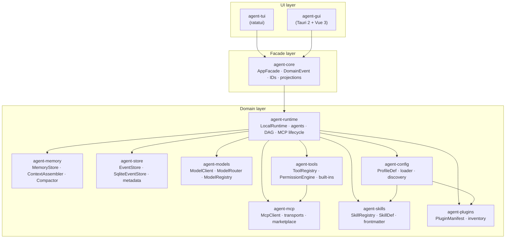
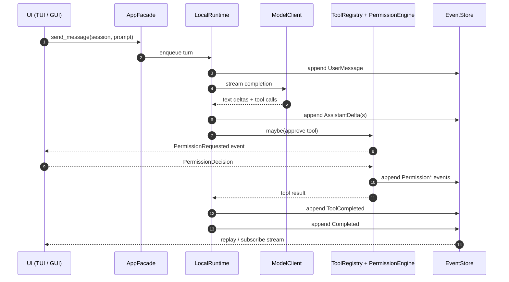
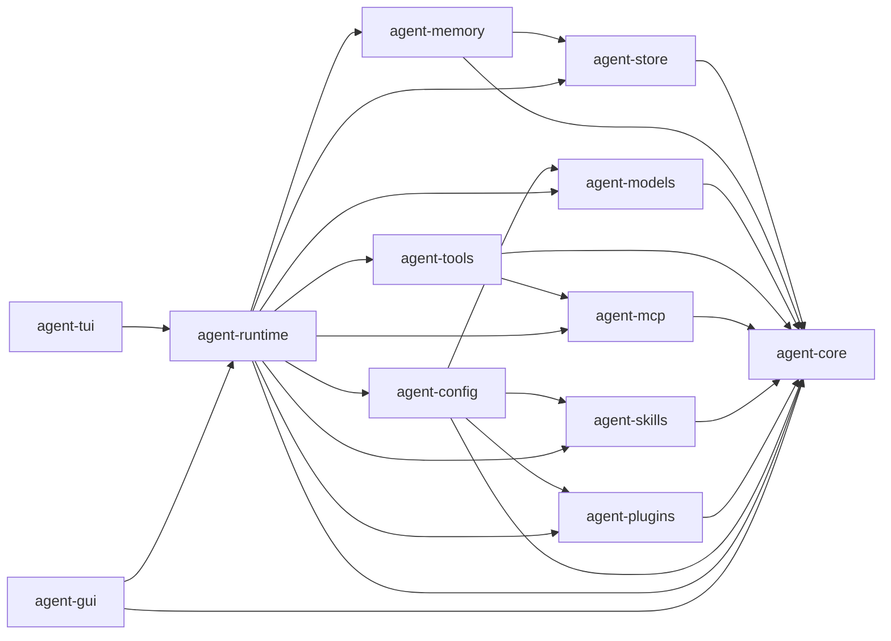

# Architecture

Kairox is a local-first AI agent workbench. Two user interfaces (a ratatui terminal app and a Tauri 2 + Vue 3 desktop app) sit on top of a shared Rust core. Everything below the UIs is a Rust workspace of small crates connected through narrow traits. There is no server, no cloud control plane, and no shared mutable singletons — the whole stack runs in a single process on your machine and persists state to a local SQLite database.

This page is the canonical map. It explains the layered diagram, the dependency rule that keeps the layers honest, every crate that belongs to a layer, how state moves through the system as events, and the design decisions behind the bigger choices.

## Layered architecture

The product splits into three layers: UIs at the top, a shared facade in the middle, and a fan-out of domain crates at the bottom.

Read the diagram top-down. A click in the GUI or a key in the TUI calls into `agent-core` — never directly into a domain crate. `agent-core` owns the application interface (`AppFacade`) and the language used to describe what happens inside the app (`DomainEvent`, `EventPayload`, typed IDs, projections). The domain crates implement that interface. None of them depend on either UI.

## The dependency rule

The single rule that keeps the architecture stable: **dependencies point inward only**.

| From layer | May depend on                              | May not depend on      |
| ---------- | ------------------------------------------ | ---------------------- |
| UI         | facade (`agent-core`)                      | domain crates directly |
| Facade     | nothing in this workspace                  | UI, domain crates      |
| Domain     | facade, other domain crates (in DAG order) | UI                     |

`agent-core` has zero crate-internal dependencies. Every other crate in the workspace either depends on `agent-core` or on another domain crate that already does. A new crate that needs to call a UI surface is a mistake; emit an event instead and let the UI react. A new UI feature that needs to skip the facade is a mistake; widen the facade.

In code, the rule is enforced at compile time — `cargo` will refuse to build a domain crate that imports a UI crate. In review, the rule shows up in PR scope: a feature that touches `agent-runtime` plus the GUI is normal; a feature that touches `agent-runtime` and reaches _back_ into `agent-gui` to read state is a smell.

## Crates, layer by layer

### Facade layer — `agent-core`

`agent-core` is small on purpose. It contains exactly:

- **`AppFacade`** — the async trait that the runtime implements and that both UIs call. Every user-visible operation goes through one of its methods.
- **Domain events** — `DomainEvent`, `EventPayload` (an enum of every payload variant), `MemoryMarker`, `MemoryScope`, `PermissionDecision`.
- **Typed identifiers** — `SessionId`, `WorkspaceId`, `TaskId`, `AgentId`, `MessageId`, all newtypes around UUIDs with `serde` support.
- **Projections** — `TaskSnapshot`, `TaskGraphSnapshot`, `TaskState`, `AgentRole`.
- **Build info** — `BuildInfo` (version, git SHA, build date) so both UIs render the same banner.

`agent-core` exports a `specta` feature that the GUI's Tauri backend enables to derive `specta::Type` for the types crossing the IPC boundary. That feature is the _only_ asymmetry — the Rust core itself has no opinion about Tauri.

### Domain layer

| Crate             | Role                                                                                                                                                                           | Key types                                                                                                                              |
| ----------------- | ------------------------------------------------------------------------------------------------------------------------------------------------------------------------------ | -------------------------------------------------------------------------------------------------------------------------------------- |
| **agent-runtime** | Orchestrates the agent loop, session lifecycle, context budgets, compaction, model switching, configurable agent settings, multi-agent strategies, MCP lifecycle, permissions. | `LocalRuntime<S, M>`, `PlannerAgent`, `WorkerAgent`, `ReviewerAgent`, `AgentStrategy`, `DagExecutor`, `TaskGraph`, `McpServerManager`. |
| **agent-models**  | Model provider abstraction (OpenAI-compatible, Anthropic, Ollama, Fake) with metadata and context-window registry.                                                             | `ModelClient` trait, `ModelRequest`, `ModelRouter`, `ModelProfile`, `ModelRegistry`.                                                   |
| **agent-tools**   | Tool registry, permission engine, built-in tools (`shell`, `fs.read`, `fs.write`, `fs.list`, `patch`, `search`), MCP-tool adapter.                                             | `ToolRegistry`, `PermissionEngine`, `Tool` trait, `PermissionMode`, `ToolRisk`, `McpToolAdapter`.                                      |
| **agent-mcp**     | MCP (Model Context Protocol) client, stdio + SSE transports, server lifecycle, discovery cache, marketplace catalog (built-in + remote sources).                               | `McpClient`, `Transport` trait, `StdioTransport`, `SseTransport`, `ServerLifecycle`, `McpServerDef`, `CatalogEntry`.                   |
| **agent-skills**  | Native skills system — reusable prompt/tool/workflow capabilities, frontmatter parsing, registry, GUI settings.                                                                | `SkillRegistry`, `SkillDef`, `SkillFrontmatter`, `SkillScope`, `SkillSettings`.                                                        |
| **agent-plugins** | Plugin manifest and inventory for plugin-provided skills, tools, hooks, and MCP servers.                                                                                       | `PluginManifest`, plugin inventory helpers.                                                                                            |
| **agent-memory**  | Durable, user-, workspace-, and session-scoped memory, context assembly with `tiktoken` budgets, prompt compaction.                                                            | `MemoryStore` trait, `SqliteMemoryStore`, `ContextAssembler`, `MemoryMarker`, `ContextCompactor`.                                      |
| **agent-store**   | Append-only SQLite event store plus metadata tables for workspace and session tracking.                                                                                        | `EventStore` trait, `SqliteEventStore`, `SessionMeta`.                                                                                 |
| **agent-config**  | TOML config loading, model profile discovery, API key resolution from env, `.kairox/` project discovery, skills config, instructions config.                                   | `ProfileDef`, `load_from_str`, `build_router`.                                                                                         |

`agent-runtime` is the only domain crate that fans out to every other domain crate. The rest stay narrow: `agent-memory` does not know about `agent-tools`, `agent-models` does not know about `agent-mcp`. When a runtime feature needs both, the runtime composes them; it never asks one domain crate to import another.

### UI layer

| Crate         | Role                                                                                                                                                          | Key types                                                                                                                                                                                                  |
| ------------- | ------------------------------------------------------------------------------------------------------------------------------------------------------------- | ---------------------------------------------------------------------------------------------------------------------------------------------------------------------------------------------------------- |
| **agent-tui** | Three-panel ratatui app (sessions, chat, trace). Build-info banner, permission modal, model-switch UI.                                                        | `App`, `ChatPanel`, `SessionsPanel`, `TracePanel`, `PermissionModal`.                                                                                                                                      |
| **agent-gui** | Tauri 2 backend (Rust) + Vue 3 frontend. Persistent sessions, task graph, MCP & memory UI, marketplace, model/agent/plugin/hook/instructions/skills settings. | Rust: `commands.rs`, `GuiState`, `event_forwarder.rs`, `specta.rs`. Vue: stores (`session`, `taskGraph`, `agents`, `mcp`, `memory`, `catalog`, `skills`), components (`ChatPanel.vue`, `TaskSteps.vue`, …) |

Both UIs implement the same interaction model — start a session, send a prompt, watch a trace, approve permissions — over the same facade. The TUI is the simplest possible reference client; the GUI adds persistence, multi-session, marketplace, and settings management.

## Event-sourced state

State changes in Kairox are events, not mutations. Every meaningful thing that happens inside the runtime — a message arrives, a tool is invoked, a permission is decided, a task starts or completes, a model switches, memory is proposed — is recorded as a `DomainEvent` and appended to the event store. UIs render from event streams, not from mutable state owned by some "session manager".

A few properties fall out of this design:

- **Replay is free.** Restarting the GUI re-reads events from SQLite and rebuilds task snapshots, chat history, and trace timelines. There is no "rebuild from cache" path.
- **UIs are subscribers, not owners.** The GUI's `event_forwarder` calls `LocalRuntime::subscribe_all()` and forwards every `DomainEvent` to the renderer via Tauri's `emit`. The TUI does the same in-process. Both filter by the currently focused `SessionId`.
- **Persistence is bounded.** `agent-store` writes envelopes only. Privacy defaults (see the [Permissions & Tools](./permissions-and-tools) page) constrain what payload content is persisted in production.
- **Auditing is a side effect of the design.** Because every decision is an event, the trace panel does not need a parallel audit log; it _is_ the audit log.

The event taxonomy itself — every variant of `EventPayload` and what emits it — is documented on the [Runtime & Sessions](./runtime-and-sessions) page.

## Trait boundaries

Trait boundaries are not decoration. Every cross-crate dependency in Kairox goes through a trait so that tests can substitute fakes and so that adapters (a new model provider, a new transport, a new event store backend) plug in without touching the runtime.

| Trait                   | Defined in    | Used in                                | Notes                                                                                          |
| ----------------------- | ------------- | -------------------------------------- | ---------------------------------------------------------------------------------------------- |
| `AppFacade`             | agent-core    | agent-runtime, agent-tui, agent-gui    | The integration point between UIs and the runtime.                                             |
| `EventStore`            | agent-store   | agent-runtime, agent-memory            | Implemented by `SqliteEventStore`; tests use in-memory SQLite (`:memory:`).                    |
| `MemoryStore`           | agent-memory  | agent-runtime, agent-gui (read-only)   | Implemented by `SqliteMemoryStore`.                                                            |
| `ModelClient`           | agent-models  | agent-runtime                          | Implemented by OpenAI-compatible, Anthropic, Ollama, and Fake clients; the router multiplexes. |
| `Tool` / `ToolProvider` | agent-tools   | agent-runtime, agent-mcp (via adapter) | Built-in tools and MCP-exposed tools both implement `Tool`.                                    |
| `Transport`             | agent-mcp     | agent-mcp internal                     | Implemented by `StdioTransport`, `SseTransport`.                                               |
| `AgentStrategy`         | agent-runtime | agent-runtime                          | Planner / Worker / Reviewer roles. Strategies compose; they do not subclass.                   |

The reason for the discipline is concrete: `crates/agent-runtime/tests/full_stack.rs` exercises a real `LocalRuntime<SqliteEventStore, FakeModelClient>` end-to-end without a model API key, an MCP server, or a GUI window — because every collaborator is a trait and a fake is one `cargo test` away.

## Crate dependency graph

The dependency rule above translates into a real DAG. The graph below is the shape `cargo` enforces — read it as _who knows about whom_, not _what calls what at runtime_.

`agent-tui` and `agent-gui` are the only crates that depend on `agent-runtime`. Nothing depends back on them. That asymmetry is the whole point — it means a new model provider, a new tool, a new MCP transport, or a new skill source can be added without touching either UI as long as the corresponding domain crate exposes its capability through the trait it already implements.

## Decision log

A few of the larger choices are worth recording. They were not obvious from the start, and they shape every page of this site.

### Why a facade instead of direct domain calls

The GUI used to call `agent-runtime` directly. Adding the TUI revealed how much GUI-shaped assumption had leaked across — Tauri-flavored error types, GUI-specific event shapes. Pulling those types up into `agent-core` and forcing both UIs through `AppFacade` made the runtime free to refactor (the entire `agent-runtime` module layout was split apart in [#532](https://github.com/Z-Only/kairox/pull/532)) without breaking either UI. The cost is one extra trait dispatch per call. That cost is irrelevant for an LLM-bound workflow.

### Why event sourcing instead of a state struct

Three forces pushed the runtime toward events: (1) the GUI and TUI need to render the same trace from the same source, (2) the desktop app needs to recover state cleanly after a crash or restart, and (3) the audit and observability story for permission decisions is much cleaner when every decision is a row, not a method return value. Once events were in place, the compaction and model-switching features (see [#531](https://github.com/Z-Only/kairox/pull/531) and [#533](https://github.com/Z-Only/kairox/pull/533)) became "append a few more event variants" instead of "thread new state through every consumer".

### Why split `agent-runtime` into focused modules

`agent-runtime` grew large. Splitting it into `agent_loop`, `agents`, `dag_executor`, `event_emitter`, `facade_runtime`, `mcp_manager`, `memory_handler`, `permission`, `session`, and `task_graph` made each module testable in isolation and made the dependency lines inside the crate visible. The pattern is the same as the workspace pattern, recursively: small modules, narrow interfaces, no module reaching back into another. See [#532](https://github.com/Z-Only/kairox/pull/532) for the queue-the-actor refactor that came out of that split.

### Why SQLite (and not a custom file format)

SQLite gives transactional appends, deterministic recovery, indexed reads for the task graph and memory queries, and zero external services. It is widely available and battle-tested. The event store is append-only and the memory store is small; there is no schema-migration treadmill to fear.

### Why two UIs instead of one

The TUI is a deliberate forcing function for facade quality. If a feature is implementable in the TUI, the facade is probably right; if it is not, the facade has GUI-specific concerns leaking into it. The GUI is the product surface for end users; the TUI is the reference client for developers and the test bench for facade refactors. Maintaining both is cheap because both consume the same events.

### Why Bun and not npm/pnpm

The repository pins `packageManager` to Bun and the project's lint-staged, husky, and `just` recipes assume `bun`. Bun's install speed and built-in `bun test` keep the GUI loop fast on a developer laptop. The trade-off — yet-another package manager in a team's toolbox — is documented in [Installation](../guide/installation) and [Troubleshooting & FAQ](../guide/troubleshooting).

## What this page does not cover

This page maps the system. It does not explain the runtime's per-turn behavior, the memory protocol, the permission modes, or the extensibility surfaces. Each of those has its own page in this section. Start with [Runtime & Sessions](./runtime-and-sessions) for what happens on every prompt.
