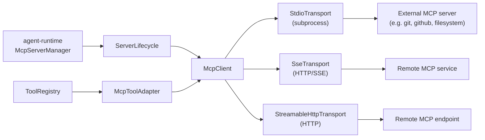

# Extensibility: MCP, Skills, Plugins

Kairox extends in three layers. **MCP servers** plug in external tools and resources over a standard protocol. **Skills** are repo-local prompt, tool, and workflow capabilities discovered from the filesystem. **Plugins** are manifest-driven bundles that ship skills, tools, hooks, and MCP servers together. The three surfaces are deliberate: each one exists where it does because the trade-offs are different.

This page covers all three.

## MCP — Model Context Protocol

[MCP](https://modelcontextprotocol.io/) is an open protocol for exposing tools, prompts, and resources to LLMs over a transport-agnostic JSON-RPC channel. Kairox's `agent-mcp` crate is the client side of that protocol.

### Architecture

<div class="mermaid">



</div>

| Piece              | Role                                                                                                                 |
| ------------------ | -------------------------------------------------------------------------------------------------------------------- |
| `McpClient`        | One client per server. Handles handshake, capability discovery, and JSON-RPC request/response.                       |
| `Transport`        | Trait abstracting how messages cross the wire. Shipped: `StdioTransport`, `SseTransport`, `StreamableHttpTransport`. |
| `ServerLifecycle`  | Tracks `Starting → Ready → Stopped / Failed` and reports transitions as `McpServer*` events.                         |
| `McpServerManager` | Top-level coordinator inside `agent-runtime`; reads config, starts servers, registers tools.                         |
| `McpToolAdapter`   | Wraps an MCP-exposed tool in the `Tool` trait so the runtime treats it like any built-in.                            |
| `CatalogEntry`     | Marketplace metadata for a server (name, description, runtime requirements, install hint).                           |

### Transports

| Transport         | When to use                                                             | How to declare                                     |
| ----------------- | ----------------------------------------------------------------------- | -------------------------------------------------- |
| `stdio`           | Local subprocesses that follow the MCP stdio convention (most servers). | `type = "stdio"` plus `command` and `args`.        |
| `sse`             | Remote HTTP services that speak MCP over Server-Sent Events.            | `type = "sse"` plus `url` and optional `headers`.  |
| `streamable_http` | Remote MCP endpoints using the Streamable HTTP transport.               | `type = "streamable_http"` plus `url` and headers. |

stdio is the default because most MCP servers ship as binaries or `npx`/`uvx` scripts.

### Server lifecycle and events

`McpServerManager` emits four events:

| Event               | Trigger                                           |
| ------------------- | ------------------------------------------------- |
| `McpServerStarting` | Manager initiates the transport and handshake.    |
| `McpServerReady`    | Handshake succeeds; tools are registered.         |
| `McpServerStopped`  | User stops the server or shutdown is in progress. |
| `McpServerFailed`   | Handshake or runtime error; carries diagnostic.   |

Lifecycle is observable from both UIs. The TUI shows server status in the trace panel; the GUI's `McpStatusIndicator.vue` shows a per-server pill that turns green on `Ready`, yellow on `Starting`, red on `Failed`.

### Marketplace catalog

`agent-mcp` exposes a catalog of curated servers. Sources are pluggable:

- **Built-in** — a static list compiled into `agent-mcp` for first-launch discoverability.
- **Remote** — a `CatalogSource` pointing at a JSON manifest hosted elsewhere; the runtime fetches and caches it.

The GUI's marketplace view (`apps/agent-gui/src/views/MarketplaceView.vue` and supporting components in `apps/agent-gui/src/components/marketplace/`) renders the catalog, surfaces runtime requirements (Node, Python, etc.), and walks the user through install with progress reporting.

### Example: declaring an MCP server in `kairox.toml`

```toml
[mcp_servers.git]
type = "stdio"
command = "npx"
args = ["-y", "@modelcontextprotocol/server-git", "--repository", "."]

[mcp_servers.github]
type = "stdio"
command = "npx"
args = ["-y", "@modelcontextprotocol/server-github"]
env = { GITHUB_PERSONAL_ACCESS_TOKEN = "" }

[mcp_servers.search]
type = "sse"
url = "https://example.com/mcp"
headers = { Authorization = "Bearer ${SEARCH_TOKEN}" }

[mcp_servers.remote-http]
type = "streamable_http"
url = "https://example.com/mcp"
api_key_env = "MCP_API_TOKEN"
```

For stdio servers, an empty `env` value means "read the environment variable with the same name when the server starts." The full schema lives in [Configuration](../reference/configuration).

## Skills — native prompt, tool, and workflow capabilities

`agent-skills` is the in-process extensibility layer. A skill is a markdown file with YAML frontmatter that declares a reusable capability — a prompt, a tool wiring, a workflow recipe, or some combination.

### Anatomy of a skill

```markdown
---
name: pr-review
description: Review a pull request diff with focus on correctness and tests.
scope: workspace
keywords: [review, pr, diff]
tools: [shell, fs.read]
---

You are a thorough code reviewer. The user will share a PR. Walk through:

1. The diff, file by file.
2. Test coverage of changed lines.
3. Any new public APIs and their docs.
4. Risk: data migrations, security, performance.

Conclude with a one-paragraph verdict and a labeled list of must-fix items.
```

The frontmatter is parsed into `SkillFrontmatter`; the body is the prompt body. The skill becomes a `SkillDef` in the `SkillRegistry`.

### Frontmatter fields

| Field         | Type     | Required | Meaning                                                                              |
| ------------- | -------- | -------- | ------------------------------------------------------------------------------------ |
| `name`        | string   | yes      | Stable identifier; namespaced by source.                                             |
| `description` | string   | yes      | One-line summary shown in pickers and the settings UI.                               |
| `scope`       | enum     | yes      | `user` / `workspace` / `session` — where the skill applies.                          |
| `keywords`    | string[] | no       | Discovery hints; the runtime can match user prompts against keywords.                |
| `tools`       | string[] | no       | Tools the skill expects to call; the runtime ensures they are registered before run. |
| `model`       | string   | no       | Pin a specific model profile when this skill runs.                                   |
| `arguments`   | object   | no       | Declared inputs; UI renders a form.                                                  |

### Scopes

| Scope       | Loaded from                                  | Visible in                          |
| ----------- | -------------------------------------------- | ----------------------------------- |
| `user`      | `~/.kairox/skills/` and configured user dirs | All sessions for this user.         |
| `workspace` | `.kairox/skills/` inside the workspace       | Sessions started in this workspace. |
| `session`   | Ad-hoc, in-memory, attached to a session     | Only the originating session.       |

The registry deduplicates by `name` with workspace-scoped skills overriding user-scoped skills, and session-scoped skills overriding both. The GUI's `SkillsSettingsView.vue` lets a user inspect, enable, and disable skills per scope without touching the filesystem.

### SkillHub install

The marketplace integrates with SkillHub (or equivalent skill registries) to install skills into the configured user or workspace directory. Installs are file-write operations that go through the policy engine like everything else — under the default `ApprovalPolicy::OnRequest` + `SandboxPolicy::WorkspaceWrite` pair, an install prompts for `fs.write` whenever the target directory falls outside the sandbox's writable roots.

## Plugins — manifests that ship bundles

A plugin packages skills, tools, hooks, and MCP server declarations together. `agent-plugins` parses the manifest and feeds the inventory to the relevant crates.

### Manifest

Kairox resolves plugin manifests in this order: `.kairox-plugin/plugin.json`, `.codex-plugin/plugin.json`, then `.claude-plugin/plugin.json`. MCP server inventory can be declared through the manifest's `mcpServers` field or through a sibling `.mcp.json` file.

```json
{
  "name": "my-plugin",
  "version": "0.2.0",
  "description": "Project workflow helpers.",
  "homepage": "https://github.com/example/kairox-my-plugin",
  "skills": "./skills/",
  "mcpServers": {
    "issue-tracker": {
      "command": "node",
      "args": ["./mcp/issue-tracker.js"]
    }
  },
  "hooks": [
    {
      "event": "pre_turn",
      "script": "./hooks/inject-context.js"
    }
  ],
  "permissions": {
    "approvalPolicy": "on_request",
    "sandboxPolicy": "workspace_write",
    "tools": ["shell.exec", "fs.read"]
  },
  "compatibility": {
    "kairoxVersion": ">=0.34.0 <0.35.0",
    "platforms": ["macos", "linux"],
    "requires": ["node >=20", "git"]
  },
  "publisher": "Example Labs",
  "trust": "community"
}
```

Codex-compatible plugins often keep MCP declarations in `.mcp.json` instead:

```json
{
  "mcpServers": {
    "issue-tracker": {
      "command": "node",
      "args": ["./mcp/issue-tracker.js"]
    }
  }
}
```

### Inventory

`PluginManifestView` exposes a flat inventory plus permission, compatibility, and trust metadata for settings and marketplace display. Each kind of contribution is routed to its owning crate:

| Contribution | Routed to                                           |
| ------------ | --------------------------------------------------- |
| skill        | `SkillRegistry` (with the plugin name as namespace) |
| tool         | `ToolRegistry`                                      |
| MCP server   | `McpServerManager` (via `agent-config` merge)       |
| hook         | runtime hook registry                               |

Skills shipped via plugins are namespaced as `<plugin>:<name>`. The convention prevents two plugins from colliding on the same skill name and gives users a clear path back to the source.

### Settings

Plugins have first-class GUI settings: enable / disable as a whole, enable / disable individual contributions, override paths. Disabled contributions do not load, even if their files exist.

### Plugins vs MCP servers

Plugins can include MCP servers. The distinction:

- An **MCP server declared in `kairox.toml`** is a user-level configuration choice; the user maintains the install.
- An **MCP server bundled in a plugin** ships with the plugin; the user installs the plugin and the server comes along.

If you ship a workflow tool, prefer a plugin so the user gets one install instead of three. If you maintain a long-lived MCP server that many people use independently, ship it standalone and let users wire it up.

## Choosing the right surface

| Need                                                              | Use                                                                   |
| ----------------------------------------------------------------- | --------------------------------------------------------------------- |
| Reusable prompt for the current project, edited inline.           | Workspace skill                                                       |
| Personal prompt library that travels with the user.               | User skill                                                            |
| External capability spoken to over a process / network boundary.  | MCP server                                                            |
| Bundle of related skills + tools + hooks + MCP for a workflow.    | Plugin                                                                |
| One-off scratch prompt for a single session.                      | Session skill                                                         |
| Behavior change that should apply to _every_ session in the repo. | Instructions config (see [Configuration](../reference/configuration)) |

## What this page does not cover

This page describes how external capabilities reach the runtime. It does not cover the configuration schema for any of these surfaces — that lives in [Configuration](../reference/configuration). It does not cover the runtime's per-turn behavior — that is in [Runtime & Sessions](./runtime-and-sessions).
