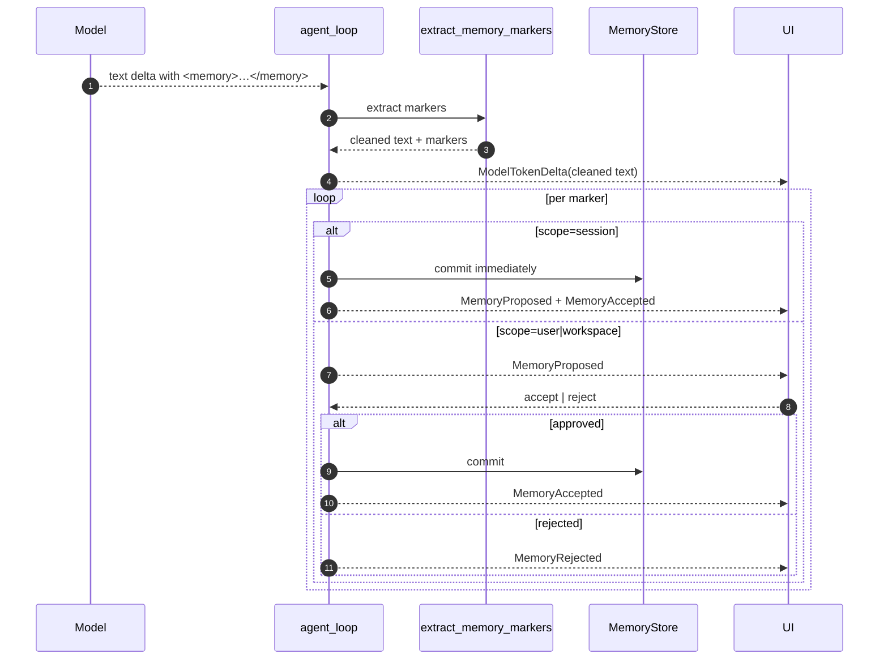
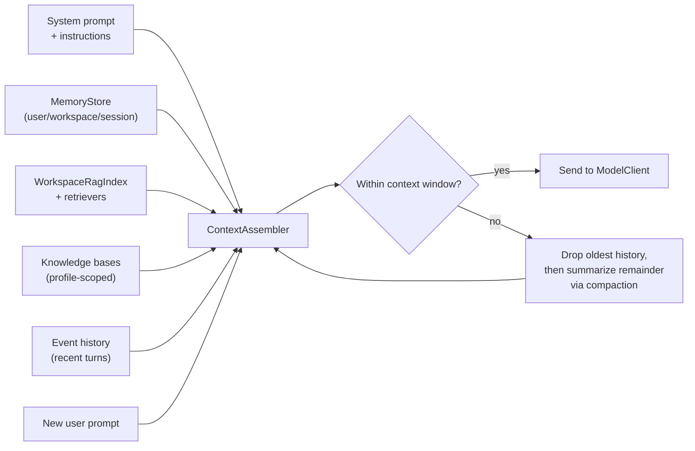

# Memory & Context

Kairox treats memory, retrieval, and compaction as first-class parts of every turn. Long-running sessions need a way to remember user preferences, project conventions, and ongoing work without re-pasting them every prompt; they also need retrieval for relevant workspace documents and a way to drop old context when the model's window fills up.

This page explains how the LLM proposes memories with `<memory>` tags, how the memory store keeps them scoped, how workspace RAG and configured knowledge bases add retrieved context, how the context assembler builds the prompt for every turn under a tiktoken budget, and how compaction shrinks history without losing the thread.

## The `<memory>` marker protocol

The LLM does not write to memory by calling a tool. It writes to memory by emitting `<memory>` tags inside its response. `agent-memory::extract_memory_markers` parses those tags out of the stream, strips them from the visible text, and routes each marker through the approval flow appropriate for its scope.

### Scopes

| Scope       | When to use                                                                                      | Lifetime                                    | Approval                                                                                  |
| ----------- | ------------------------------------------------------------------------------------------------ | ------------------------------------------- | ----------------------------------------------------------------------------------------- |
| `session`   | Within-conversation facts the agent wants to recall later in the same session.                   | Discarded when the session is archived.     | Auto-accepted. Emits `MemoryProposed` + `MemoryAccepted`.                                 |
| `user`      | Personal preferences, working style, persistent ergonomic choices.                               | Persists across all sessions for this user. | Prompts the UI. Emits `MemoryProposed` and waits for `MemoryAccepted` / `MemoryRejected`. |
| `workspace` | Project conventions, repo-specific facts, decisions that bind future sessions in this workspace. | Persists for the workspace.                 | Prompts the UI. Emits `MemoryProposed` and waits for approval.                            |

### Markup

The model emits markers in the response stream:

```
<memory scope="session">User prefers explanations before code.</memory>
<memory scope="user" key="editor.font">JetBrains Mono 14px.</memory>
<memory scope="workspace" key="commit.style">Conventional Commits with scope prefix.</memory>
```

`scope="session"` does not require a key — session memories are small and time-bounded. `scope="user"` and `scope="workspace"` require a `key` so subsequent writes overwrite rather than duplicate. The markers are stripped from visible output before the UI renders the assistant message, so end users see the explanation without the markup.

### Round trip

<div class="mermaid">



</div>

The UI never sees the raw `<memory>` markup. It sees the cleaned text and a `MemoryProposed` event next to it, which the chat stream renders as an inline "Remember this?" prompt with approve/reject buttons.

### Why approval matters

Auto-committing `user` and `workspace` memories would let the model overwrite settings the user did not ask to change. Worse, a malicious tool result fed back into the model could prompt the model to write a memory that affects later sessions. Requiring explicit approval bounds the blast radius and keeps the memory layer something the user owns.

## MemoryStore

`MemoryStore` is a trait in `agent-memory`. The shipped implementation is `SqliteMemoryStore`, backed by the same SQLite database that holds the event store but in a separate table set.

A memory record stores:

- `scope` (`Session | User | Workspace`)
- `workspace_id` / `session_id` (whichever applies)
- `key` (for user/workspace)
- `body` (the memory text)
- `created_at`, `updated_at`
- `approved_at` (null for session memories)

Lookups are keyed by scope + workspace/session + key, with a fallback "list all in this scope" query used by the GUI's memory browser. Durable memories remain exact and inspectable records; similarity and full-text retrieval live in the separate workspace retrieval layer described below.

## Context assembly

Every turn rebuilds the prompt from scratch. `ContextAssembler` is the component that decides what goes in. It takes the active model's context window, recent message history, relevant memories, workspace retrieval hits, knowledge-base hits, and the new user prompt, then produces a `Vec<Message>` that fits under the model's token budget.

### Inputs

1. **System prompt.** The agent's strategy-specific system prompt, plus any active instructions configuration.
2. **Memories.** All `user` and `workspace` memories for the current workspace, plus the active session's `session` memories. Filtered by relevance heuristics (key match, recency) when the budget is tight.
3. **Workspace retrieval.** Hits from the local `WorkspaceRagIndex` and any active `WorkspaceRetriever` implementations.
4. **Knowledge bases.** Profile-scoped configured sources such as SQLite FTS knowledge bases.
5. **History.** Recent messages from the event stream — `UserMessageAdded`, the cleaned `ModelTokenDelta`s finalized by `AssistantMessageCompleted`, and `ToolInvocationCompleted` payloads.
6. **The new user prompt.** Always included verbatim.

### Token accounting

`tiktoken` (via the `tiktoken-rs` crate) is the canonical tokenizer used to measure budget consumption. The assembler uses each model's declared context window minus a configurable reserve (the "headroom" left for the model's response). It then walks the inputs in priority order and stops adding history once the next message would exceed the budget. Memories take precedence over old history; the assembler will drop the oldest user/assistant exchanges to keep an approved `user` memory in context.

### Pipeline

<div class="mermaid">



</div>

## Workspace retrieval and knowledge bases

Memory records are for facts the user or model explicitly chose to preserve. Workspace retrieval is for "find relevant context I did not explicitly save."

`agent-memory` provides `WorkspaceRagIndex`, a SQLite-backed chunk store with a pluggable `EmbeddingBackend`. The current deterministic backend keeps the system local-first and testable; another backend can implement the same trait for local embedding models or remote APIs. During turn preparation, the runtime queries the workspace index and injects the results as a distinct workspace retrieval context source.

Configured knowledge bases use the same retrieval boundary. `[knowledge_bases.<id>]` can enable SQLite FTS today, and the config model already represents Tantivy, Bedrock Knowledge Bases, Pinecone, and Weaviate so service-specific clients can plug into `WorkspaceRetriever`. Profile aliases decide which model profiles see each source. When multiple retrievers are active, `CompositeWorkspaceRetriever` merges the hits before context assembly.

The trace/context source names distinguish these inputs from durable memories: approved records come from `MemoryStore`, while retrieved chunks come from workspace retrieval or knowledge-base sources.

## Compaction

Compaction is the mechanism that prevents the message history from growing past the active model's context window. It runs in two flavors:

### Automatic compaction

The runtime checks the assembler's budget at the end of every turn (the race-free hook landed in [#533](https://github.com/Z-Only/kairox/pull/533); see also [#532](https://github.com/Z-Only/kairox/pull/532) for why this is queued in the session actor). If the next turn would exceed the budget under the current history, the runtime triggers a compaction _before_ releasing the actor for the next user input.

Compaction summarizes the oldest tier of history into a single `assistant`-flavored memory note that the assembler treats as durable context. The original events are not deleted from the store; the summary is appended as an event with provenance, so the trace remains complete.

### Manual compaction

The UI can request compaction explicitly: TUI keyboard shortcut, GUI menu item, or `AppFacade::compact(session)` call. Manual compaction follows the same pipeline as automatic, but it does not wait for a budget overflow.

### Events

| Event                        | When                                                                                 |
| ---------------------------- | ------------------------------------------------------------------------------------ |
| `ContextCompactionStarted`   | Session actor begins compaction (auto or manual).                                    |
| `CompactionSummary`          | Summary appended with provenance for the replaced range.                             |
| `ContextCompactionCompleted` | Active context now uses the summary.                                                 |
| `ContextCompactionFailed`    | Summarization errored (model failure, budget edge case).                             |
| `ContextCompactionSkipped`   | A turn-end trigger was suppressed because compaction was already active or disabled. |

A failed compaction does not block the session, but the next turn is still subject to the budget guard — the runtime will refuse to send if the assembled prompt overflows.

### Busy-state guard

Compaction cannot run while a turn is in flight. The session actor enforces this by enqueueing compaction requests behind the current turn. Likewise, profile switches enqueue behind compaction so that a switch to a smaller-window model never lands mid-summary. The combination prevents the family of bugs where "the model is now in two states at once."

## How the UI surfaces memory

- **TUI** renders proposed memories inline in the chat stream with `a` to approve, `r` to reject. The trace panel logs `MemoryAccepted` events with the scope and key.
- **GUI** uses chat-stream stream items (`ChatPermissionItem.vue` for permissions; the memory equivalent is the proposed-memory card) and a dedicated `MemoryBrowser.vue` view for inspecting and editing existing memories at any time. Accepted edits replace the previous body for that key in `MemoryStore`.

Both surfaces talk to the same `MemoryStore` via the facade. There is no UI-only memory cache; if you edit a memory in the GUI while the TUI is open against the same workspace, the TUI's next turn picks up the new value.

## Patterns and pitfalls

- **Memories should be facts, not instructions.** "User prefers TypeScript over JavaScript for new files." is good. "Always write TypeScript." is an instruction that belongs in the instructions configuration (see [Configuration](../reference/configuration)).
- **Keep keys stable.** A `user` memory keyed `editor.font` is overwritten by the next write under the same key. A memory keyed `font-preference-2026` is a new memory that shadows nothing.
- **Workspace memories are project-scoped.** Switching to a different workspace surfaces a different set. The model never sees a memory that belongs to a workspace it is not currently working in.
- **Retrieval hits are not memories.** A workspace RAG or knowledge-base hit can help the current turn, but it does not become durable memory unless the model proposes a `<memory>` marker and the normal approval path accepts it.
- **Compaction is lossy by design.** The summary is a paraphrase, not a verbatim record. Use memories for things that must survive verbatim; the event store keeps the original messages for audit purposes either way.
- **Approval prompts cost the user's attention.** A model that proposes ten `workspace` memories in a row is annoying. Prompt engineering should encourage the model to consolidate into one memory per turn unless multiple unrelated facts are genuinely new.

## What this page does not cover

This page covers what gets remembered and how the prompt gets built. It does not cover what tools the model can call ([Permissions & Tools](./permissions-and-tools)) or how external capabilities ship ([Extensibility](./extensibility)).
