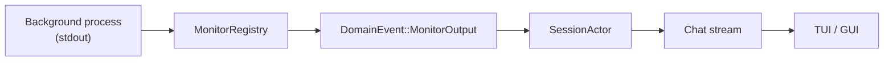

# Monitors

Monitors are background shell processes that stream their stdout into the conversation as real-time events. They let the agent observe long-running or indefinite processes — log tails, file watchers, build outputs, polling loops — without blocking the main turn.

A monitor is a read-level tool: creating one does not require user confirmation, same as reading a file. The agent decides when a background observation would be useful and spins one up inline.

## When to use monitors

- Tailing a log file for errors while working on a fix.
- Watching a directory for file changes during a build.
- Polling a remote API at intervals until a condition is met.
- Streaming CI check results as they land.
- Any "tell me when X happens" pattern that does not need to block the conversation.

## Creating a monitor

The `monitor_create` tool starts a background process and immediately returns its `MonitorId`. No user approval prompt fires — the tool's risk classification is read-level.

### Parameters

| Parameter     | Type   | Required | Description                                                                 |
| ------------- | ------ | -------- | --------------------------------------------------------------------------- |
| `command`     | String | Yes      | Shell command to run. Each stdout line becomes an event.                    |
| `description` | String | Yes      | Short human-readable label shown in notifications and the chat stream.      |
| `timeout_ms`  | u64    | No       | Kill the process after this many milliseconds. Default 300 000 (5 minutes). |
| `persistent`  | bool   | No       | If `true`, ignore timeout and run until explicitly stopped or session ends. |

### Example

```
monitor_create(
  command: "tail -f /var/log/app.log | grep --line-buffered ERROR",
  description: "errors in app.log",
  timeout_ms: 600000,
  persistent: false
)
```

The monitor starts immediately. The returned `MonitorId` is used to reference it later.

## Timeout vs persistent mode

Every monitor runs in one of two modes:

| Mode           | Lifetime                                                 | Use it for                                                       |
| -------------- | -------------------------------------------------------- | ---------------------------------------------------------------- |
| **Timeout**    | Killed after `timeout_ms` (default 300s, max 3600s).     | Bounded observations — "watch this for the next 10 minutes."     |
| **Persistent** | Runs until `monitor_stop` is called or the session ends. | Indefinite observations — log tails, file watchers, PR monitors. |

When a timeout fires, the monitor transitions to `Completed` status and a final status-change event is emitted. Persistent monitors transition to `Stopped` when explicitly stopped or when the runtime tears down the session.

## How events are delivered

The data flow from a monitor's stdout to the user's chat stream:

<div class="mermaid">



</div>

1. **Stdout line emitted.** The spawned process writes a line to stdout.
2. **Registry captures it.** `MonitorRegistry` reads from the process handle and wraps the line in a `DomainEvent::MonitorOutput` carrying the `MonitorId`, timestamp, and content.
3. **Batching.** Lines arriving within 200ms of each other are batched into a single event delivery, so a burst of output groups naturally.
4. **Session receives the event.** The event enters the session's event stream like any other domain event.
5. **UI renders it.** The TUI renders monitors via the `ChatStreamItem::Monitor` variant in `fold_stream`. The GUI renders via the `ChatMonitorItem.vue` component. Both show monitor output as expandable items in the conversation flow.

Status transitions (`Running` -> `Completed` / `Failed` / `Stopped`) are delivered as `DomainEvent::MonitorStatusChanged` events and update the monitor's metadata.

## Listing and stopping monitors

Two companion tools manage the monitor lifecycle after creation:

### `monitor_list`

Returns all monitors for the current session — both active and completed. Each entry includes the `MonitorMetadata`: id, description, command, status, timing information, and mode.

### `monitor_stop`

Stops a running monitor by its `MonitorId`. The background process is killed, the status transitions to `Stopped`, and a final `MonitorStatusChanged` event is emitted. Stopping an already-finished monitor is a no-op.

## Domain types

The core types live in `agent-core`:

| Type              | Role                                                                                               |
| ----------------- | -------------------------------------------------------------------------------------------------- |
| `MonitorId`       | Unique identifier for a monitor instance.                                                          |
| `MonitorStatus`   | Enum: `Running`, `Completed`, `Failed`, `Stopped`.                                                 |
| `MonitorMetadata` | Full descriptor: id, description, command, persistent, timeout_ms, status, started_at, stopped_at. |

## Architecture notes

For contributors working on the monitor subsystem:

- **`MonitorRegistry`** lives in the `agent-tools` crate. It owns the spawned process handles, reads stdout asynchronously, and emits domain events through the runtime's event channel.
- **Session cleanup.** The runtime wires registry cleanup on session end — all running monitors are stopped and their processes killed when a session actor drops.
- **Event routing.** `DomainEvent::MonitorOutput` and `DomainEvent::MonitorStatusChanged` flow through the same event pipeline as tool results and model outputs. No special plumbing is needed for new consumers.
- **UI rendering.** The TUI uses `ChatStreamItem::Monitor` in its stream folding logic. The GUI uses `ChatMonitorItem.vue` as a dedicated component in the chat stream renderer.
- **Policy.** Monitor creation is classified as read-level risk. It does not trigger `ApprovalPolicy` prompts under any approval mode because it only observes — it does not mutate the filesystem or network on behalf of the user.
