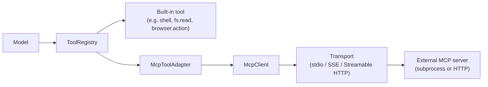
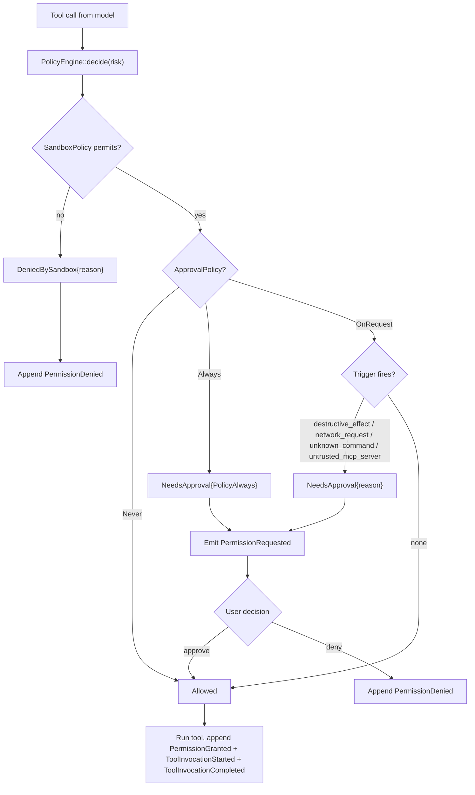

# Permissions & Tools

Tools are how the model touches the outside world — shell commands, files, search, patches, MCP-exposed capabilities. That makes the policy engine the most security-relevant piece of the runtime. Kairox's design is conservative by default: every tool call passes through the policy engine, every decision is an event, and every axis is explicit.

This page covers the two orthogonal policies (`ApprovalPolicy` × `SandboxPolicy`), the built-in tools and their risk classifications, how MCP tools plug in through the adapter, and the decision flow that ties them together.

::: tip History
The legacy single-axis `PermissionMode` enum (`ReadOnly` / `Suggest` / `Agent` / `Autonomous` / `Interactive`) was removed end-to-end in v0.31.0 (PRs [#517](https://github.com/Z-Only/kairox/pull/517), [#520](https://github.com/Z-Only/kairox/pull/520)). The new model has two independent axes — when to ask, and what the sandbox structurally permits — which lets a user say things like "allow workspace writes without prompting" that the old enum could not express. See `docs/superpowers/specs/2026-05-26-permission-sandbox-approval-design.md` for the full decision matrix.
:::

## Two orthogonal policies

Every session carries two policy values. They are independent: the approval axis controls _when the user is asked_, the sandbox axis controls _what the runtime structurally allows_.

### `ApprovalPolicy` — when to ask

`ApprovalPolicy` lives in `agent-tools/src/policy/approval.rs`.

| Value       | Behavior                                                                                                                          | Use it for                                                                  |
| ----------- | --------------------------------------------------------------------------------------------------------------------------------- | --------------------------------------------------------------------------- |
| `Never`     | Tools allowed by the sandbox run without prompting. Anything the sandbox rejects still fails — approval cannot widen the sandbox. | Background jobs, batch runs, autonomous agents.                             |
| `OnRequest` | (Default.) The policy engine prompts only when a structural reason fires (sandbox rejection, destructive effect, network, etc.).  | Day-to-day interactive work where the user wants final say on side effects. |
| `Always`    | Every tool call prompts, even one the sandbox would allow silently.                                                               | Demos, audits, paranoid debugging where every action should be reviewed.    |

`ApprovalPolicy::default()` is `OnRequest`.

### `SandboxPolicy` — what is structurally allowed

`SandboxPolicy` lives in `agent-tools/src/policy/sandbox.rs`.

| Variant                                             | Behavior                                                                                                                                      | Use it for                                                                  |
| --------------------------------------------------- | --------------------------------------------------------------------------------------------------------------------------------------------- | --------------------------------------------------------------------------- |
| `ReadOnly`                                          | Writes are rejected. Network is rejected. Read tools still run.                                                                               | Investigations, repo audits, "just read this for me" sessions.              |
| `WorkspaceWrite { network_access, writable_roots }` | (Default.) Writes are allowed under the workspace root and any extra `writable_roots`. Network is gated by `network_access` (off by default). | Normal development. The most common configuration.                          |
| `DangerFullAccess`                                  | Writes anywhere, network unconditionally allowed.                                                                                             | Trusted scripts that need to touch system paths or unrestricted networking. |

`SandboxPolicy::default()` is `WorkspaceWrite { network_access: false, writable_roots: vec![] }`.

### Why two axes

A single mode forced the user to choose along one ordering. The two-axis model expresses preferences the old enum could not:

- "Let writes happen under the workspace, but never silently — always ask." → `WorkspaceWrite` + `Always`.
- "Read-only sandbox, never bother me." → `ReadOnly` + `Never`. A write attempt is still rejected; approval cannot override the sandbox.
- "Full access, no prompts." → `DangerFullAccess` + `Never`. The "I know what I'm doing" mode.

Both axes can be changed mid-session and surface in the GUI (`ChatApprovalSelector.vue`, `ChatSandboxSelector.vue`) and TUI status bar.

## Built-in tools

`agent-tools` ships a minimal set of built-in tools. Every built-in implements the `Tool` trait and is registered with the `ToolRegistry` at runtime startup.

| Tool             | Module              | What it does                                                  | Risk   | Effect surface                    |
| ---------------- | ------------------- | ------------------------------------------------------------- | ------ | --------------------------------- |
| `shell.exec`     | `ShellExecTool`     | Runs a shell command and returns stdout/stderr.               | High   | Arbitrary process execution.      |
| `fs.read`        | `fs::read`          | Reads a file's content.                                       | Low    | Read-only filesystem access.      |
| `fs.write`       | `fs::write`         | Writes content to a file (creates or overwrites).             | Medium | Filesystem mutation.              |
| `fs.list`        | `fs::list`          | Lists directory entries.                                      | Low    | Read-only filesystem access.      |
| `patch.apply`    | `PatchApplyTool`    | Applies a unified diff to one or more files in the workspace. | Medium | Filesystem mutation (multi-file). |
| `search.ripgrep` | `RipgrepSearchTool` | Runs `ripgrep` over the workspace and returns matches.        | Low    | Read-only filesystem access.      |
| `monitor.start`  | `MonitorStartTool`  | Starts a background monitor.                                  | Low    | Monitor process lifecycle.        |
| `monitor.list`   | `MonitorListTool`   | Lists active background monitors.                             | Low    | Read-only monitor metadata.       |
| `monitor.stop`   | `MonitorStopTool`   | Stops a running background monitor.                           | Low    | Monitor process lifecycle.        |
| `browser.action` | `BrowserTool`       | Drives a Playwright-backed browser action.                    | Medium | Browser and network interaction.  |
| `browser.batch`  | `BrowserBatchTool`  | Runs multiple browser actions in sequence.                    | Medium | Browser and network interaction.  |
| `computer.use`   | `ComputerUseTool`   | Captures or controls the desktop via platform backends.       | High   | Desktop input / screen access.    |

A tool's `PolicyEffect` (read-only / workspace write / network / destructive / unknown command) is the input the policy engine actually consults; `Risk` is the UI-facing hint shown in prompts and status bars.

### Why these and not more

The built-in set is intentionally small. Anything fancier — git operations, database queries, code formatting, project-specific commands, or higher-level workflow automation — belongs in an MCP server. The runtime gives users primitives and a policy engine; MCP gives users packaged capabilities.

## MCP tool adapter

External capabilities reach the runtime through `agent-mcp` and surface as `Tool` implementations via `McpToolAdapter`. From the runtime's perspective an MCP tool is just another `Tool`; the adapter is the only place that knows the call has to cross a process boundary.

The adapter respects the same policy engine. An MCP tool with no declared effect gets the default risk and an unknown-command approval reason; in `OnRequest` mode it prompts like any built-in. Untrusted MCP servers can also trip `ApprovalReason::UntrustedMcpServer` even when the effect itself looks benign.

See [Extensibility: MCP / Skills / Plugins](./extensibility) for the full MCP lifecycle, transports, and marketplace story.

## The policy decision flow

Every tool call walks the same path. `PolicyEngine::decide` takes a `PolicyRisk` (effect, tool name, optional command) and returns one of three variants of `PolicyDecision`.

A few invariants come out of the diagram:

- **Sandbox is structural.** `DeniedBySandbox` cannot be overridden by approval. A user "approving" a write under `ReadOnly` does not unlock the write — they would have to switch the sandbox first.
- **Approval is procedural.** `Never` does not widen the sandbox; it only silences prompts the sandbox already cleared.
- **Every decision lands on the event stream.** Sandbox denials and user denials emit `PermissionDenied`; approved calls emit `PermissionGranted` and then `ToolInvocationStarted` plus `ToolInvocationCompleted` or `ToolInvocationFailed`.
- **Approval reasons are typed.** `ApprovalReason` is one of `SandboxRejected`, `PolicyAlways`, `DestructiveEffect`, `UnknownCommand`, `NetworkRequest`, `UntrustedMcpServer` — UIs render the reason next to the tool name.
- **Approved tools cannot become denied retroactively.** Once `PermissionGranted` is appended, the runtime invokes the tool.

## Inspecting decisions

Both UIs render the decision flow as the user sees it:

- **TUI** shows a permission modal with the tool name, the arguments, the risk, the approval reason, and approve/deny keys. The status bar shows both axes; `B` cycles the sandbox policy. The trace panel lists every `PermissionRequested` / `PermissionGranted` / `PermissionDenied` event.
- **GUI** uses `PermissionPrompt.vue` for the modal and `ChatPermissionItem.vue` for inline stream items. `ChatApprovalSelector.vue` and `ChatSandboxSelector.vue` change the two axes per session. Persistent rules ("always allow `fs.read` for this workspace") are remembered as `workspace`-scoped memories with a permission-specific key namespace.

For machine inspection, the event store is the source of truth. Filtering events by `PermissionRequested` / `PermissionGranted` / `PermissionDenied` for a `SessionId` returns the full audit log. Per-session policy is persisted on `SessionMeta` (`approval_policy`, `sandbox_policy`) and migrated by `agent-store` migration `0007_approval_sandbox_policy.sql`.

## Designing for policy failure

When you write code that triggers tools — whether you are designing a skill, a plugin, or an MCP server — assume any tool may be rejected by the sandbox or denied by the user. The runtime guarantees:

- A sandbox-rejected tool returns a `PermissionDenied` with a structured reason before invocation.
- A user-denied tool returns a `PermissionDenied` with the denial reason before invocation.
- An invoked tool that errors returns `ToolInvocationFailed`.
- The model sees the failure and can re-plan.
- The user can change either axis mid-session and try again without restarting.

Do not assume "the agent" or "the user" is the principal. The principal is whoever the policy engine consults at decision time, which depends on the active `ApprovalPolicy` and `SandboxPolicy`. Build for both.

## What this page does not cover

This page covers how tool calls are gated. It does not cover how external tools are packaged ([Extensibility: MCP / Skills / Plugins](./extensibility)) or how project configuration shapes the defaults ([Configuration](../reference/configuration)).
