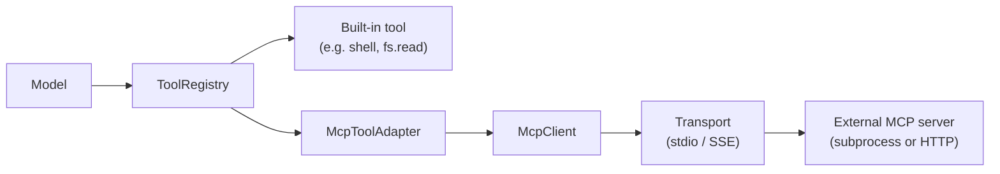
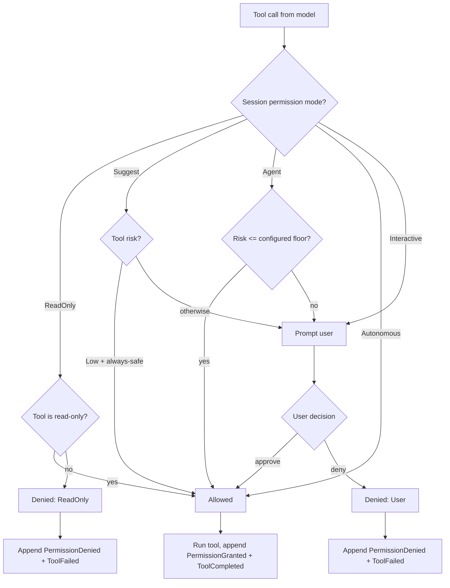

# Permissions & Tools

Tools are how the model touches the outside world — shell commands, files, search, patches, MCP-exposed capabilities. That makes the permission engine the most security-relevant piece of the runtime. Kairox's design is conservative by default: every tool call passes through the permission engine, every decision is an event, and every mode is explicit.

This page covers the five permission modes, the built-in tools and their risk classifications, how MCP tools plug in through the adapter, and the decision flow that ties them together.

## The five permission modes

`PermissionMode` is set per session (and defaulted from `agent-config`). It controls how the permission engine reacts to a tool call. The modes form a strict ordering from most restrictive to most permissive.

| Mode          | What happens on a tool call                                                                                                                                   | Use it for                                                                                               |
| ------------- | ------------------------------------------------------------------------------------------------------------------------------------------------------------- | -------------------------------------------------------------------------------------------------------- |
| `ReadOnly`    | Only tools classified as read-only run. Any tool with side effects is denied immediately. No prompt.                                                          | Investigations, repo audits, "just read this for me" sessions.                                           |
| `Suggest`     | (Default.) Every tool that is not unambiguously safe prompts the user. Approved calls run; denied calls return a `ToolFailed` event with the denial reason.   | Day-to-day interactive work where the user wants final say on side effects.                              |
| `Agent`       | The agent decides within policy: tools below a configured risk floor run without prompt; tools above the floor still prompt. The floor is set in config.      | Established workflows where the user trusts the model with low-risk tools but wants oversight elsewhere. |
| `Autonomous`  | Every tool runs without prompt, including high-risk ones. The decision is still recorded as `PermissionGranted` for audit, but the user is not interrupted.   | Background jobs, scripts, batch sessions where there is no human at the keyboard.                        |
| `Interactive` | Every tool prompts with a pending state — the runtime appends `PermissionRequested` and blocks the session until a decision arrives. No tools run by default. | Demos, audits, paranoid debugging where every single action should be reviewed.                          |

The default for new sessions is `Suggest`. Privacy defaults in production also lean toward `Suggest` for any session that has a real model or shell tool configured (see `agent-runtime` privacy notes and the [AGENTS.md](https://github.com/Z-Only/kairox/blob/main/AGENTS.md) reference).

### Switching modes

Modes are part of a session's identity. They are set at creation time via the facade and can be changed mid-session by the user (TUI shortcut, GUI settings pane). Changing the mode emits an event so the trace records who changed it and when; subsequent tool calls use the new mode.

## Built-in tools

`agent-tools` ships a minimal set of built-in tools. Every built-in implements the `Tool` trait and is registered with the `ToolRegistry` at runtime startup.

| Tool       | Module              | What it does                                                  | Risk   | Effect surface                    |
| ---------- | ------------------- | ------------------------------------------------------------- | ------ | --------------------------------- |
| `shell`    | `ShellExecTool`     | Runs a shell command and returns stdout/stderr.               | High   | Arbitrary process execution.      |
| `fs.read`  | `fs::read`          | Reads a file's content.                                       | Low    | Read-only filesystem access.      |
| `fs.write` | `fs::write`         | Writes content to a file (creates or overwrites).             | Medium | Filesystem mutation.              |
| `fs.list`  | `fs::list`          | Lists directory entries.                                      | Low    | Read-only filesystem access.      |
| `patch`    | `PatchApplyTool`    | Applies a unified diff to one or more files in the workspace. | Medium | Filesystem mutation (multi-file). |
| `search`   | `RipgrepSearchTool` | Runs `ripgrep` over the workspace and returns matches.        | Low    | Read-only filesystem access.      |

Risk is the runtime's hint to the permission engine. In `Agent` mode, the configured floor decides which calls auto-run; in `Suggest` mode, the risk is shown in the prompt to help the user decide; in `ReadOnly` mode, anything above Low is denied.

### Why these and not more

The built-in set is intentionally small. Anything fancier — git operations, HTTP calls, database queries, code formatting, project-specific commands — belongs in an MCP server. The runtime gives users primitives and a permission engine; MCP gives users packaged capabilities. Splitting the two keeps the runtime small and keeps capability decisions in the hands of the people who maintain the MCP catalog.

## MCP tool adapter

External capabilities reach the runtime through `agent-mcp` and surface as `Tool` implementations via `McpToolAdapter`. From the runtime's perspective an MCP tool is just another `Tool`; the adapter is the only place that knows the call has to cross a process boundary.

The adapter respects the same permission engine. An MCP-exposed `git.commit` tool with no risk metadata gets the default risk and prompts in `Suggest` mode like any built-in. MCP servers can declare risk hints; the registry honors them.

See [Extensibility: MCP / Skills / Plugins](./extensibility) for the full MCP lifecycle, transports, and marketplace story.

## The permission decision flow

Every tool call walks the same decision tree. The engine answers `Allowed`, `Denied`, or `Prompt`; the runtime acts accordingly.

A few invariants come out of the diagram:

- **Every call lands on the event stream.** Approval and denial both append events, so the trace shows every decision regardless of mode.
- **Prompts block the session, not the runtime.** Other sessions keep running. The blocked session's actor sits with one pending turn until the user answers.
- **A denied tool produces a `ToolFailed` payload** with the denial reason, which the model sees on its next stream chunk and can react to (apologize, try a different approach, ask the user a question).
- **Approved tools cannot become denied retroactively.** Once `PermissionGranted` is appended, the runtime invokes the tool. The audit log will reflect that the user authorized it at this point in time.

## Inspecting decisions

Both UIs render the decision flow as the user sees it:

- **TUI** shows a permission modal with the tool name, the arguments, the risk, and approve/deny keys. The trace panel lists every `PermissionRequested` / `PermissionGranted` / `PermissionDenied` event.
- **GUI** uses `PermissionPrompt.vue` for the modal and `ChatPermissionItem.vue` for inline stream items. Persistent rules (always allow `fs.read` for this workspace) are remembered as `workspace`-scoped memories with a permission-specific key namespace.

For machine inspection, the event store is the source of truth. Filtering events by `PermissionRequested` / `PermissionGranted` / `PermissionDenied` for a `SessionId` returns the full audit log for that conversation.

## Designing for permission failure

When you write code that triggers tools — whether you are designing a skill, a plugin, or an MCP server — assume any tool may be denied. The runtime guarantees:

- A denied tool returns a `ToolFailed` with a structured reason.
- The model sees the failure and can re-plan.
- The user can change the mode mid-session and try again without restarting.

Do not assume "the agent" or "the user" is the principal. The principal is whoever the permission engine consults at decision time, which depends on the mode. Build for both.

## What this page does not cover

This page covers how tool calls are gated. It does not cover how external tools are packaged ([Extensibility: MCP / Skills / Plugins](./extensibility)) or how project configuration shapes the defaults ([Configuration](../reference/configuration)).
