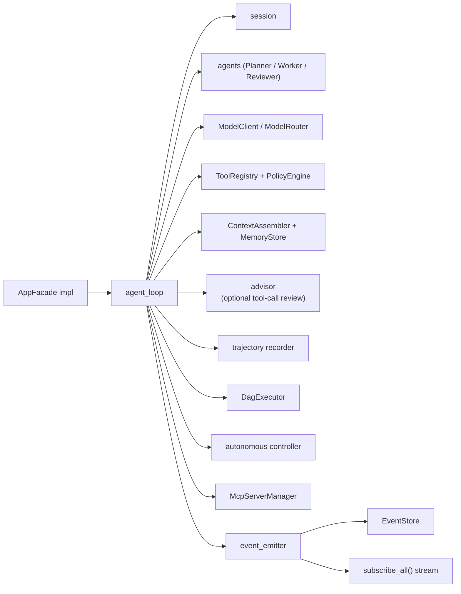
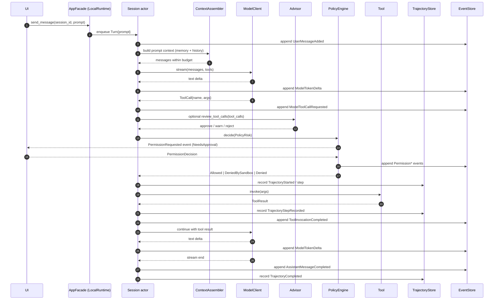
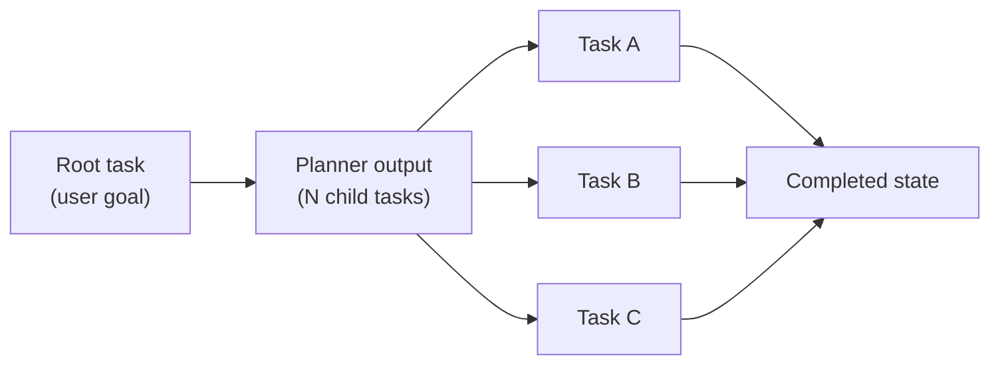

# Runtime & Sessions

`agent-runtime` is the engine that turns a user prompt into work. It owns the agent loop, manages sessions, applies context budgets, calls model providers, invokes tools, asks the policy engine, runs advisor self-reflection, records trajectories, executes autonomous checkpoints, runs multi-agent strategies, executes task DAGs, and orchestrates the MCP server lifecycle. Every other domain crate is something the runtime composes; the runtime composes none of the UIs.

If [Architecture](./architecture) explained the static shape of the system, this page explains how the system moves.

## LocalRuntime in one diagram

`LocalRuntime<S, M>` is a generic struct over an `EventStore` `S` and a `ModelClient` `M` (often a `ModelRouter` that multiplexes several clients). It hosts every collaborator the runtime needs and implements `AppFacade`.

Every arrow on this diagram is a function call inside `agent-runtime`. There are no shared mutexes between the UIs and the loop; UIs talk to the runtime through `AppFacade` and read state through the event stream. Inside the runtime, the session actor (see [#531](https://github.com/Z-Only/kairox/pull/531) and [#532](https://github.com/Z-Only/kairox/pull/532)) serializes mutations against a single session so that model switches and compaction cannot race the active turn.

## A single user turn

The most useful way to understand the runtime is to follow one prompt from keystroke to completion. The sequence below is the happy path for a single-agent turn that calls one tool.

Seven things are worth pointing out:

1. **The session is an actor.** Turns enqueue against the session, so a second user message arriving mid-turn waits for the current turn's terminal `AssistantMessageCompleted` or cancellation event. Model switches and compaction enqueue against the same actor — they cannot interleave halfway through a tool call.
2. **The context assembler is consulted every turn.** It rebuilds the message list from recent history and relevant memory, respecting the active model's context window. Nothing is "kept in memory between turns"; everything is rebuilt from events.
3. **Permission is a request/response on the event bus.** When `PolicyEngine::decide(PolicyRisk)` returns `NeedsApproval`, the runtime emits `PermissionRequested`, waits for `PermissionDecision`, then emits the terminal `PermissionGranted` / `PermissionDenied`. UIs subscribe to the request and post the decision back through the facade.
4. **Advisor review is optional and inline.** If `[advisor]` is enabled, the runtime asks a configured profile to review the planned tool calls before the policy engine executes them. A rejection blocks the tool batch and is recorded as events.
5. **Tool results are model input.** The runtime feeds tool results back into the model in the same stream, so the assistant's next deltas may reflect the tool's output without a new user prompt.
6. **Trajectory capture records the work.** Tool actions and observations become ordered trajectory steps with timing and optional screenshot IDs. This is the source for replay, eval, and GUI inspection.
7. **`AssistantMessageCompleted` is the successful terminal signal.** The UI uses it to clear the "thinking" indicator and the test suite uses it to assert the turn ended. Cancelled turns emit `SessionCancelled` / `TaskCancelled` depending on scope.

## Session lifecycle

A session is the unit of conversation. It owns a model profile, an agent strategy, an `ApprovalPolicy` × `SandboxPolicy` pair, and a stream of events. Sessions live as long as their event stream — there is no in-memory session struct that has to be hydrated.

| State            | Triggered by                                                                            | What changes                                                                                                 |
| ---------------- | --------------------------------------------------------------------------------------- | ------------------------------------------------------------------------------------------------------------ |
| `Created`        | `AppFacade::create_session(workspace, profile, agent, approval_policy, sandbox_policy)` | `SessionId` minted, `SessionInitialized` appended, metadata row inserted, subscriber stream opened.          |
| `Active`         | First `send_message`                                                                    | Session actor accepts turns; events stream to subscribers.                                                   |
| `SwitchingModel` | `AppFacade::switch_model(session, profile)`                                             | Switch enqueued behind the active turn; `ModelProfileSwitched` event appended once it lands.                 |
| `Compacting`     | Manual compaction request or auto-compaction at turn end                                | `ContextCompactionStarted` → summary appended → `ContextCompactionCompleted`; budget guard prevents reentry. |
| `Idle`           | After `AssistantMessageCompleted`, no enqueued work                                     | Subscriber stream stays open; UI keeps the chat scrolled to the last message.                                |
| `Archived`       | `AppFacade::archive_session(session)`                                                   | Metadata flag set; events remain on disk; the session disappears from the active list in both UIs.           |

A session is never deleted by default. Archiving hides it. Removing events is a destructive operation that the runtime does not expose by design — the trace is the audit log, and tampering with it is not a casual action.

## Event payload taxonomy

`EventPayload` is a single enum that names every observable thing the runtime can do. The table below groups the variants by topic; the actual list lives in `crates/agent-core/src/events.rs` and is regenerated into TypeScript by `just gen-types`.

| Group                               | Variants                                                                                                                                                 | Emitted by                                     |
| ----------------------------------- | -------------------------------------------------------------------------------------------------------------------------------------------------------- | ---------------------------------------------- |
| Workspace / session                 | `WorkspaceOpened`, `SessionInitialized`, `SessionCancelled`                                                                                              | `session` module + facade                      |
| Conversation / model                | `UserMessageAdded`, `ModelRequestStarted`, `ModelTokenDelta`, `ModelToolCallRequested`, `AssistantMessageCompleted`, `ModelProfileSwitched`              | `agent_loop` + session actor                   |
| Tools / permissions                 | `PermissionRequested`, `PermissionGranted`, `PermissionDenied`, `ToolInvocationStarted`, `ToolInvocationCompleted`, `ToolInvocationFailed`, `FilePatch*` | `agent_loop` + `permission`                    |
| Advisor review                      | `AdvisorReviewStarted`, `AdvisorReviewCompleted`                                                                                                         | `advisor` + `agent_loop`                       |
| Memory / context                    | `ContextAssembled`, `MemoryProposed`, `MemoryAccepted`, `MemoryRejected`, `ContextCompaction*`, `CompactionSummary`                                      | `memory_handler` + compaction runtime          |
| Task graph / agents / autonomous    | `AgentTask*`, `TaskDecomposed`, `TaskBlocked`, `TaskRetried`, `TaskCancelled`, `Agent*`, `AutonomousTask*`                                               | `dag_executor`, `task_graph`, autonomous loop  |
| Skills / MCP / catalog              | `SkillDiscovered`, `SkillActivated`, `SkillDeactivated`, `SkillSuggested`, `McpServer*`, `McpToolCall*`, `McpTrust*`, `Catalog*`                         | skill registry, `mcp_manager`, catalog runtime |
| Monitors / LSP / DAP / trajectories | `MonitorStarted`, `MonitorEvent`, `MonitorStopped`, `MonitorFailed`, `LspServer*`, `DapSession*`, `DapBreakpointHit`, `Trajectory*`                      | tool registry, debug integrations, recorder    |

Every variant is exhaustively matched in the GUI's TypeScript consumers — adding a variant to `EventPayload` without updating the TS handlers is a compile error after `just gen-types` runs. That is the contract that keeps the UIs honest as the runtime grows.

## Task graph and DAG executor

Not every workload is a single back-and-forth. The runtime supports task DAGs for plans, follow-ups, and multi-step refactors. A `TaskGraph` is a directed acyclic graph of `TaskNode`s; the `DagExecutor` walks ready nodes in dependency order and may run multiple independent nodes concurrently.

The executor emits task events for every transition (`AgentTaskStarted`, `AgentTaskCompleted`, `AgentTaskFailed`, `TaskBlocked`, `TaskRetried`, or `TaskCancelled`), and a `TaskGraphSnapshot` projection that the UI renders in the task panel. Concurrency is bounded by the active strategy — see below.

## Multi-agent strategies

`AgentStrategy` is a trait. Each implementation decides what role the next call plays and how results are reconciled. The current set:

- **Single (default).** One agent, one stream. Used by quick prompts and the TUI.
- **Planner.** Decomposes the user goal into child tasks and emits a `TaskGraphSnapshot`. The DAG executor takes over from there.
- **Worker.** Executes a single task in the graph. Workers are the leaf nodes.
- **Reviewer.** Inspects worker output against the parent task's acceptance signal and emits a verdict. Failed verdicts re-enqueue the worker.

Strategies compose. A workspace can be configured to default to Planner-then-Worker; an individual session can override the strategy at creation time. The runtime never decides strategy mid-turn — it is part of the session's identity.

## Advisor self-reflection

The advisor is not a second visible chat participant and it is not an `AgentStrategy`. It is an inline safety review that runs between "the model proposed tool calls" and "the runtime asks the policy engine to execute them." It is configured from `[advisor]`:

| Mode          | Behavior                                                                                         |
| ------------- | ------------------------------------------------------------------------------------------------ |
| `off`         | Default. The primary agent proceeds directly to policy evaluation.                               |
| `lightweight` | Review only high-risk tool batches, such as destructive shell commands or writes outside bounds. |
| `full`        | Review every tool-call batch before execution.                                                   |

The advisor uses `profile` from `[advisor]` when set, otherwise the session's active profile. It returns `approve`, `approve_with_warnings`, or `reject`. A reject records `AdvisorReviewCompleted`, emits a final assistant message explaining the block, and skips tool execution. Advisor failures are fail-open: the runtime logs the issue and continues rather than letting a malformed review deadlock the session.

## Trajectory recording

Every turn can produce a trajectory: an ordered action/observation record that lives beside the event stream. The runtime starts a trajectory for the turn, records each tool invocation as a step, and completes it with `success`, `failed`, or `cancelled`.

Trajectory steps include:

| Field           | Meaning                                                                  |
| --------------- | ------------------------------------------------------------------------ |
| `action`        | The tool or runtime action that was attempted.                           |
| `action_input`  | JSON input sent to that action.                                          |
| `observation`   | The result or error preview.                                             |
| `screenshot_id` | Optional identifier when a browser/computer-use screenshot was captured. |
| `duration_ms`   | Wall-clock duration for the step.                                        |

The GUI trajectory viewer reads this store for debugging and replay; `kairox-eval` can use the same data to compare runs and regressions.

## Autonomous task controller

Autonomous tasks are durable goals that can span more than one session. The core types (`AutonomousTaskId`, task events, snapshots) live in `agent-core`; persistence lives in `agent-store`; the controller and checkpoint writer live in `agent-runtime`; and the GUI exposes management commands and a settings panel.

The controller keeps the high-level goal, acceptance criteria, session budget, and checkpoint JSON explicit. It emits `AutonomousTaskCreated`, `AutonomousTaskSessionStarted`, `AutonomousTaskCheckpointed`, and terminal `AutonomousTaskCompleted` / `AutonomousTaskFailed` / `AutonomousTaskCancelled` events. This keeps long-running work inspectable instead of hiding progress inside one unbounded chat transcript.

## Model switching with budget guards

Switching models mid-session is supported and serialized. The flow:

1. UI calls `AppFacade::switch_model(session, new_profile)`.
2. Session actor enqueues the profile switch behind any active turn.
3. The active turn (if any) finishes — including any auto-compaction the turn triggers.
4. The actor evaluates the new profile's context window. If the current conversation exceeds the new budget, the runtime triggers compaction _before_ the switch lands.
5. `ModelProfileSwitched` is appended; subsequent turns use the new client.

The guard exists because the previous design allowed a switch to land into a partially compacted state, and the next user turn would fail with a budget-overflow at the new provider. The refactor in [#531](https://github.com/Z-Only/kairox/pull/531) moved switches into the actor; the refactor in [#533](https://github.com/Z-Only/kairox/pull/533) made auto-compaction race-free at turn end. The two together mean that a user can switch from a 200k-window model to an 8k-window model without dropping a turn.

## MCP server lifecycle

The MCP manager owns external Model Context Protocol servers — long-running subprocesses (stdio) or HTTP endpoints (SSE / Streamable HTTP) that expose tools the runtime can call.

| State      | Triggered by                                       | Side effects                                                                             |
| ---------- | -------------------------------------------------- | ---------------------------------------------------------------------------------------- |
| `Starting` | First request requiring the server, or eager start | `McpServerStarting` event, transport spawned, handshake begun.                           |
| `Ready`    | Handshake succeeds, tools enumerated               | `McpServerReady` event, tools registered with `McpToolAdapter`, available to the model.  |
| `Stopped`  | User stops the server, runtime shuts down, idle GC | `McpServerStopped` event, transport closed.                                              |
| `Failed`   | Handshake or runtime error                         | `McpServerFailed` event with diagnostic; the manager retries with backoff if configured. |

Servers are _managed_ by the runtime but _defined_ by `agent-config`. Adding an MCP server means editing `kairox.toml`; the manager picks up the new entry on next discovery. See [Extensibility: MCP / Skills / Plugins](./extensibility) for the full MCP story.

## Permissions in the loop

The policy engine is consulted on every tool call. `PolicyEngine::decide(PolicyRisk)` returns one of three variants: `Allowed`, `DeniedBySandbox { reason }`, or `NeedsApproval { reason }`. `NeedsApproval` causes the runtime to emit a `PermissionRequested` event and wait for a `PermissionDecision`. The wait is bounded by the session actor's queue, so a user who walks away with an unanswered prompt blocks new turns but does not corrupt state. `DeniedBySandbox` is structural and cannot be widened by user approval — the runtime appends `ToolInvocationFailed` directly.

See [Permissions & Tools](./permissions-and-tools) for the orthogonal `ApprovalPolicy` × `SandboxPolicy` model and the built-in tools' risk classifications.

## Where the runtime gets its inputs

The runtime is configured at boot time, not at runtime:

- **Profiles and model clients** come from `agent-config::build_router(...)`, which reads `~/.kairox/config.toml` (and `.kairox/` overrides), resolves API keys from env vars, and returns a `ModelRouter` ready for the runtime to consume.
- **Tools** come from `agent-tools::ToolRegistry`, which registers the built-in `Tool` implementations and accepts `McpToolAdapter` instances for MCP-exposed tools.
- **Skills and plugins** come from `agent-skills::SkillRegistry` and `agent-plugins`, which scan configured directories and produce `SkillDef`s the runtime can use as prompt or tool capabilities.
- **Advisor policy** comes from `[advisor]` in config and is consulted only when the selected mode says a tool batch should be reviewed.
- **Memory store and event store** are passed in at construction time. The TUI uses on-disk SQLite; tests use `:memory:`.

The runtime is generic over `S: EventStore` and `M: ModelClient` precisely so that the same code runs in production and in `crates/agent-runtime/tests/full_stack.rs` with a fake model client and an in-memory event store. The same loop, the same event taxonomy, the same actor — only the backing stores differ.

## Testing the runtime

If you want to learn the runtime by reading tests, start with these files in `crates/agent-runtime/tests/`:

- `full_stack.rs` — a single-agent turn end-to-end with `FakeModelClient` and `SqliteEventStore`.
- `agent_loop.rs` — the agent loop's behavior under tool calls, tool failures, and model errors.
- `session_lifecycle.rs` — `Created`, `Active`, `SwitchingModel`, `Archived` transitions.
- `task_graph_integration.rs` — DAG execution with Planner / Worker / Reviewer.
- `agent_loop/advisor.rs` — advisor review events, fail-open behavior, and rejection blocking tool execution.
- `memory_protocol.rs` — `<memory>` marker round-trip including approval queue.
- `mcp_integration.rs` — the MCP manager against a fixture transport.
- `refactor_baseline.rs` — invariants kept stable across runtime refactors.
- `fake_session.rs` — the fixtures the rest of the tests build on.

Each file is self-contained and runs under `cargo test --workspace`. The full-stack tests are the most useful starting point for new contributors.

## What this page does not cover

This page maps how the runtime moves. It does not cover what gets remembered ([Memory & Context](./memory-and-context)), how tools are gated ([Permissions & Tools](./permissions-and-tools)), or how external capabilities are loaded ([Extensibility](./extensibility)).
