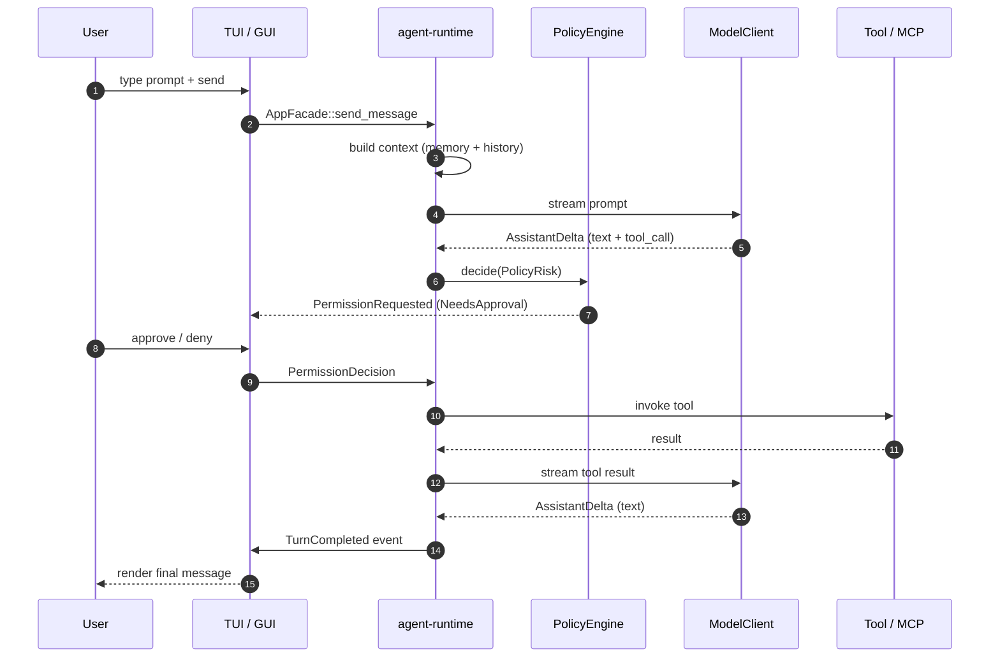

<script setup>
import { withBase } from "vitepress";
</script>

# First Session

This page walks you through one complete Kairox session end to end — in the TUI and in the GUI, with a real model, real tool calls, and a real permission prompt. By the end you will have seen the agent loop, the trace timeline, a model switch mid-session, and an automatic context compaction.

Before you start, you should have followed [Getting Started](./getting-started) (or the full [Installation](./installation) walkthrough) and you should have a working profile in `.kairox/config.toml`. If you do not, copy `kairox.toml.example` to `.kairox/config.toml`, fill in an API key, and come back.

## What you will see

The high-level shape of every Kairox turn:

<div class="mermaid">



</div>

Every arrow in that diagram becomes a row in the trace timeline. Nothing happens that is not an event; nothing in the UI is rendered from anywhere but events. That is the model.

## Part 1 — A first turn in the TUI

Open the TUI:

```bash
just tui
```

You will see a three-pane layout: sessions on the left, chat in the middle, trace on the right. The status bar at the bottom shows the active profile, the current `ApprovalPolicy` and `SandboxPolicy`, and the context usage meter.

### Pick a profile

Press <kbd>Alt+P</kbd> to open the profile selector. Use arrow keys to pick a profile (anything other than `fake` if you have a real API key configured). Press <kbd>Enter</kbd>.

The status bar updates to show the new profile. The model switch is non-destructive — the existing session is reused with the new model; nothing in the chat scrolls or resets.

### Send a message

Type a short message — try `What files are in this directory?` — and press <kbd>Ctrl+Enter</kbd> to send.

You will see, in order:

1. Your message appear in the chat pane.
2. A `TurnStarted` row in the trace pane.
3. An `AssistantDelta` row as the model starts streaming. Text accumulates in the chat pane character by character.
4. If the model decides to call a tool (likely `shell` for that prompt), a permission prompt overlay appears.

### Handle the permission prompt

The overlay shows the tool name (`shell`), the exact arguments (`ls .`), and the risk classification (High, because shell can execute anything). Three options:

- <kbd>Y</kbd> — allow this one call.
- <kbd>N</kbd> — deny this one call. The model sees the denial and can re-plan.
- <kbd>D</kbd> — deny all future calls of this kind for the session.

For this walkthrough, press <kbd>Y</kbd>.

A `PermissionGranted` event lands in the trace; the tool runs; a `ToolCompleted` event lands with the output; the model resumes streaming a final answer; the turn ends with `TurnCompleted`.

You have just seen the entire flow that [Permissions & Tools](../concepts/permissions-and-tools) describes.

### Switch model mid-session

Press <kbd>Alt+P</kbd> and switch to a different profile (e.g., from a fast model to a heavier one). Send another message. The new request goes to the new model, but the chat history is preserved. The runtime serializes the switch through the session actor so it cannot race the active turn — see [Runtime & Sessions](../concepts/runtime-and-sessions).

### Watch context fill

Each turn appends to the context. The status-bar meter shows usage as a fraction of the active profile's `context_window`. When usage crosses the `auto_compact_threshold` (default 0.85), the runtime triggers an automatic compaction: the oldest tier of history collapses into a summary message. You will see a `ContextCompacted` event in the trace and the meter drops back down.

To trigger compaction manually, use the command palette (<kbd>Ctrl+P</kbd>) and run "Compact context". See [Memory & Context](../concepts/memory-and-context) for the full pipeline.

### Exit

Press <kbd>Ctrl+C</kbd> to interrupt the current turn (or to quit if no turn is active). The session is persisted to SQLite under `~/.kairox/` — next time you open the TUI, the session list will include it.

## Part 2 — A first session in the GUI

The GUI shows the same model with a different interaction style: clickable surfaces, persistent panels, and rich settings.

```bash
just tauri-dev
```

The desktop window opens. The screenshot below shows the default workbench layout: sessions list on the left, chat in the center, trace + tasks on the right.

<figure class="screenshot">
  
  <figcaption>The desktop workbench: sessions, chat, trace, and task graph in one window.</figcaption>
</figure>

### Configure from settings

Click the settings icon (top right). Settings is organized by concern:

- **Models** — profiles and the active default.
- **Agents** — multi-agent strategy configuration.
- **MCP** — server lifecycle, marketplace.
- **Skills** — enabled skills per scope.
- **Plugins** — installed plugins and their contributions.
- **Hooks** — hook scripts and triggers.
- **Instructions** — user and project instructions.

<figure class="screenshot">
  
  <figcaption>Settings surfaces every configurable piece — models, agents, MCP, skills, plugins, hooks, instructions.</figcaption>
</figure>

Click **Models** and confirm your profile is listed. Click the profile to make it the default for new sessions.

### Start a session

Back on the workbench, click **+ New session**. A session is created; events are appended to SQLite. Type a prompt and press <kbd>Enter</kbd> (use <kbd>Shift+Enter</kbd> for a newline) to send.

### Inline permission flow

When the model requests a tool, the GUI renders the permission prompt _inline_ in the chat stream — not as a modal. You see the tool name, the arguments, and the risk classification with **Allow** / **Deny** / **Always allow** buttons.

"Always allow" persists the decision as a workspace-scoped rule (e.g., "always allow `fs.read` in this workspace"). The runtime remembers it; future calls of the same shape do not prompt.

### Observe the trace

The trace timeline on the right side updates in real time. Every event has a row; you can search the trace (`/`), filter by event type, and click a row to see its payload. The same `PermissionGranted` / `ToolCompleted` / `AssistantDelta` rows you saw in the TUI appear here, with richer presentation.

### Switch model mid-session

Use the profile dropdown in the session header to pick a different profile. The runtime queues the switch (so it cannot race an active turn), then routes subsequent requests to the new model. See [Runtime & Sessions](../concepts/runtime-and-sessions) for the actor model.

### Trigger compaction

Open the command palette (<kbd>Ctrl/Cmd+P</kbd>), search for "compact context", and run it. A `ContextCompacted` event appears in the trace; the context meter resets; the chat history is unchanged but the oldest messages have been replaced internally with a summary.

### Persistent state

Close the window. Reopen with `just tauri-dev`. The session list, the chat history, the trace, and the task graph are all restored from the event store. Nothing in the GUI is held only in memory — all state is rebuilt from events.

## Part 3 — Try MCP

The marketplace view (top-level navigation) lists curated MCP servers — git, GitHub, filesystem, fetch, and more. Install one (the marketplace handles the runtime requirement check, downloads the server, and registers it).

Once installed, the server's tools appear in the registry. The model can call them; they pass through the same policy engine as the built-ins. The trace marks tool calls with the originating server so you can audit what spoke to what.

For the full extensibility story — MCP, skills, plugins — see [Extensibility: MCP / Skills / Plugins](../concepts/extensibility).

## What you have learned

After this walkthrough you have hands-on intuition for:

- The agent loop and the event stream that drives every UI.
- The orthogonal `ApprovalPolicy` × `SandboxPolicy` model and the inline permission flow.
- Profile switching mid-session without losing history.
- Automatic and manual context compaction.
- Persistent sessions across restarts.
- The marketplace and the MCP lifecycle.

The deeper conceptual reads:

- [Architecture](../concepts/architecture) — the layered design, the dependency rule, the facade trait.
- [Runtime & Sessions](../concepts/runtime-and-sessions) — the actor model, the agent loop, DAG execution, multi-agent strategies.
- [Memory & Context](../concepts/memory-and-context) — the `<memory>` protocol, context assembly, compaction internals.
- [Permissions & Tools](../concepts/permissions-and-tools) — both policy axes, every built-in tool, the decision flow.

## What this page does not cover

This page walks through one happy-path session in each UI. It does not cover every keystroke ([CLI & Keyboard](../reference/cli-and-keyboard)), every config field ([Configuration](../reference/configuration)), or what to do when something goes wrong ([Troubleshooting & FAQ](./troubleshooting)).
