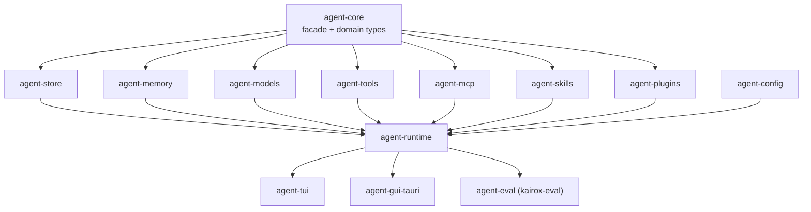

# Crate Index

Kairox is a Cargo workspace with thirteen crates plus a Tauri app crate. This page is the at-a-glance map: one row per crate, what it owns, the types you will see most often, and what depends on it. For the architectural reasoning behind the split, see [Architecture](../concepts/architecture).

## The dependency rule

There is exactly one dependency direction in the workspace:

```text
agent-core → agent-store, agent-memory, agent-models, agent-tools, agent-mcp, agent-skills, agent-plugins
agent-config → (uses domain types from agent-core; declarative only)
agent-runtime → composes all of the above
agent-tui, agent-gui-tauri, agent-eval → depend on agent-runtime (and the facade in agent-core)
```

The runtime composes domain crates. UIs and the eval binary compose the runtime. Domain crates do not know about the runtime; the runtime does not know about the UIs. New crates that try to invert this direction are rejected in review.

<div class="mermaid">



</div>

## Domain crates

### `agent-core`

| What           | Detail                                                                               |
| -------------- | ------------------------------------------------------------------------------------ |
| Repo path      | [`crates/agent-core`](https://github.com/Z-Only/kairox/tree/main/crates/agent-core)  |
| Purpose        | Domain types, events, the `AppFacade` trait, and build-info plumbing.                |
| Key types      | `AppFacade`, `EventPayload`, `DomainEvent`, `SessionId`, `TaskSnapshot`, `BuildInfo` |
| Depended on by | Every other crate. This is the foundation.                                           |

`agent-core` is intentionally small. It does not know how to persist events, how to call a model, or how to run a tool — it only defines the contracts. The `AppFacade` trait in particular is the single seam between UIs and the runtime, and the `EventPayload` enum is the single seam between the runtime and anything that wants to observe what is happening.

### `agent-store`

| What           | Detail                                                                                |
| -------------- | ------------------------------------------------------------------------------------- |
| Repo path      | [`crates/agent-store`](https://github.com/Z-Only/kairox/tree/main/crates/agent-store) |
| Purpose        | SQLite-backed event store and metadata tables. Single source of truth for sessions.   |
| Key types      | `EventStore` (trait), `SqliteEventStore`, `SessionMetadata`                           |
| Depended on by | `agent-runtime`, `agent-tui`, `agent-gui-tauri`                                       |

Event sourcing lives here. The event stream is append-only; nothing in `agent-store` mutates an event after it is appended. Replays for projections (like the GUI's task panel) read events back; archive flips a metadata flag.

### `agent-memory`

| What           | Detail                                                                                             |
| -------------- | -------------------------------------------------------------------------------------------------- |
| Repo path      | [`crates/agent-memory`](https://github.com/Z-Only/kairox/tree/main/crates/agent-memory)            |
| Purpose        | Memory store, `<memory>` marker extraction, context assembly under a token budget, and compaction. |
| Key types      | `MemoryStore` (trait), `SqliteMemoryStore`, `ContextAssembler`, `ContextCompactor`                 |
| Depended on by | `agent-runtime`                                                                                    |

The `extract_memory_markers` function in this crate is where the `<memory scope="...">` protocol meets the runtime. The context assembler uses `tiktoken-rs` for token accounting; the compactor turns the oldest tier of history into a single summary message when the budget is tight. See [Memory & Context](../concepts/memory-and-context).

### `agent-models`

| What           | Detail                                                                                      |
| -------------- | ------------------------------------------------------------------------------------------- |
| Repo path      | [`crates/agent-models`](https://github.com/Z-Only/kairox/tree/main/crates/agent-models)     |
| Purpose        | LLM provider clients, the streaming `ModelClient` trait, and the `ModelRouter` multiplexer. |
| Key types      | `ModelClient`, `ModelRouter`, `ModelRegistry`, `ProfileDef`                                 |
| Depended on by | `agent-runtime`                                                                             |

One file per provider (Anthropic, OpenAI-compatible, Ollama, Fake). The `ModelRegistry` holds curated context-window and capability metadata; the router picks the right client for a session's active profile and forwards stream chunks back as `AssistantDelta` events.

### `agent-tools`

| What           | Detail                                                                                                                                                                              |
| -------------- | ----------------------------------------------------------------------------------------------------------------------------------------------------------------------------------- |
| Repo path      | [`crates/agent-tools`](https://github.com/Z-Only/kairox/tree/main/crates/agent-tools)                                                                                               |
| Purpose        | The `Tool` trait, the `ToolRegistry`, the orthogonal Approval × Sandbox `PolicyEngine`, and the built-in tools.                                                                     |
| Key types      | `Tool`, `ToolRegistry`, `PolicyEngine`, `ApprovalPolicy`, `SandboxPolicy`, `PolicyDecision`, `PolicyRisk`, `ApprovalReason`, `ShellExecTool`, `PatchApplyTool`, `RipgrepSearchTool` |
| Depended on by | `agent-runtime`, `agent-mcp` (via `McpToolAdapter`)                                                                                                                                 |

Built-in tools: `shell.exec`, `fs.read`, `fs.write`, `fs.list`, `patch.apply`, `search.ripgrep`, `monitor.start`, `monitor.list`, and `monitor.stop`. `PolicyEngine::decide(PolicyRisk)` returns a `PolicyDecision` of `Allowed`, `DeniedBySandbox { reason }`, or `NeedsApproval { reason }`; the runtime turns the latter into permission events. The legacy single-axis `PermissionMode` enum was removed end-to-end in v0.31.0. See [Permissions & Tools](../concepts/permissions-and-tools).

### `agent-mcp`

| What           | Detail                                                                                                                                     |
| -------------- | ------------------------------------------------------------------------------------------------------------------------------------------ |
| Repo path      | [`crates/agent-mcp`](https://github.com/Z-Only/kairox/tree/main/crates/agent-mcp)                                                          |
| Purpose        | MCP client, transports (stdio + SSE + Streamable HTTP), lifecycle state machine, health checks, protocol types, marketplace catalog.       |
| Key types      | `McpClient`, `Transport`, `StdioTransport`, `SseTransport`, `StreamableHttpTransport`, `ServerLifecycle`, `McpToolAdapter`, `CatalogEntry` |
| Depended on by | `agent-runtime`, `agent-gui-tauri` (for the marketplace view)                                                                              |

`McpToolAdapter` wraps an MCP-exposed tool in the `Tool` trait so the runtime treats it like a built-in. The marketplace catalog is pluggable (built-in static list + remote `CatalogSource`). See [Extensibility](../concepts/extensibility).

### `agent-skills`

| What           | Detail                                                                                                                     |
| -------------- | -------------------------------------------------------------------------------------------------------------------------- |
| Repo path      | [`crates/agent-skills`](https://github.com/Z-Only/kairox/tree/main/crates/agent-skills)                                    |
| Purpose        | Native skills system. Parses markdown skills with YAML frontmatter into `SkillDef`s and serves them via a scoped registry. |
| Key types      | `SkillRegistry`, `SkillDef`, `SkillFrontmatter`, `SkillScope`                                                              |
| Depended on by | `agent-runtime`, `agent-plugins`                                                                                           |

Discovery is filesystem-driven: `~/.kairox/skills/`, `.kairox/skills/`, plus any directories declared in config. Workspace skills override user skills; session skills override both.

### `agent-plugins`

| What           | Detail                                                                                                     |
| -------------- | ---------------------------------------------------------------------------------------------------------- |
| Repo path      | [`crates/agent-plugins`](https://github.com/Z-Only/kairox/tree/main/crates/agent-plugins)                  |
| Purpose        | Parses plugin manifests and exposes flat inventories of skills, tools, hooks, and MCP server declarations. |
| Key types      | `PluginManifest`, plugin inventory helpers                                                                 |
| Depended on by | `agent-runtime`                                                                                            |

A plugin packages multiple contributions in a single install. The runtime routes each contribution to its owning crate (skill → `SkillRegistry`, tool → `ToolRegistry`, MCP server → `McpServerManager`, hook → runtime hook registry).

### `agent-config`

| What           | Detail                                                                                               |
| -------------- | ---------------------------------------------------------------------------------------------------- |
| Repo path      | [`crates/agent-config`](https://github.com/Z-Only/kairox/tree/main/crates/agent-config)              |
| Purpose        | TOML config parsing, profile discovery, `.kairox/` discovery, instructions, skill/MCP config wiring. |
| Key types      | `ProfileDef`, `McpServerConfig`, `ContextSettings`, `build_router(...)`                              |
| Depended on by | `agent-runtime`                                                                                      |

The runtime calls `build_router(...)` at boot to get a configured `ModelRouter` plus the rest of the static config. Discovery walks up five parents from the cwd looking for `.kairox/config.toml`, then falls back to `~/.kairox/config.toml`, then built-in defaults. See [Configuration](./configuration).

## Composition crate

### `agent-runtime`

| What           | Detail                                                                                                                       |
| -------------- | ---------------------------------------------------------------------------------------------------------------------------- |
| Repo path      | [`crates/agent-runtime`](https://github.com/Z-Only/kairox/tree/main/crates/agent-runtime)                                    |
| Purpose        | The agent loop, session actor, context budgets, compaction, model switching, agent strategies, DAG execution, MCP lifecycle. |
| Key types      | `LocalRuntime<S, M>`, `DagExecutor`, `AgentStrategy`, `McpServerManager`, session actor types                                |
| Depended on by | `agent-tui`, `agent-gui-tauri`, `agent-eval`                                                                                 |

`LocalRuntime<S, M>` is generic over its event store `S` and model client `M`. Production wires `SqliteEventStore` and a real `ModelRouter`; tests wire `:memory:` SQLite and a `FakeModelClient`. The session actor (PRs [#531](https://github.com/Z-Only/kairox/pull/531), [#532](https://github.com/Z-Only/kairox/pull/532), [#533](https://github.com/Z-Only/kairox/pull/533)) serializes turns, model switches, and compaction against a single session. See [Runtime & Sessions](../concepts/runtime-and-sessions).

## UI crates

### `agent-tui`

| What           | Detail                                                                                                      |
| -------------- | ----------------------------------------------------------------------------------------------------------- |
| Repo path      | [`crates/agent-tui`](https://github.com/Z-Only/kairox/tree/main/crates/agent-tui)                           |
| Purpose        | Terminal UI built on `ratatui`. Subscribes to runtime events and renders chat, trace, sessions, MCP status. |
| Key types      | `App` (top-level), individual screen modules                                                                |
| Depended on by | The `kairox` binary.                                                                                        |

The TUI is a thin shell over `AppFacade`. State is rebuilt from events on every render; there is no per-session in-memory cache that has to be hydrated.

### `agent-gui-tauri`

| What           | Detail                                                                                                           |
| -------------- | ---------------------------------------------------------------------------------------------------------------- |
| Repo path      | [`apps/agent-gui/src-tauri`](https://github.com/Z-Only/kairox/tree/main/apps/agent-gui/src-tauri)                |
| Purpose        | Tauri command surface for the GUI. Exposes the runtime to the Vue frontend over IPC and emits typed events back. |
| Key types      | `#[tauri::command]` handlers in `commands.rs`, type bridge in `specta.rs`                                        |
| Depended on by | The Tauri build of the desktop app.                                                                              |

The Vue frontend (`apps/agent-gui/src`) consumes generated TypeScript from `apps/agent-gui/src/generated/{commands,events}.ts`. Those files are regenerated by `just gen-types` after every `EventPayload` or command signature change — they are not edited by hand.

## Tooling crate

### `agent-eval`

| What           | Detail                                                                                                                       |
| -------------- | ---------------------------------------------------------------------------------------------------------------------------- |
| Repo path      | [`crates/agent-eval`](https://github.com/Z-Only/kairox/tree/main/crates/agent-eval)                                          |
| Purpose        | The `kairox-eval` CLI. Headless evaluation harness — runs JSONL scenarios against a configured runtime and collects metrics. |
| Key types      | `EvalHarness`, `EvalScenario`, `EvalExpectation`, `EvalRunOptions`, `EvalResult`, `EvalSummary`, `EvalReport`                |
| Depended on by | Standalone binary.                                                                                                           |

Eval depends on the runtime and the domain crates the same way the GUI does, but emits machine-readable output instead of pixels. It supports scenario listing, tag filters, fail-fast runs, JSONL results, summary JSON, combined report JSON, and expectation checks for required/forbidden events, tool counts, failures, elapsed time, and context-token budgets.

## At a glance

| Crate             | Lines of API surface | Stability                                                                                                                      |
| ----------------- | -------------------- | ------------------------------------------------------------------------------------------------------------------------------ |
| `agent-core`      | Small                | The facade and `EventPayload` are versioned conservatively. Additions are non-breaking; renames go through deprecation cycles. |
| `agent-store`     | Small                | Stable. Schema migrations are explicit and tested in `crates/agent-store/tests`.                                               |
| `agent-memory`    | Medium               | Memory protocol is stable; compaction internals evolve.                                                                        |
| `agent-models`    | Medium               | Provider clients evolve as upstreams add features.                                                                             |
| `agent-tools`     | Small                | Built-in tool set is intentionally fixed (see [Permissions & Tools](../concepts/permissions-and-tools)).                       |
| `agent-mcp`       | Medium               | Tracks upstream MCP spec; transports stable.                                                                                   |
| `agent-skills`    | Small                | Frontmatter is stable; discovery rules can grow.                                                                               |
| `agent-plugins`   | Small                | Manifest is stable; contribution kinds can grow.                                                                               |
| `agent-config`    | Medium               | TOML schema additions are non-breaking; removals trigger a migration warning.                                                  |
| `agent-runtime`   | Large                | Internal types refactor freely; observable behavior (events, facade) is stable.                                                |
| `agent-tui`       | Medium               | UI changes are not API; bindings are stable.                                                                                   |
| `agent-gui-tauri` | Medium               | Tauri commands are an API contract with the Vue frontend; changes go through `just gen-types`.                                 |
| `agent-eval`      | Small                | CLI flags are stable; harness is evolving.                                                                                     |

## What this page does not cover

This page lists the crates and their roles. It does not explain how a turn flows through them ([Runtime & Sessions](../concepts/runtime-and-sessions)), what the layered architecture is ([Architecture](../concepts/architecture)), or what the configuration schema looks like ([Configuration](./configuration)).
