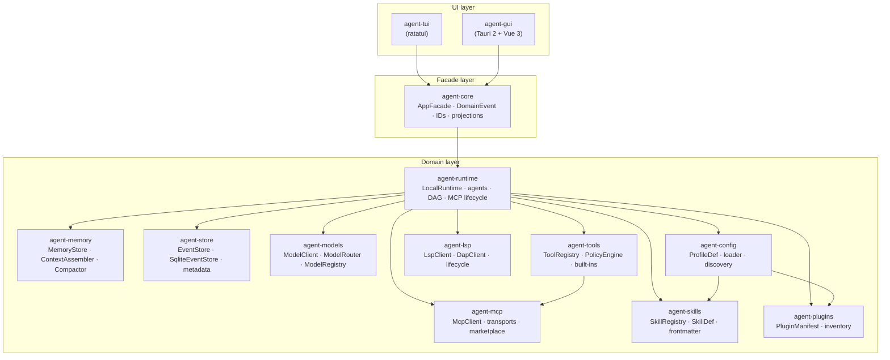
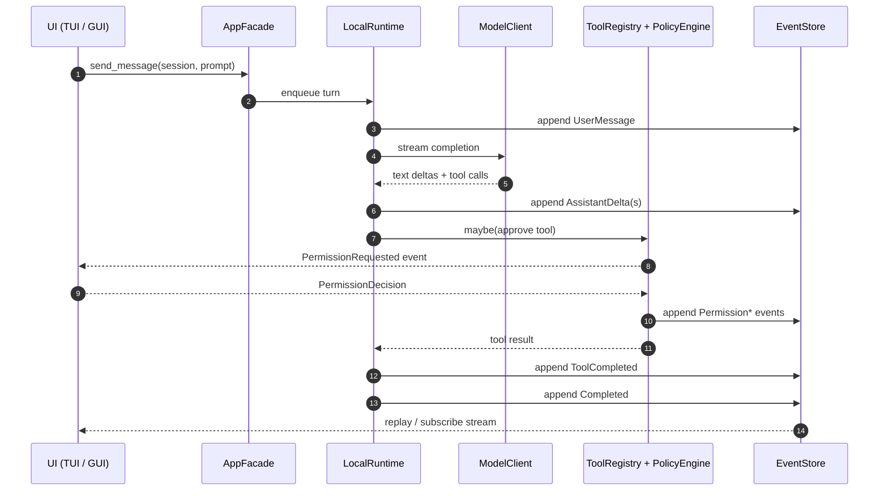
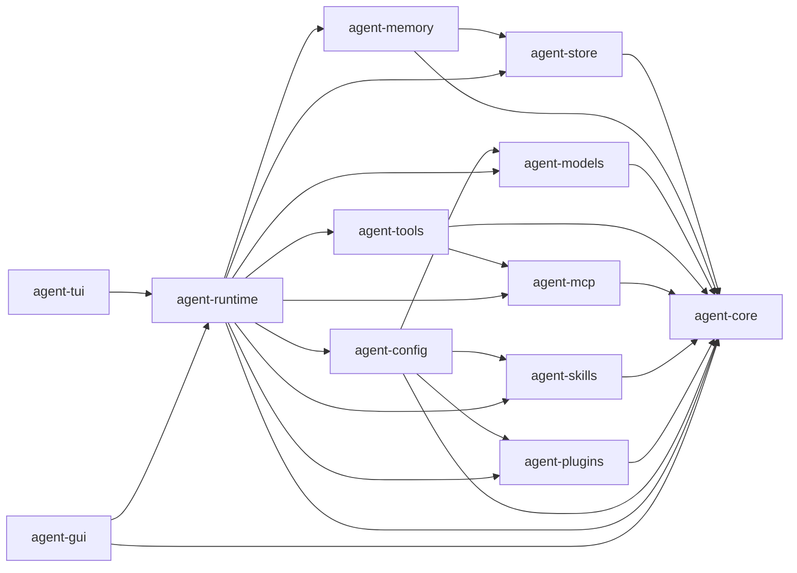

# 架构总览

Kairox 是一个 local-first 的 AI agent 工作台。两个用户界面(基于 ratatui 的终端应用,以及基于 Tauri 2 + Vue 3 的桌面应用)运行在同一个 Rust 内核之上。UI 之下的所有内容都是一个由小型 crate 组成的 Rust workspace,彼此之间只通过狭窄的 trait 相连。没有服务端、没有云控制面、也没有任何共享的可变单例 —— 整个技术栈都在你机器上的单一进程中运行,并将状态持久化到本地的 SQLite 数据库。

本页是这套架构的权威地图。它会解释分层示意图、维系分层秩序的依赖规则、每一层中的所有 crate、状态如何以事件的形式在系统中流动,以及背后那些较大设计决策的理由。

## 分层架构

产品被划分为三层:最上层是 UI,中间是共享的 facade,底部是扇出的领域 crate。

请自上而下地阅读这张图。GUI 中的一次点击或 TUI 中的一次按键,最终都会调用 `agent-core`,而绝不会直接调用任何领域 crate。`agent-core` 持有应用接口(`AppFacade`),并定义了描述应用内部行为的"语言"(`DomainEvent`、`EventPayload`、各种类型化 ID、projections)。领域 crate 负责实现这套接口,它们都不依赖任何一个 UI。

## 依赖规则

让这套架构保持稳定的唯一规则是:**依赖只能向内指向**。

| 所在层 | 允许依赖                               | 不允许依赖         |
| ------ | -------------------------------------- | ------------------ |
| UI     | facade(`agent-core`)                   | 直接依赖领域 crate |
| Facade | workspace 内部什么都不依赖             | UI、领域 crate     |
| Domain | facade,以及其他领域 crate(按 DAG 顺序) | UI                 |

`agent-core` 在 workspace 内部零依赖。其他每一个 crate 要么依赖 `agent-core`,要么依赖一个已经间接依赖它的领域 crate。任何新增 crate 想去调用 UI 表面,都是错的;正确做法是发出一个 event,让 UI 自己去响应。任何新增 UI 功能想绕过 facade,也是错的;正确做法是把 facade 拓宽。

在代码层面,这条规则由编译期强制保证 —— `cargo` 会拒绝构建一个引用了 UI crate 的领域 crate。在 review 阶段,它体现在 PR 的范围上:一个同时改 `agent-runtime` 和 GUI 的 feature 是正常的;但一个改 `agent-runtime` 又反过来去 `agent-gui` 读取状态的 feature,就是味道不对。

## 各层 crate 一览

### Facade 层 —— `agent-core`

`agent-core` 是被刻意保持精简的。它只包含:

- **`AppFacade`** —— runtime 实现、两个 UI 调用的异步 trait。所有用户可见的操作都要走它的某个方法。
- **领域事件** —— `DomainEvent`、`EventPayload`(一个囊括了每种 payload 变体的 enum)、`MemoryMarker`、`MemoryScope`、`PermissionDecision`。
- **类型化标识符** —— `SessionId`、`WorkspaceId`、`TaskId`、`AgentId`、`MessageId`,全部是基于 UUID 的 newtype,并带有 `serde` 支持。
- **Projections** —— `TaskSnapshot`、`TaskGraphSnapshot`、`TaskState`、`AgentRole`。
- **构建信息** —— `BuildInfo`(版本号、git SHA、构建日期),让两个 UI 呈现一致的 banner。

`agent-core` 导出了一个 `specta` feature,GUI 的 Tauri 后端会启用它,以便为跨 IPC 边界的类型推导出 `specta::Type`。这一处是*唯一*的不对称 —— Rust 内核本身对 Tauri 不持任何立场。

### 领域层

| Crate             | 角色                                                                                                                                                                                        | 关键类型                                                                                                                                                                           |
| ----------------- | ------------------------------------------------------------------------------------------------------------------------------------------------------------------------------------------- | ---------------------------------------------------------------------------------------------------------------------------------------------------------------------------------- |
| **agent-runtime** | 编排 agent loop、session-actor 执行运行时、context budgets、turn-end 无竞态 compaction、模型切换、可配置的 agent 设置、multi-agent 策略、MCP 生命周期、permissions。                        | `LocalRuntime<S, M>`、`SessionActor`、`SessionExecutionRuntime`、`PlannerAgent`、`WorkerAgent`、`ReviewerAgent`、`AgentStrategy`、`DagExecutor`、`TaskGraph`、`McpServerManager`。 |
| **agent-models**  | 模型提供方抽象(OpenAI 兼容、Anthropic、Ollama、Fake),并带有 metadata 与 context-window 注册表。                                                                                             | `ModelClient` trait、`ModelRequest`、`ModelRouter`、`ModelProfile`、`ModelRegistry`。                                                                                              |
| **agent-tools**   | 工具注册表、正交的 Approval × Sandbox 策略引擎、内置工具(`shell.exec`、`fs.read`、`fs.write`、`fs.list`、`patch.apply`、`search.ripgrep`、`monitor.start/list/stop`),以及 MCP-tool 适配器。 | `ToolRegistry`、`PolicyEngine`、`ApprovalPolicy`、`SandboxPolicy`、`PolicyDecision`、`PolicyRisk`、`Tool` trait、`ToolRisk`、`McpToolAdapter`、`MonitorRegistry`。                 |
| **agent-mcp**     | MCP(Model Context Protocol)客户端、stdio + SSE + Streamable HTTP 传输、server 生命周期、discovery 缓存、marketplace 目录(内置 + 远端来源)。                                                 | `McpClient`、`Transport` trait、`StdioTransport`、`SseTransport`、`StreamableHttpTransport`、`ServerLifecycle`、`McpServerDef`、`CatalogEntry`。                                   |
| **agent-lsp**     | LSP 和 DAP 客户端实现、JSON-RPC transport、server 生命周期管理，用于代码智能与调试器集成。                                                                                                  | `LspClient`、`DapClient`、`LspServerDef`、`DapServerDef`、`LspServerLifecycle`、`DapServerLifecycle`、`ServerStatus`。                                                             |
| **agent-skills**  | 原生 skills 系统 —— 可复用的 prompt / tool / workflow 能力、frontmatter 解析、注册表、GUI 设置。                                                                                            | `SkillRegistry`、`SkillDef`、`SkillFrontmatter`、`SkillScope`、`SkillSettings`。                                                                                                   |
| **agent-plugins** | 描述插件提供的 skills、tools、hooks、MCP server 的 manifest 与 inventory。                                                                                                                  | `PluginManifest`,以及若干 inventory 辅助方法。                                                                                                                                     |
| **agent-memory**  | 用户、workspace、session 三种作用域下的持久化记忆,基于 `tiktoken` budget 的 context 装配,以及 prompt compaction。                                                                           | `MemoryStore` trait、`SqliteMemoryStore`、`ContextAssembler`、`MemoryMarker`、`ContextCompactor`。                                                                                 |
| **agent-store**   | append-only 的 SQLite event store,以及用于 workspace 和 session 追踪的 metadata 表。                                                                                                        | `EventStore` trait、`SqliteEventStore`、`SessionMeta`。                                                                                                                            |
| **agent-config**  | TOML 配置加载、model profile 发现、从 env 中解析 API key、`.kairox/` 项目发现、skills 配置、instructions 配置。                                                                             | `ProfileDef`、`load_from_str`、`build_router`。                                                                                                                                    |

`agent-runtime` 是唯一一个会扇出到所有其他领域 crate 的领域 crate。其余 crate 都保持狭窄:`agent-memory` 不感知 `agent-tools`,`agent-models` 不感知 `agent-mcp`。当一个 runtime 功能同时需要两者时,由 runtime 来组合它们;它从不让某个领域 crate 反过来 import 另一个领域 crate。

### UI 层

| Crate         | 角色                                                                                                                                               | 关键类型                                                                                                                                                                                          |
| ------------- | -------------------------------------------------------------------------------------------------------------------------------------------------- | ------------------------------------------------------------------------------------------------------------------------------------------------------------------------------------------------- |
| **agent-tui** | 三栏式的 ratatui 应用(sessions、chat、trace)。带构建信息 banner、permission modal、模型切换 UI。                                                   | `App`、`ChatPanel`、`SessionsPanel`、`TracePanel`、`PermissionModal`。                                                                                                                            |
| **agent-gui** | Tauri 2 后端(Rust)+ Vue 3 前端。持久化的 session、任务图、MCP 与 memory UI、marketplace、模型 / agent / 插件 / hook / instructions / skills 设置。 | Rust:`commands.rs`、`GuiState`、`event_forwarder.rs`、`specta.rs`。Vue:stores(`session`、`taskGraph`、`agents`、`mcp`、`memory`、`catalog`、`skills`)、组件(`ChatPanel.vue`、`TaskSteps.vue`、……) |

两个 UI 实现的是同一套交互模型 —— 开启 session、发送 prompt、观察 trace、批准 permission —— 走的是同一个 facade。TUI 是最朴素的参考客户端;GUI 则在此基础上增加了持久化、多 session、marketplace 以及设置管理。

## 事件溯源的状态

在 Kairox 中,状态变更是事件,而不是 mutation。runtime 内部发生的每一件有意义的事 —— 收到一条消息、调用一个工具、做出一次 permission 决策、任务启动或完成、切换模型、提议记忆 —— 都被记录为一个 `DomainEvent` 并 append 到 event store。UI 是从事件流中渲染出来的,而不是从某个"session manager"持有的可变状态中渲染。

这套设计带来几个自然的特性:

- **重放是免费的。** 重启 GUI 会从 SQLite 重读事件,然后重建任务快照、聊天历史和 trace 时间线。没有什么"从 cache 重建"的路径。
- **UI 是订阅者,而不是所有者。** GUI 的 `event_forwarder` 调用 `LocalRuntime::subscribe_all()`,把每一个 `DomainEvent` 通过 Tauri 的 `emit` 转发给渲染端。TUI 在同一进程内做同样的事。两者都会按当前聚焦的 `SessionId` 过滤。
- **持久化是有边界的。** `agent-store` 只写 envelope。生产环境下的隐私默认配置(参见 [Permissions & Tools](./permissions-and-tools) 一页)限制了哪些 payload 内容会被持久化。
- **审计是这套设计的副产品。** 因为每个决策都是一个事件,trace 面板根本不需要一份额外的 audit log;它*就是*那份 audit log。

事件分类本身 —— `EventPayload` 的每一个变体以及由谁发出 —— 在 [Runtime & Sessions](./runtime-and-sessions) 页中有完整说明。

## Trait 边界

Trait 边界不是装饰。Kairox 中每一条跨 crate 的依赖都要通过 trait,这样测试时可以替换为 fake,新加适配器(新的 model provider、新的 transport、新的 event store 后端)时也可以即插即用,不必动到 runtime。

| Trait                   | 定义于        | 使用方                              | 说明                                                                            |
| ----------------------- | ------------- | ----------------------------------- | ------------------------------------------------------------------------------- |
| `AppFacade`             | agent-core    | agent-runtime、agent-tui、agent-gui | UI 与 runtime 之间的集成点。                                                    |
| `EventStore`            | agent-store   | agent-runtime、agent-memory         | 由 `SqliteEventStore` 实现;测试中使用内存版 SQLite(`:memory:`)。                |
| `MemoryStore`           | agent-memory  | agent-runtime、agent-gui(只读)      | 由 `SqliteMemoryStore` 实现。                                                   |
| `ModelClient`           | agent-models  | agent-runtime                       | 由 OpenAI 兼容、Anthropic、Ollama 以及 Fake 客户端实现;由 router 进行多路复用。 |
| `Tool` / `ToolProvider` | agent-tools   | agent-runtime、agent-mcp(经适配器)  | 内置工具与 MCP 暴露的工具都实现 `Tool`。                                        |
| `Transport`             | agent-mcp     | agent-mcp 内部                      | 由 `StdioTransport`、`SseTransport` 实现。                                      |
| `AgentStrategy`         | agent-runtime | agent-runtime                       | Planner / Worker / Reviewer 角色。策略之间通过组合搭配,而不是通过继承派生。     |

如此严格的纪律有一个具体的理由:`crates/agent-runtime/tests/full_stack.rs` 可以端到端地跑一个真正的 `LocalRuntime<SqliteEventStore, FakeModelClient>`,不需要 model API key、不需要 MCP server、也不需要 GUI 窗口 —— 因为每一个协作者都是一个 trait,而每一个 fake 都只是一次 `cargo test` 的事。

## Crate 依赖图

上面那条依赖规则,在实际中就是这样一张 DAG。下面这张图正是 `cargo` 实际强制执行的形状 —— 请把它理解为*谁知道谁*,而不是*运行时谁调用谁*。

`agent-tui` 和 `agent-gui` 是仅有的两个依赖 `agent-runtime` 的 crate。没有任何 crate 反过来依赖它们。这种不对称正是关键所在 —— 它意味着,只要对应的领域 crate 已经通过它实现的 trait 暴露了能力,新增一个 model provider、新增一个工具、新增一个 MCP transport、或是新增一个 skill 来源,都不需要去碰任何一个 UI。

## 决策记录

有几个较大的决策值得记录在案。它们并不是从一开始就显而易见的,但它们塑造了本站的每一页。

### 为什么用 facade,而不是直接调用领域

GUI 过去是直接调用 `agent-runtime` 的。加上 TUI 之后,我们才发现有多少假设是 GUI 形状专属的 —— Tauri 风味的错误类型、GUI 专属的 event 形状。把这些类型上提到 `agent-core`,并强制两个 UI 都走 `AppFacade`,让 runtime 可以自由地重构(整个 `agent-runtime` 的模块布局在 [#532](https://github.com/Z-Only/kairox/pull/532) 中被彻底拆分)而不会破坏任何一个 UI。代价是每次调用多一次 trait 分发,这对一个被 LLM 阻塞的工作流来说微不足道。

### 为什么用 event sourcing,而不是一个状态结构体

有三股力量把 runtime 推向了 events:(1) GUI 和 TUI 需要从同一个数据源渲染同一份 trace;(2) 桌面应用在崩溃或重启之后需要干净地恢复状态;(3) 把每个 permission 决策都记成一行,而不是某个方法的返回值,对审计和可观测性来说要干净得多。事件机制就位之后,后续的 compaction 和模型切换功能(参见 [#531](https://github.com/Z-Only/kairox/pull/531) 与 [#533](https://github.com/Z-Only/kairox/pull/533))就变成了"再加几个 event 变体",而不是"把新状态串到每一个消费者里"。

### 为什么把 `agent-runtime` 拆成多个聚焦模块

`agent-runtime` 变得越来越大。把它拆成 `agent_loop`、`agents`、`dag_executor`、`event_emitter`、`facade_runtime`、`mcp_manager`、`memory_handler`、`permission`、`session`、`task_graph` 之后,每个模块都可以单独测试,模块之间的依赖关系也变得可见。这个模式跟 workspace 的模式是同一个 —— 小模块、窄接口、模块之间互不反向依赖,只是递归地应用到了 crate 内部。这次拆分之后随之而来的"queue-the-actor"重构请见 [#532](https://github.com/Z-Only/kairox/pull/532)。

### 为什么用 SQLite(而不是自定义文件格式)

SQLite 提供事务性的 append、确定性的恢复、对任务图与 memory 查询的索引读取,而且零外部服务依赖。它通用、经过实战检验。Event store 是 append-only 的,memory store 体量也很小;不存在那种需要不断 schema-migration 的痛苦。

### 为什么要做两个 UI,而不是一个

TUI 是对 facade 质量的一种刻意的施压机制。如果一个功能能在 TUI 中实现,那 facade 多半设计得正确;如果不能,那说明 facade 里掺杂了 GUI 专属的关切。GUI 是面向最终用户的产品形态;TUI 则是开发者的参考客户端,也是 facade 重构的试金石。同时维护两者的成本并不高,因为它们消费同样的事件。

### 为什么用 Bun 而不是 npm/pnpm

仓库把 `packageManager` 锁定到了 Bun,而项目里的 lint-staged、husky、`just` 等 recipe 都假设使用 `bun`。Bun 的安装速度以及内置的 `bun test` 能让 GUI 的开发循环在开发者笔记本上保持流畅。代价 —— 团队工具箱里又多一个包管理器 —— 已经在 [安装](../guide/installation) 与 [问题排查与 FAQ](../guide/troubleshooting) 中说明。

## 本页不涉及的内容

本页是这套系统的地图。它不会展开 runtime 在每一 turn 内的行为、memory 协议、`ApprovalPolicy` × `SandboxPolicy` 决策矩阵或扩展面。每一项都在本节中有专门的一页。下一步,从 [Runtime & Sessions](./runtime-and-sessions) 开始,看看每个 prompt 背后发生了什么。
