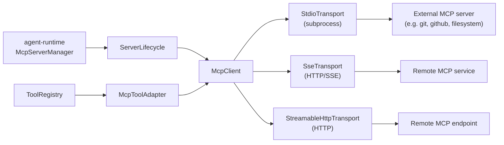

# 扩展性:MCP、Skills、Plugins

Kairox 在三个层面上做扩展。**MCP server** 通过一个标准协议接入外部 tool 与资源。**Skills** 是从文件系统发现的、仓库内本地的 prompt / tool / workflow 能力。**Plugins** 是 manifest 驱动的 bundle,把 skill、tool、hook 和 MCP server 打包到一起。这三种扩展面都是有意为之的:每一种之所以存在于它所在的位置,是因为它们的取舍点不同。

本页把这三种都讲一遍。

## MCP —— Model Context Protocol

[MCP](https://modelcontextprotocol.io/) 是一个开放协议,通过一个与传输无关的 JSON-RPC 通道,向 LLM 暴露 tool、prompt 与 resource。Kairox 的 `agent-mcp` crate 是这个协议的客户端实现。

### 架构

<div class="mermaid">



</div>

| 组件               | 角色                                                                                             |
| ------------------ | ------------------------------------------------------------------------------------------------ |
| `McpClient`        | 每个 server 一个 client。负责握手、能力发现以及 JSON-RPC 的 request/response。                   |
| `Transport`        | 抽象消息如何过线的 trait。出厂支持:`StdioTransport`、`SseTransport`、`StreamableHttpTransport`。 |
| `ServerLifecycle`  | 跟踪 `Starting → Ready → Stopped / Failed` 的状态迁移,并以 `McpServer*` 事件形式上报。           |
| `McpServerManager` | 位于 `agent-runtime` 顶层的协调器;读取配置、启动 server、注册 tool。                             |
| `McpToolAdapter`   | 把一个 MCP 暴露的 tool 包成 `Tool` trait,让 runtime 像对待任何内置 tool 一样对待它。             |
| `CatalogEntry`     | 某个 server 的 marketplace metadata(名称、描述、运行时要求、安装提示)。                          |

### Transport

| Transport         | 适用场景                                             | 如何声明                                                    |
| ----------------- | ---------------------------------------------------- | ----------------------------------------------------------- |
| `stdio`           | 遵循 MCP stdio 约定的本地子进程(绝大多数 server)。   | 在配置里 `type = "stdio"` 加上 `command` 与 `args`。        |
| `sse`             | 通过 Server-Sent Events 说 MCP 的远端 HTTP 服务。    | 在配置里 `type = "sse"` 加上 `url`,可选 `headers`。         |
| `streamable_http` | 使用 Streamable HTTP transport 的远端 MCP endpoint。 | 在配置里 `type = "streamable_http"` 加上 `url` 和 headers。 |

stdio 是默认值,因为大多数 MCP server 都以二进制或 `npx`/`uvx` 脚本的形式发布。

### Server 生命周期与事件

`McpServerManager` 会发出四个事件:

| 事件                | 触发条件                              |
| ------------------- | ------------------------------------- |
| `McpServerStarting` | manager 启动 transport 并发起握手。   |
| `McpServerReady`    | 握手成功;工具被注册。                 |
| `McpServerStopped`  | 用户停止 server,或 runtime 正在关闭。 |
| `McpServerFailed`   | 握手或运行时错误;携带诊断信息。       |

生命周期在两个 UI 中都是可观察的。TUI 在 trace 面板里显示 server 状态;GUI 的 `McpStatusIndicator.vue` 给出一个 per-server 的指示点,`Ready` 时变绿、`Starting` 时变黄、`Failed` 时变红。

### Marketplace 目录

`agent-mcp` 暴露一份精选的 server 目录。目录的来源是可插拔的:

- **Built-in** —— 一份编译进 `agent-mcp` 的静态列表,确保首次启动就有内容可看。
- **Remote** —— 一个指向远端 JSON manifest 的 `CatalogSource`;runtime 会去 fetch 并缓存。

GUI 的 marketplace 视图(`apps/agent-gui/src/views/MarketplaceView.vue` 以及 `apps/agent-gui/src/components/marketplace/` 下的配套组件)负责渲染目录、暴露运行时要求(Node、Python 等),并带用户走完安装流程,同时显示进度。

### 示例:在 `kairox.toml` 中声明一个 MCP server

```toml
[mcp_servers.git]
type = "stdio"
command = "npx"
args = ["-y", "@modelcontextprotocol/server-git", "--repository", "."]

[mcp_servers.github]
type = "stdio"
command = "npx"
args = ["-y", "@modelcontextprotocol/server-github"]
env = { GITHUB_PERSONAL_ACCESS_TOKEN = "" }

[mcp_servers.search]
type = "sse"
url = "https://example.com/mcp"
headers = { Authorization = "Bearer ${SEARCH_TOKEN}" }

[mcp_servers.remote-http]
type = "streamable_http"
url = "https://example.com/mcp"
api_key_env = "MCP_API_TOKEN"
```

对于 stdio server,`env` 中的空值表示"server 启动时读取同名环境变量"。完整 schema 在 [Configuration](../reference/configuration) 中。

## Skills —— 原生 prompt / tool / workflow 能力

`agent-skills` 是进程内的扩展层。一个 skill 就是一份带 YAML frontmatter 的 markdown 文件,声明出一种可复用的能力 —— 一个 prompt、一种 tool 接线方式、一个 workflow recipe,或者这几者的组合。

### 一个 skill 的解剖

```markdown
---
name: pr-review
description: Review a pull request diff with focus on correctness and tests.
scope: workspace
keywords: [review, pr, diff]
tools: [shell, fs.read]
---

You are a thorough code reviewer. The user will share a PR. Walk through:

1. The diff, file by file.
2. Test coverage of changed lines.
3. Any new public APIs and their docs.
4. Risk: data migrations, security, performance.

Conclude with a one-paragraph verdict and a labeled list of must-fix items.
```

frontmatter 会被解析为 `SkillFrontmatter`;body 即 prompt 本体。这个 skill 最终成为 `SkillRegistry` 中的一个 `SkillDef`。

### Frontmatter 字段

| 字段          | 类型     | 必填 | 含义                                                            |
| ------------- | -------- | ---- | --------------------------------------------------------------- |
| `name`        | string   | 是   | 稳定的标识符;按来源做命名空间。                                 |
| `description` | string   | 是   | 一行摘要,显示在 picker 和设置 UI 中。                           |
| `scope`       | enum     | 是   | `user` / `workspace` / `session` —— skill 在哪里生效。          |
| `keywords`    | string[] | 否   | 发现用的提示词;runtime 可以拿用户的 prompt 跟 keywords 做匹配。 |
| `tools`       | string[] | 否   | skill 预期会调用的工具;runtime 会在运行前确保它们已被注册。     |
| `model`       | string   | 否   | 跑这个 skill 时锁定到某个 model profile。                       |
| `arguments`   | object   | 否   | 声明输入;UI 会据此渲染一个表单。                                |

### 作用域

| 作用域      | 加载位置                               | 可见范围                        |
| ----------- | -------------------------------------- | ------------------------------- |
| `user`      | `~/.kairox/skills/` 以及配置的用户目录 | 当前用户的所有 session。        |
| `workspace` | workspace 内的 `.kairox/skills/`       | 在此 workspace 启动的 session。 |
| `session`   | 临时、内存中,绑定到某个 session 上     | 仅当前发起者所在的 session。    |

registry 会按 `name` 做去重,workspace 作用域的 skill 覆盖 user 作用域的,session 作用域的又覆盖前两者。GUI 的 `SkillsSettingsView.vue` 让用户可以按作用域查看、启用、禁用 skill,而不必动文件系统。

### SkillHub 安装

marketplace 跟 SkillHub(或等价的 skill 注册中心)集成,可以把 skill 安装到配置好的 user 或 workspace 目录。安装本质上是写文件操作,跟其他写操作一样要走 policy engine —— 在默认的 `ApprovalPolicy::OnRequest` + `SandboxPolicy::WorkspaceWrite` 组合下,当目标目录落在 sandbox 的 writable roots 之外时,安装会针对该目录弹出一次 `fs.write` 的 prompt。

## Plugins —— 用 manifest 打包的 bundle

一个 plugin 把 skill、tool、hook 以及 MCP server 的声明打包到一起。`agent-plugins` 负责解析 manifest,并把 inventory 喂给相关的 crate。

### Manifest

Kairox 会按顺序解析这些 plugin manifest:`.kairox-plugin/plugin.json`、`.codex-plugin/plugin.json`、`.claude-plugin/plugin.json`。MCP server inventory 可以通过 manifest 的 `mcpServers` 字段声明,也可以放在同级 `.mcp.json` 文件中。

```json
{
  "name": "my-plugin",
  "version": "0.2.0",
  "description": "Project workflow helpers.",
  "homepage": "https://github.com/example/kairox-my-plugin",
  "skills": "./skills/",
  "mcpServers": {
    "issue-tracker": {
      "command": "node",
      "args": ["./mcp/issue-tracker.js"]
    }
  },
  "hooks": [
    {
      "event": "pre_turn",
      "script": "./hooks/inject-context.js"
    }
  ],
  "permissions": {
    "approvalPolicy": "on_request",
    "sandboxPolicy": "workspace_write",
    "tools": ["shell.exec", "fs.read"]
  },
  "compatibility": {
    "kairoxVersion": ">=0.42.0 <0.43.0",
    "platforms": ["macos", "linux"],
    "requires": ["node >=20", "git"]
  },
  "publisher": "Example Labs",
  "trust": "community"
}
```

Codex 兼容的 plugin 也经常把 MCP 声明放在 `.mcp.json` 中:

```json
{
  "mcpServers": {
    "issue-tracker": {
      "command": "node",
      "args": ["./mcp/issue-tracker.js"]
    }
  }
}
```

### Inventory

`PluginManifestView` 暴露扁平 inventory,并带有 permission、compatibility 与 trust metadata,供设置页和 marketplace 展示。每一种贡献类型都会被路由到对应的 owning crate:

| 贡献类型   | 路由到                                     |
| ---------- | ------------------------------------------ |
| skill      | `SkillRegistry`(以 plugin 名作为命名空间)  |
| tool       | `ToolRegistry`                             |
| MCP server | `McpServerManager`(经 `agent-config` 合并) |
| hook       | runtime hook 注册表                        |

通过 plugin 发布的 skill 命名空间形如 `<plugin>:<name>`。这条约定防止两个 plugin 在同一个 skill 名上撞车,也给用户留下一条清晰的反向溯源路径。

### 设置

plugin 在 GUI 中是一等的 settings 项:作为整体启用 / 禁用、单独启用 / 禁用某一项贡献、覆盖路径。被禁用的贡献不会加载,即便对应文件还在。

### Plugin 与 MCP server 的关系

plugin 也可以内含 MCP server。两者的区别在于:

- **在 `kairox.toml` 中声明的 MCP server** 是用户层面的配置选择;用户自己维护安装。
- **被打包到 plugin 中的 MCP server** 是跟 plugin 一起发布的;用户安装了 plugin,server 也就跟着进来了。

如果你要发布一个 workflow tool,优先选 plugin,这样用户做一次安装而不是三次。如果你维护的是一个被很多人独立使用的长期 MCP server,就让它独立发布,由用户自行接线。

## LSP & DAP —— 代码智能与调试

`agent-lsp` crate 提供 Language Server Protocol (LSP) 和 Debug Adapter Protocol (DAP) 客户端。与引入*新*能力的 MCP server 不同，LSP 和 DAP server 让 agent 直接使用现有的开发者工具链：跳转到定义、查找引用、悬停文档、断点和变量检查。

### 架构

| 类型       | 关键结构体                                                   | 职责                                                          |
| ---------- | ------------------------------------------------------------ | ------------------------------------------------------------- |
| LSP 客户端 | `LspClient`                                                  | 通过 stdio transport 进行 LSP 协议 JSON-RPC 通信              |
| DAP 客户端 | `DapClient`                                                  | 通过 stdio transport 进行 DAP 协议 JSON-RPC 通信              |
| 生命周期   | `LspServerLifecycle` / `DapServerLifecycle`                  | 持有子进程、跟踪 `ServerStatus`、处理启动/停止/重启           |
| 传输层     | `LspStdioTransport`                                          | 启动 server 进程、连接 stdin/stdout、将 stderr 输出到 tracing |
| 工具提供者 | `LspToolProvider` / `DapToolProvider`（在 `agent-tools` 中） | 将客户端包装为动态 `Tool` 实例，供 agent 调用                 |

### Server 生命周期

每个 LSP/DAP server 通过配置定义，由 lifecycle 结构体管理：

1. 通过 stdio transport 启动 server 进程。
2. 发送 `initialize` 请求，附带项目根 URI 和客户端 capabilities。
3. 跟踪 `ServerStatus` —— `Stopped`、`Starting`、`Running` 或 `Failed`。
4. 关闭时发送 `shutdown` + `exit` 通知并终止子进程。

### 动态工具注入

LSP server 启动后，runtime 注册 `LspToolProvider`，将 LSP 操作（`textDocument/definition`、`textDocument/references`、`textDocument/hover` 等）暴露为 agent 可在 session 中调用的 tool。DAP server 通过 `DapToolProvider` 以同样方式暴露调试操作（`launch`、`setBreakpoints`、`variables` 等）。

这些 tool 与 MCP tool 和内置 tool 一起出现在 tool registry 中。Agent 根据任务选择合适的 tool —— 文本搜索用 `search.ripgrep`，精确导航用 LSP 的 `textDocument/definition`。

### 示例：在 `kairox.toml` 中声明 LSP server

```toml
[lsp_servers.rust-analyzer]
command = "rust-analyzer"
args = []
languages = ["rust"]
file_patterns = ["*.rs"]
```

```toml
[dap_servers.codelldb]
command = "codelldb"
args = ["--port", "0"]
languages = ["rust", "c", "cpp"]
```

## 选哪一种扩展面

| 需求                                                     | 用什么                                                            |
| -------------------------------------------------------- | ----------------------------------------------------------------- |
| 当前项目内可复用、就地编辑的 prompt。                    | Workspace skill                                                   |
| 跟随用户走的个人 prompt 库。                             | User skill                                                        |
| 通过进程或网络边界调用的外部能力。                       | MCP server                                                        |
| 代码智能（跳转到定义、引用、悬停文档）。                 | LSP server                                                        |
| 交互式调试（断点、单步执行、变量检查）。                 | DAP server                                                        |
| 把 skill + tool + hook + MCP 打包在一起的工作流 bundle。 | Plugin                                                            |
| 单 session 内一次性的临时 prompt。                       | Session skill                                                     |
| 应当作用于此仓库下*每一个* session 的行为变更。          | Instructions 配置(见 [Configuration](../reference/configuration)) |

## 本页不涉及的内容

本页讲的是外部能力如何接入 runtime。它不涉及这些扩展面各自的配置 schema —— 那部分在 [Configuration](../reference/configuration)。它也不涉及 runtime 在每一 turn 内的行为 —— 那在 [Runtime & Sessions](./runtime-and-sessions)。
