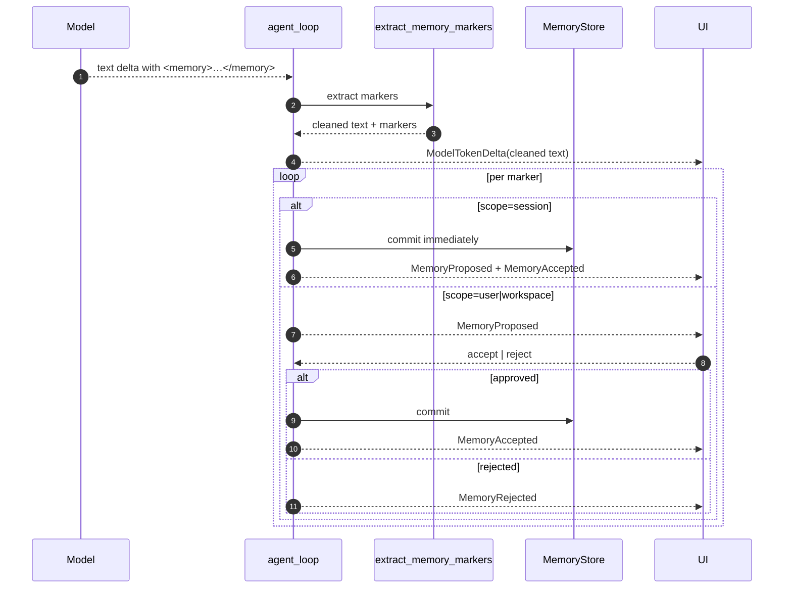
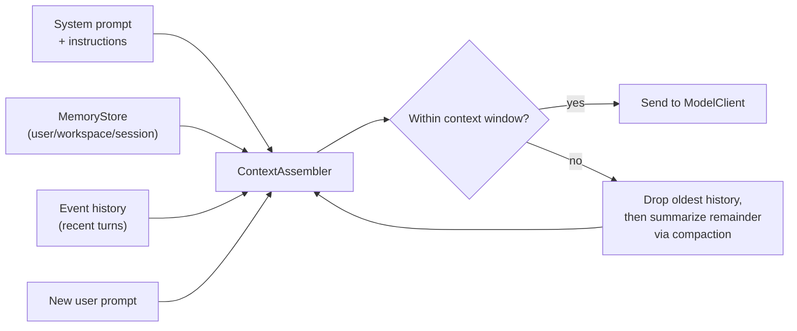

# Memory 与 Context

Kairox 把 memory 当作每一 turn 的一等公民。长 session 需要一种方式来记住用户偏好、项目约定和正在进行的工作 —— 而不必每次都把它们重新粘贴一遍 —— 同时也需要一种方式,在模型的 window 满了之后丢弃旧的上下文。Memory 和 compaction 就是这件事的一体两面。

本页解释 LLM 如何通过 `<memory>` 标签来"提议"记忆、memory store 如何按作用域保存这些记忆、context assembler 如何在每一 turn 内基于 tiktoken budget 构建 prompt,以及 compaction 如何在不丢失主线的前提下压缩历史。

## `<memory>` 标记协议

LLM 不是通过调用某个 tool 来写入 memory 的。它是通过在响应里发出 `<memory>` 标签来写入 memory 的。`agent-memory::extract_memory_markers` 会把这些标签从 stream 中解析出来,从可见文本中剥离掉,并按每个标记自身的作用域走相应的审批流程。

### 作用域

| 作用域      | 何时使用                                                         | 生命周期                          | 审批                                                                      |
| ----------- | ---------------------------------------------------------------- | --------------------------------- | ------------------------------------------------------------------------- |
| `session`   | agent 想在同一个 session 后续中复用的对话内事实。                | session 被归档时丢弃。            | 自动接受。发出 `MemoryProposed` + `MemoryAccepted`。                      |
| `user`      | 个人偏好、工作风格、长期的人体工学选择。                         | 跨当前用户的所有 session 持久化。 | 弹给 UI。发出 `MemoryProposed`,等待 `MemoryAccepted` / `MemoryRejected`。 |
| `workspace` | 项目约定、仓库相关事实、会约束此 workspace 后续 session 的决策。 | 在 workspace 内持久化。           | 弹给 UI。发出 `MemoryProposed`,等待审批。                                 |

### 标记语法

模型在响应流中发出标记:

```
<memory scope="session">User prefers explanations before code.</memory>
<memory scope="user" key="editor.font">JetBrains Mono 14px.</memory>
<memory scope="workspace" key="commit.style">Conventional Commits with scope prefix.</memory>
```

`scope="session"` 不要求带 key —— session memory 很小,而且时间是有界的。`scope="user"` 与 `scope="workspace"` 必须带 `key`,这样后续写入会覆盖而不是重复。这些标记在 UI 渲染 assistant 消息之前就会从可见输出中被剥离,所以最终用户看到的只是说明文本,而看不到标记本身。

### 一次完整的来回

<div class="mermaid">



</div>

UI 永远看不到 `<memory>` 的原始标记。它看到的是清洗后的文本,以及紧挨着它的一个 `MemoryProposed` 事件,聊天流会把它渲染成一个内联的"要记住这个吗?"卡片,带有"批准 / 拒绝"按钮。

### 为什么审批很重要

如果对 `user` 和 `workspace` 这两种 memory 自动落库,模型就可以悄悄改掉用户并没有同意要改的设置。更糟糕的是,一个被注入恶意内容的 tool 结果可能反过来引导模型写出一段会影响未来 session 的 memory。要求显式审批,可以把这种影响半径圈起来,让 memory 这一层始终是用户自己拥有的东西。

## MemoryStore

`MemoryStore` 是 `agent-memory` 中的一个 trait。出厂实现是 `SqliteMemoryStore`,跟 event store 共享同一个 SQLite 数据库,但用的是另一组表。

一条 memory 记录包含:

- `scope`(`Session | User | Workspace`)
- `workspace_id` / `session_id`(取决于作用域)
- `key`(供 user / workspace 使用)
- `body`(memory 的文本内容)
- `created_at`、`updated_at`
- `approved_at`(对 session memory 来说为 null)

查询是按 scope + workspace/session + key 来做的,还有一个 GUI 的 memory browser 用的"列出此 scope 下全部"的回退查询。这里没有 embedding 索引;memory 召回靠的是 scope + 时效 + key,而不是相似度。这是一个有意为之的设计:项目级 memory 应该是精确且可审视的,而不是"差不多匹配"的。

## Context 装配

每一 turn 都从头重新构建 prompt。`ContextAssembler` 就是决定"放什么进去"的组件。它拿到当前模型的 context window、最近的消息历史和相关的 memory,产出一个能塞进模型 token budget 之内的 `Vec<Message>`。

### 输入

1. **System prompt。** 当前策略对应的 system prompt,加上正在生效的 instructions 配置。
2. **Memory。** 当前 workspace 下所有 `user` 和 `workspace` memory,加上当前 session 的 `session` memory。当 budget 紧张时,会根据相关性启发式(key 命中、时效)做过滤。
3. **历史。** 来自事件流的近期消息 —— `UserMessageAdded`、被清洗过并由 `AssistantMessageCompleted` 定稿的 `ModelTokenDelta`,以及 `ToolInvocationCompleted` 的 payload。
4. **新的用户 prompt。** 永远会原文带上。

### Token 核算

`tiktoken`(通过 `tiktoken-rs` crate)是用于度量 budget 消耗的权威 tokenizer。assembler 用每个模型声明的 context window 减去一个可配置的预留量("headroom",留给模型自身响应使用)。然后它按优先级顺序遍历输入,一旦再加一条消息就会超出 budget,就停止继续加历史。memory 优先于旧历史;为了让一条已批准的 `user` memory 留在 context 中,assembler 会愿意丢掉最早的几轮 user / assistant 来回。

### 流水线

<div class="mermaid">



</div>

## Compaction

Compaction 是用来防止消息历史涨过当前模型 context window 的机制。它有两种形态:

### 自动 compaction

runtime 在每一 turn 末尾都会检查一次 assembler 的 budget(race-free 的钩子是在 [#533](https://github.com/Z-Only/kairox/pull/533) 中落地的;关于为什么要在 session actor 中排队执行,也可参见 [#532](https://github.com/Z-Only/kairox/pull/532))。如果按当前的历史规模,下一 turn 就会超出 budget,runtime 会在把 actor 交还给下一个用户输入*之前*就触发一次 compaction。

Compaction 会把最早一层的历史总结为一条 `assistant` 风味的 memory note,assembler 会把它当作持久化上下文来对待。原始事件不会从 store 里删除;summary 是带 provenance 地作为一个事件被 append 进去的,这样 trace 仍然是完整的。

### 手动 compaction

UI 可以显式请求 compaction:TUI 的键盘快捷键、GUI 的菜单项,或者 `AppFacade::compact(session)` 调用。手动 compaction 走的是和自动一样的流水线,只是不需要等到 budget 溢出。

### 事件

| 事件                         | 何时发出                                               |
| ---------------------------- | ------------------------------------------------------ |
| `ContextCompactionStarted`   | Session actor 开始执行 compaction(自动或手动)。        |
| `CompactionSummary`          | 带 provenance 的 summary 已 append。                   |
| `ContextCompactionCompleted` | 当前 context 开始使用 summary。                        |
| `ContextCompactionFailed`    | 总结过程出错(模型失败、budget 边界情况)。              |
| `ContextCompactionSkipped`   | turn 末尾触发被抑制,因为 compaction 已在运行或已禁用。 |

compaction 失败不会阻塞 session,但下一 turn 仍然要受 budget guard 约束 —— 如果装配好的 prompt 溢出,runtime 会拒绝发送。

### Busy 状态守卫

Compaction 不能在 turn 进行中运行。session actor 通过把 compaction 请求排在当前 turn 之后来强制保证这一点。同样地,profile switch 会排在 compaction 之后,这样切换到一个更小 window 的模型时,永远不会落在总结进行到一半的状态上。两者合起来,可以杜绝那一整族"模型同时处于两种状态"的 bug。

## UI 如何呈现 memory

- **TUI** 在聊天流中内联地渲染"被提议的 memory",`a` 批准、`r` 拒绝。trace 面板会把 `MemoryAccepted` 事件连同 scope 和 key 一起打出来。
- **GUI** 使用聊天流的 stream item(permission 走 `ChatPermissionItem.vue`;memory 这边对应的是"被提议的 memory 卡片"),以及一个专门的 `MemoryBrowser.vue` 视图,随时可以查看并编辑已有 memory。被接受的编辑会在 `MemoryStore` 中覆盖该 key 下的旧 body。

两个表面都通过 facade 跟同一个 `MemoryStore` 对话。不存在任何 UI-only 的 memory 缓存;如果你在 GUI 里改了一条 memory,而 TUI 同时也开在同一个 workspace 上,TUI 下一 turn 就会拿到新值。

## 模式与陷阱

- **memory 应该是事实,而不是指令。** "User prefers TypeScript over JavaScript for new files." 是好的。"Always write TypeScript." 是一条指令,应该放进 instructions 配置(见 [Configuration](../reference/configuration))。
- **保持 key 的稳定。** 一条 key 为 `editor.font` 的 `user` memory 会被下一次同 key 的写入覆盖。一条 key 为 `font-preference-2026` 的 memory 是一条新 memory,什么也覆盖不了。
- **workspace memory 是项目级的。** 切换到不同的 workspace,会看到不同的一组 memory。模型永远不会看到不属于它当前所在 workspace 的 memory。
- **compaction 在设计上就是 lossy 的。** summary 是一段意译,而不是逐字记录。对那些必须逐字保留的内容,请用 memory;不管怎样,event store 始终保留着原始消息,可供审计。
- **审批 prompt 是在消耗用户的注意力。** 一个模型如果在一 turn 内连续提议十条 `workspace` memory,会让人很烦。除非真有多条彼此无关的新事实,否则 prompt 工程应该鼓励模型把它合并成"一 turn 一条 memory"。

## 本页不涉及的内容

本页讲的是哪些东西会被记住,以及 prompt 是如何被构建出来的。它不涉及模型可以调用哪些工具([Permissions & Tools](./permissions-and-tools)),也不涉及外部能力是如何被打包发布的([扩展性](./extensibility))。
