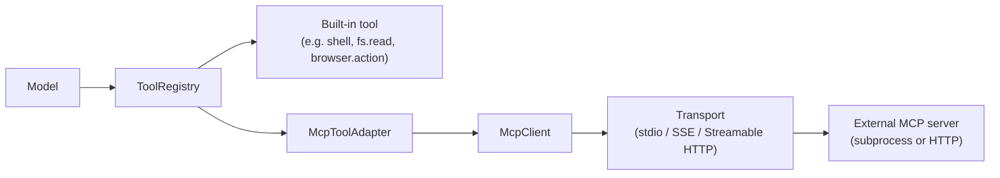
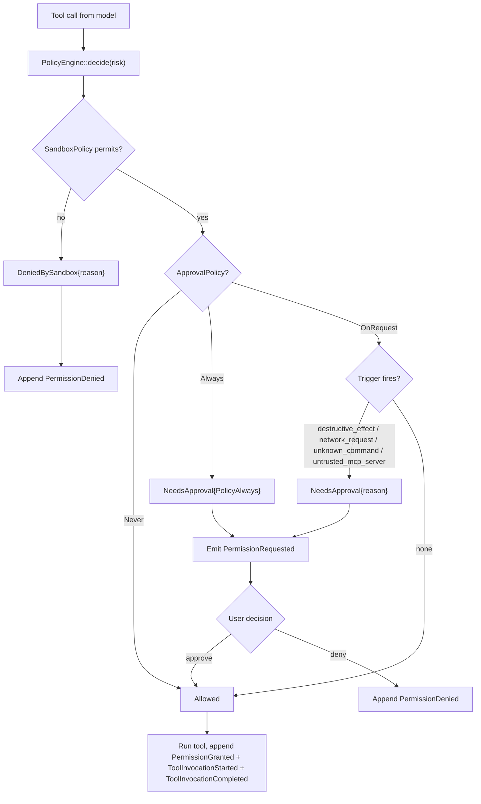

# Permissions 与 Tools

工具是模型接触外部世界的方式 —— shell 命令、文件、search、patch、MCP 暴露的能力。这也让 policy engine 成为 runtime 中最与安全相关的一块。Kairox 的设计是默认保守的:每一次 tool 调用都要走 policy engine,每一个决策都是一个事件,每一个轴都是显式的。

本页覆盖两个正交策略(`ApprovalPolicy` × `SandboxPolicy`)、内置工具及其风险分级、MCP 工具如何通过 adapter 接入,以及把它们串起来的决策流。

::: tip 历史背景
单轴的 `PermissionMode` 枚举(`ReadOnly` / `Suggest` / `Agent` / `Autonomous` / `Interactive`)已于 v0.31.0 端到端移除(PR [#517](https://github.com/Z-Only/kairox/pull/517)、[#520](https://github.com/Z-Only/kairox/pull/520))。新模型有两个独立的轴 —— 什么时候问、sandbox 在结构上允许什么 —— 这让用户可以表达旧枚举无法表达的偏好,例如"允许 workspace 内写入,但完全不要弹 prompt"。完整决策矩阵见 `docs/superpowers/specs/2026-05-26-permission-sandbox-approval-design.md`。
:::

## 两个正交策略

每个 session 都带两个策略值。它们彼此独立:approval 轴控制 _什么时候问用户_,sandbox 轴控制 _runtime 结构上允许什么_。

### `ApprovalPolicy` —— 什么时候问

`ApprovalPolicy` 定义在 `agent-tools/src/policy/approval.rs`。

| 值          | 行为                                                                                              | 适用场景                                          |
| ----------- | ------------------------------------------------------------------------------------------------- | ------------------------------------------------- |
| `Never`     | sandbox 放行的 tool 直接运行,不弹 prompt。任何被 sandbox 拒掉的仍会失败 —— 批准不能放宽 sandbox。 | 后台作业、批处理、自主 agent。                    |
| `OnRequest` | (默认)只有结构性原因触发时才会弹 prompt(sandbox 拒绝、破坏性 effect、network 等)。                | 日常交互式工作,用户希望对副作用拥有最终决定权。   |
| `Always`    | 任何 tool 调用都会弹 prompt,即便 sandbox 默认会放行。                                             | demo、审计、偏执的调试,任何动作都需要被一一审视。 |

`ApprovalPolicy::default()` 是 `OnRequest`。

### `SandboxPolicy` —— 结构上允许什么

`SandboxPolicy` 定义在 `agent-tools/src/policy/sandbox.rs`。

| 变体                                                | 行为                                                                                                      | 适用场景                                     |
| --------------------------------------------------- | --------------------------------------------------------------------------------------------------------- | -------------------------------------------- |
| `ReadOnly`                                          | 写操作全部被拒。网络访问被拒。只读工具仍可用。                                                            | 调查、仓库审计、"帮我读一下就好"类 session。 |
| `WorkspaceWrite { network_access, writable_roots }` | (默认)允许在 workspace 根目录及配置的 `writable_roots` 下写入。网络访问由 `network_access` 控制(默认关)。 | 普通开发。最常用的配置。                     |
| `DangerFullAccess`                                  | 任意位置可写,无条件允许网络。                                                                             | 那些必须触碰系统路径或开放网络的可信脚本。   |

`SandboxPolicy::default()` 是 `WorkspaceWrite { network_access: false, writable_roots: vec![] }`。

### 为什么是两个轴

单一模式逼着用户沿一条排序做选择。两轴模型可以表达旧枚举表达不了的偏好:

- "允许 workspace 内写入,但每次都问。" → `WorkspaceWrite` + `Always`。
- "只读 sandbox,从不打扰我。" → `ReadOnly` + `Never`。写操作仍会被拒;批准不能压过 sandbox。
- "完全放权,不要弹 prompt。" → `DangerFullAccess` + `Never`。即"我自己心里有数"模式。

两个轴都可以在 session 进行中改变,并出现在 GUI(`ChatApprovalSelector.vue`、`ChatSandboxSelector.vue`)与 TUI 状态栏中。

## 内置工具

`agent-tools` 出厂带了一组精简的内置工具。每一个内置工具都实现 `Tool` trait,并在 runtime 启动时注册进 `ToolRegistry`。

| Tool             | 模块                | 作用                                                   | 风险   | 影响面                  |
| ---------------- | ------------------- | ------------------------------------------------------ | ------ | ----------------------- |
| `shell.exec`     | `ShellExecTool`     | 运行一条 shell 命令,返回 stdout/stderr。               | High   | 任意进程执行。          |
| `fs.read`        | `fs::read`          | 读取一个文件的内容。                                   | Low    | 只读文件系统访问。      |
| `fs.write`       | `fs::write`         | 把内容写入文件(创建或覆盖)。                           | Medium | 文件系统改动。          |
| `fs.list`        | `fs::list`          | 列出某个目录下的条目。                                 | Low    | 只读文件系统访问。      |
| `patch.apply`    | `PatchApplyTool`    | 对 workspace 中的一个或多个文件应用一个 unified diff。 | Medium | 文件系统改动(多文件)。  |
| `search.ripgrep` | `RipgrepSearchTool` | 在 workspace 上跑 `ripgrep` 并返回匹配。               | Low    | 只读文件系统访问。      |
| `monitor.start`  | `MonitorStartTool`  | 启动一个后台 monitor。                                 | Low    | Monitor 进程生命周期。  |
| `monitor.list`   | `MonitorListTool`   | 列出活跃的后台 monitor。                               | Low    | 只读 monitor metadata。 |
| `monitor.stop`   | `MonitorStopTool`   | 停止一个正在运行的后台 monitor。                       | Low    | Monitor 进程生命周期。  |
| `browser.action` | `BrowserTool`       | 驱动一个 Playwright-backed browser action。            | Medium | 浏览器与网络交互。      |
| `browser.batch`  | `BrowserBatchTool`  | 顺序执行多个 browser action。                          | Medium | 浏览器与网络交互。      |
| `computer.use`   | `ComputerUseTool`   | 通过平台 backend 截图或控制桌面。                      | High   | 桌面输入 / 屏幕访问。   |

policy engine 真正读取的是 tool 的 `PolicyEffect`(只读 / workspace 写 / 网络 / 破坏性 / 未知命令);`Risk` 则是 UI 用来在 prompt 和状态栏里展示的提示。

### 为什么是这些,而不是更多

内置工具集是被刻意做小的。任何更复杂的能力 —— git 操作、数据库查询、代码格式化、项目专属命令,或更高层的 workflow 自动化 —— 都应该交给一个 MCP server。runtime 给用户的是 primitive 加上一套 policy engine;MCP 给用户的是打好包的能力。

## MCP tool 适配器

外部能力通过 `agent-mcp` 接入 runtime,并通过 `McpToolAdapter` 以 `Tool` 实现的形式暴露出来。从 runtime 的角度看,一个 MCP 工具就是另一个 `Tool`;只有 adapter 知道这次调用要跨进程边界。

adapter 同样会经过 policy engine。一个没有声明 effect 的 MCP 工具会被赋予默认风险和"未知命令"批准原因;在 `OnRequest` 模式下也会像任何内置工具一样弹 prompt。即便 effect 本身看起来无害,不受信任的 MCP server 仍可能触发 `ApprovalReason::UntrustedMcpServer`。

完整的 MCP 生命周期、transport 与 marketplace 故事见 [扩展性:MCP / Skills / Plugins](./extensibility)。

## Policy 决策流

每一次 tool 调用走的都是同一条路径。`PolicyEngine::decide` 接收一个 `PolicyRisk`(effect、tool 名、可选 command),返回 `PolicyDecision` 的三种变体之一。

从这张图里可以提炼出几条不变式:

- **Sandbox 是结构性的。** `DeniedBySandbox` 不能被批准覆盖。用户在 `ReadOnly` 下"批准"一个写操作,并不会解锁该写操作 —— 必须先切换 sandbox。
- **Approval 是流程性的。** `Never` 不会放宽 sandbox;它只是把 sandbox 已经放行的调用静音。
- **每一次 decision 都会落到事件流上。** sandbox 拒绝和用户拒绝会 append `PermissionDenied`;被批准的调用会先 append `PermissionGranted`,再 append `ToolInvocationStarted` 与 `ToolInvocationCompleted` 或 `ToolInvocationFailed`。
- **批准原因是带类型的。** `ApprovalReason` 是 `SandboxRejected`、`PolicyAlways`、`DestructiveEffect`、`UnknownCommand`、`NetworkRequest`、`UntrustedMcpServer` 之一 —— UI 会把该原因渲染在 tool 名旁。
- **批准过的 tool 不会被回溯性地撤销。** 一旦 `PermissionGranted` 被 append,runtime 就会去调用 tool。

## 审视决策

两个 UI 都会按用户视角渲染这套决策流:

- **TUI** 会弹出一个 permission modal,显示 tool 名、参数、风险、批准原因以及批准/拒绝两个按键。状态栏会展示两个轴;`B` 用于循环切换 sandbox 策略。trace 面板会列出每一条 `PermissionRequested` / `PermissionGranted` / `PermissionDenied` 事件。
- **GUI** 用 `PermissionPrompt.vue` 渲染 modal,用 `ChatPermissionItem.vue` 渲染内联 stream item。`ChatApprovalSelector.vue` 与 `ChatSandboxSelector.vue` 用来按 session 切换两个轴。持久化规则(比如"对此 workspace 始终允许 `fs.read`")会以一个 `workspace` 作用域的 memory 形式被记下来,使用 permission 专属的 key 命名空间。

供机器审视时,event store 才是权威来源。按 `SessionId` 过滤出 `PermissionRequested` / `PermissionGranted` / `PermissionDenied`,就能得到这次对话的完整 audit log。Session 级策略持久化在 `SessionMeta`(`approval_policy`、`sandbox_policy`)上,由 `agent-store` 迁移 `0007_approval_sandbox_policy.sql` 引入。

## 围绕"策略失败"来设计

当你写的代码会触发 tool 时 —— 不管你设计的是 skill、plugin 还是 MCP server —— 都要假设任何 tool 都可能被 sandbox 拒绝或被用户拒绝。runtime 保证:

- 被 sandbox 拒掉的 tool 会在调用前返回一条带结构化原因的 `PermissionDenied`。
- 被用户拒掉的 tool 会在调用前返回一条带拒绝原因的 `PermissionDenied`。
- 已经被调用但执行出错的 tool 会返回 `ToolInvocationFailed`。
- 模型能看到这次失败,可以重新规划。
- 用户可以在 session 进行中改变任一轴,然后再试一次,而不必重启。

不要假设"agent"或"user"就是 principal。真正的 principal 是 policy engine 在决策那一刻所咨询的对象,这取决于当前的 `ApprovalPolicy` 与 `SandboxPolicy`。请按两种情况都能跑通的方式来设计。

## 本页不涉及的内容

本页讲的是 tool 调用如何被把关。它不涉及外部 tool 是如何被打包发布的([扩展性:MCP / Skills / Plugins](./extensibility)),也不涉及项目配置如何塑造默认值([Configuration](../reference/configuration))。
