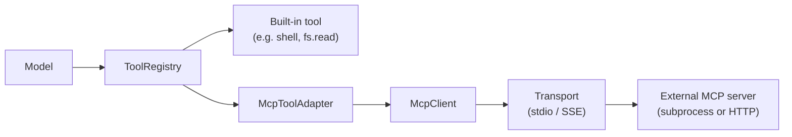
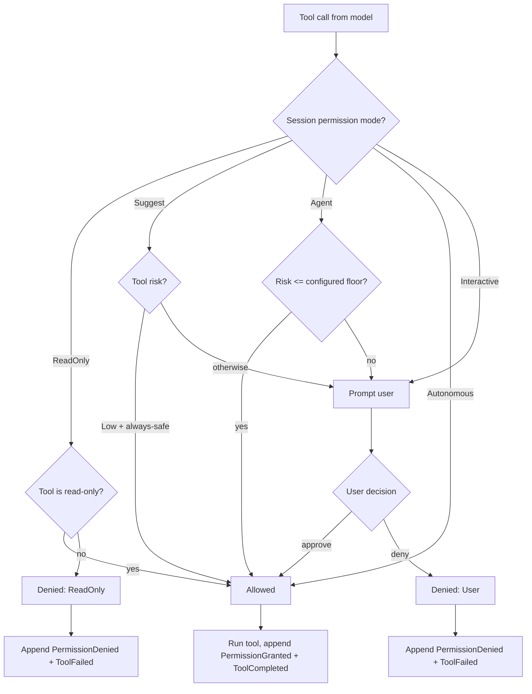

# Permissions 与 Tools

工具是模型接触外部世界的方式 —— shell 命令、文件、search、patch、MCP 暴露的能力。这也让 permission engine 成为 runtime 中最与安全相关的一块。Kairox 的设计是默认保守的:每一次 tool 调用都要走 permission engine,每一个决策都是一个事件,每一种模式都是显式的。

本页覆盖五种 permission 模式、内置工具及其风险分级、MCP 工具如何通过 adapter 接入,以及把它们串起来的决策流。

## 五种 permission 模式

`PermissionMode` 按 session 设置(默认值来自 `agent-config`)。它控制 permission engine 在面对一次 tool 调用时如何反应。这些模式构成了一条从最严格到最宽松的严格序。

| 模式          | tool 调用时的行为                                                                                                               | 适用场景                                                                                |
| ------------- | ------------------------------------------------------------------------------------------------------------------------------- | --------------------------------------------------------------------------------------- |
| `ReadOnly`    | 只允许被归类为只读的工具运行。任何带副作用的工具都会被立即拒绝。不会弹 prompt。                                                 | 调查、仓库审计、"帮我读一下就好"类 session。                                            |
| `Suggest`     | (默认)任何并非明显安全的 tool 都会弹给用户。被批准的调用会运行;被拒绝的会返回一个带拒绝原因的 `ToolFailed` 事件。               | 日常交互式工作,用户希望对副作用拥有最终决定权。                                         |
| `Agent`       | agent 在策略允许的范围内自主决定:低于配置 risk 下限的 tool 直接运行,高于下限的仍会弹 prompt。下限在配置中设定。                 | 用户对模型在低风险 tool 上的判断已经建立信任,但仍希望对其他 tool 保留监督的成熟工作流。 |
| `Autonomous`  | 任何 tool 都直接运行,包括高风险的。决策仍会被记为 `PermissionGranted` 以供审计,但不会打扰到用户。                               | 后台作业、脚本、批处理 session 等"键盘前没有人"的场景。                                 |
| `Interactive` | 任何 tool 都进入待审批状态 —— runtime 会 append `PermissionRequested` 并阻塞 session,直到收到决策。默认情况下没有 tool 会运行。 | demo、审计、偏执的调试,任何动作都需要被一一审视。                                       |

新 session 的默认值是 `Suggest`。生产环境的隐私默认配置也倾向于让任何配置了真实模型或 shell 工具的 session 保持在 `Suggest`(参见 `agent-runtime` 的隐私说明以及 [AGENTS.md](https://github.com/Z-Only/kairox/blob/main/AGENTS.md) 参考)。

### 切换模式

模式是 session 身份的一部分。它在创建 session 时通过 facade 设置,可以由用户在 session 进行中改变(TUI 快捷键、GUI 设置面板)。改变模式会发出一个事件,这样 trace 就会记录谁在何时改了它;后续的 tool 调用使用新的模式。

## 内置工具

`agent-tools` 出厂带了一组精简的内置工具。每一个内置工具都实现 `Tool` trait,并在 runtime 启动时注册进 `ToolRegistry`。

| Tool       | 模块                | 作用                                                   | 风险   | 影响面                 |
| ---------- | ------------------- | ------------------------------------------------------ | ------ | ---------------------- |
| `shell`    | `ShellExecTool`     | 运行一条 shell 命令,返回 stdout/stderr。               | High   | 任意进程执行。         |
| `fs.read`  | `fs::read`          | 读取一个文件的内容。                                   | Low    | 只读文件系统访问。     |
| `fs.write` | `fs::write`         | 把内容写入文件(创建或覆盖)。                           | Medium | 文件系统改动。         |
| `fs.list`  | `fs::list`          | 列出某个目录下的条目。                                 | Low    | 只读文件系统访问。     |
| `patch`    | `PatchApplyTool`    | 对 workspace 中的一个或多个文件应用一个 unified diff。 | Medium | 文件系统改动(多文件)。 |
| `search`   | `RipgrepSearchTool` | 在 workspace 上跑 `ripgrep` 并返回匹配。               | Low    | 只读文件系统访问。     |

风险是 runtime 给 permission engine 的提示。在 `Agent` 模式下,配置的下限决定了哪些调用可以自动跑;在 `Suggest` 模式下,风险会显示在 prompt 里帮用户做判断;在 `ReadOnly` 模式下,任何高于 Low 的都会被拒。

### 为什么是这些,而不是更多

内置工具集是被刻意做小的。任何更复杂的能力 —— git 操作、HTTP 调用、数据库查询、代码格式化、项目专属命令 —— 都应该交给一个 MCP server。runtime 给用户的是 primitive 加上一套 permission engine;MCP 给用户的是打好包的能力。把两者分开,既能让 runtime 保持小,也能把"哪些能力可被使用"的决策权交还给维护 MCP catalog 的人。

## MCP tool 适配器

外部能力通过 `agent-mcp` 接入 runtime,并通过 `McpToolAdapter` 以 `Tool` 实现的形式暴露出来。从 runtime 的角度看,一个 MCP 工具就是另一个 `Tool`;只有 adapter 知道这次调用要跨进程边界。

adapter 同样会经过 permission engine。一个没有 risk metadata 的 MCP 暴露工具 `git.commit` 会被赋予默认风险,在 `Suggest` 模式下也会像任何内置工具一样弹 prompt。MCP server 可以声明 risk 提示;registry 会尊重它们。

完整的 MCP 生命周期、transport 与 marketplace 故事见 [扩展性:MCP / Skills / Plugins](./extensibility)。

## Permission 决策流

每一次 tool 调用走的都是同一棵决策树。engine 给出 `Allowed`、`Denied` 或 `Prompt`;runtime 据此行动。

从这张图里可以提炼出几条不变式:

- **每一次调用都会落到事件流上。** 批准和拒绝都会 append 事件,所以 trace 中可以看到每一次决策,与模式无关。
- **prompt 会阻塞 session,但不会阻塞 runtime。** 其他 session 仍然在跑。被阻塞的 session 的 actor 会守着一个 pending turn,等用户给出回答。
- **被拒绝的 tool 会产出一条带拒绝原因的 `ToolFailed` payload**,模型在下一段 stream chunk 中会看到它,可以做出反应(道歉、换思路、向用户问一句)。
- **批准过的 tool 不会被回溯性地撤销。** 一旦 `PermissionGranted` 被 append,runtime 就会去调用 tool。audit log 将体现出"在该时刻该用户授权过它"。

## 审视决策

两个 UI 都会按用户视角渲染这套决策流:

- **TUI** 会弹出一个 permission modal,显示 tool 名、参数、风险,以及批准 / 拒绝两个按键。trace 面板会列出每一条 `PermissionRequested` / `PermissionGranted` / `PermissionDenied` 事件。
- **GUI** 用 `PermissionPrompt.vue` 渲染 modal,用 `ChatPermissionItem.vue` 渲染内联的 stream item。持久化规则(比如"对此 workspace 始终允许 `fs.read`")会以一个 `workspace` 作用域的 memory 形式被记下来,使用一个 permission 专属的 key 命名空间。

供机器审视时,event store 才是权威来源。按 `SessionId` 过滤出 `PermissionRequested` / `PermissionGranted` / `PermissionDenied`,就能得到这次对话的完整 audit log。

## 围绕"权限失败"来设计

当你写的代码会触发 tool 时 —— 不管你设计的是 skill、plugin 还是 MCP server —— 都要假设任何 tool 都可能被拒。runtime 保证:

- 被拒的 tool 会返回一条带结构化原因的 `ToolFailed`。
- 模型能看到这次失败,可以重新规划。
- 用户可以在 session 进行中改变模式,然后再试一次,而不必重启。

不要假设"agent"或"user"就是 principal。真正的 principal 是 permission engine 在决策那一刻所咨询的对象,这取决于当前模式。请按两种情况都能跑通的方式来设计。

## 本页不涉及的内容

本页讲的是 tool 调用如何被把关。它不涉及外部 tool 是如何被打包发布的([扩展性:MCP / Skills / Plugins](./extensibility)),也不涉及项目配置如何塑造默认值([Configuration](../reference/configuration))。
