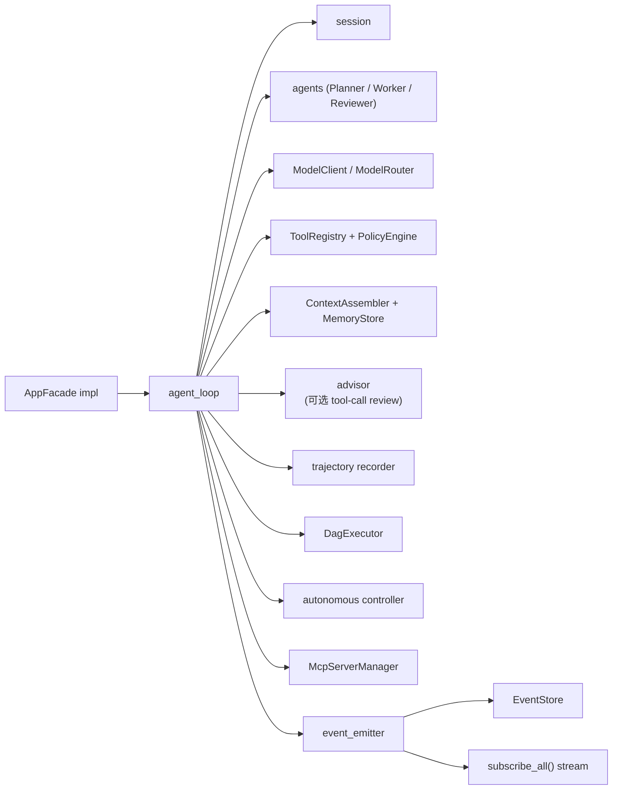
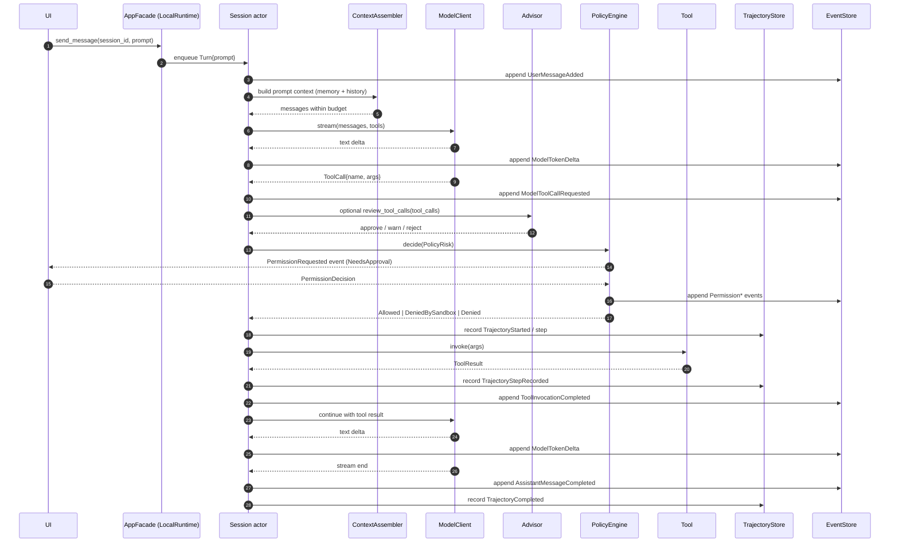
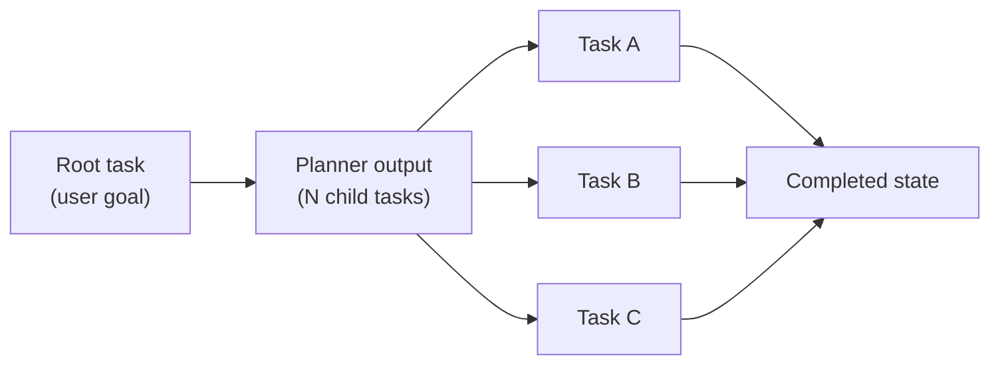

# Runtime 与 Sessions

`agent-runtime` 是把用户 prompt 转化为实际工作的引擎。它持有 agent loop、管理 session、应用 context budget、调用 model provider、调起 tool、咨询 policy engine、运行 advisor 自反检查、记录 trajectory、执行 autonomous checkpoint、运行 multi-agent 策略、执行任务 DAG,并编排 MCP server 的生命周期。其他所有领域 crate 都是被 runtime 组合进来的;而 runtime 不会反过来组合任何一个 UI。

如果说 [架构总览](./architecture) 讲的是系统的静态形状,那么本页讲的就是系统如何运动。

## 一张图看懂 LocalRuntime

`LocalRuntime<S, M>` 是一个泛型结构体,其中 `S` 是 `EventStore`,`M` 是 `ModelClient`(通常是一个对多个 client 做多路复用的 `ModelRouter`)。它持有 runtime 需要的每一个协作者,并实现 `AppFacade`。

这张图里的每一条箭头都是 `agent-runtime` 内部的一次函数调用。UI 与 agent loop 之间不存在任何共享的 mutex;UI 通过 `AppFacade` 跟 runtime 对话,通过事件流读取状态。在 runtime 内部,session actor(参见 [#531](https://github.com/Z-Only/kairox/pull/531) 与 [#532](https://github.com/Z-Only/kairox/pull/532))把对单个 session 的所有 mutation 串行化,这样模型切换和 compaction 就不会跟正在进行的 turn 抢跑。

## 一次完整的 user turn

理解 runtime 最有用的方式,就是跟着一个 prompt 走完从敲键盘到收尾的全过程。下面这条 sequence 是一个会调用一次工具的单 agent turn 的 happy path。

这里有七点值得专门指出:

1. **session 是一个 actor。** Turn 是 enqueue 到 session 上的,所以在 turn 进行到一半时到达的第二条用户消息,会一直等到当前 turn 终结的 `AssistantMessageCompleted` 或取消事件。模型切换与 compaction 也都 enqueue 到同一个 actor —— 它们不可能在一次 tool 调用进行到一半时插入进来。
2. **每一 turn 都会咨询 context assembler。** 它会从近期历史和相关 memory 重新构建消息列表,并尊重当前模型的 context window。"上下文"不会"在两 turn 之间留在内存里";一切都是从 events 重新构建出来的。
3. **Permission 是 event bus 上的一次 request/response。** 当 `PolicyEngine::decide(PolicyRisk)` 返回 `NeedsApproval` 时,runtime 会先发出 `PermissionRequested`,等待 `PermissionDecision`,然后发出终结性的 `PermissionGranted` / `PermissionDenied`。UI 订阅 request,并通过 facade 把 decision 回传。
4. **Advisor review 是可选且内联的。** 如果启用了 `[advisor]`,runtime 会在 policy engine 执行 tool 之前,让配置好的 profile 检查计划中的 tool call。拒绝会阻断这一批 tool,并记录成 event。
5. **Tool 结果是模型的输入。** runtime 会把 tool 结果在同一条 stream 中喂回模型,所以 assistant 的下一组 delta 可能就直接反映了 tool 的输出,而不需要新的 user prompt。
6. **Trajectory capture 会记录实际工作。** Tool action 和 observation 会成为按顺序排列的 trajectory step,包含耗时和可选 screenshot ID。这是 replay、eval 和 GUI 检查的来源。
7. **`AssistantMessageCompleted` 是成功终结信号。** UI 用它来清掉"thinking"指示器,测试套件用它来断言 turn 已经结束。被取消的 turn 会根据范围发出 `SessionCancelled` / `TaskCancelled`。

## Session 生命周期

session 是对话的单位。它持有一个 model profile、一种 agent 策略、一对 `ApprovalPolicy` × `SandboxPolicy` 策略以及一条事件流。session 的存活期跟它的事件流一样长 —— 不存在那种必须被"水化"(hydrate)的内存中 session struct。

| 状态             | 触发条件                                                                                | 发生的变化                                                                                            |
| ---------------- | --------------------------------------------------------------------------------------- | ----------------------------------------------------------------------------------------------------- |
| `Created`        | `AppFacade::create_session(workspace, profile, agent, approval_policy, sandbox_policy)` | 生成 `SessionId`、append `SessionInitialized`、插入 metadata 行、打开 subscriber stream。             |
| `Active`         | 首次 `send_message`                                                                     | Session actor 开始接收 turn;事件流向订阅者推送。                                                      |
| `SwitchingModel` | `AppFacade::switch_model(session, profile)`                                             | 切换请求被排在当前 turn 之后;落地时 append `ModelProfileSwitched`。                                   |
| `Compacting`     | 手动 compaction 请求,或 turn 末尾的自动 compaction                                      | `ContextCompactionStarted` → summary 被 append → `ContextCompactionCompleted`;budget guard 防止重入。 |
| `Idle`           | 在 `AssistantMessageCompleted` 之后没有排队中的工作                                     | Subscriber stream 保持打开;UI 让聊天保持滚动到最后一条消息。                                          |
| `Archived`       | `AppFacade::archive_session(session)`                                                   | metadata flag 被置位;事件仍保留在磁盘上;两个 UI 的活跃列表中都不再显示该 session。                    |

session 默认从不被删除。归档只是把它隐藏起来。删除事件是一种破坏性操作,runtime 出于设计目的并不暴露 —— trace 就是 audit log,随意改动它不是一件可以轻率做的事。

## 事件 payload 分类

`EventPayload` 是一个单一的 enum,囊括了 runtime 能做的每一件可观察的事情。下表按主题对变体做了分组;真正的列表位于 `crates/agent-core/src/events.rs`,并通过 `just gen-types` 重新生成 TypeScript 版本。

| 分组                             | 变体                                                                                                                                                     | 发出方                                         |
| -------------------------------- | -------------------------------------------------------------------------------------------------------------------------------------------------------- | ---------------------------------------------- |
| Workspace / session              | `WorkspaceOpened`、`SessionInitialized`、`SessionCancelled`                                                                                              | `session` 模块 + facade                        |
| Conversation / model             | `UserMessageAdded`、`ModelRequestStarted`、`ModelTokenDelta`、`ModelToolCallRequested`、`AssistantMessageCompleted`、`ModelProfileSwitched`              | `agent_loop` + session actor                   |
| Tools / permissions              | `PermissionRequested`、`PermissionGranted`、`PermissionDenied`、`ToolInvocationStarted`、`ToolInvocationCompleted`、`ToolInvocationFailed`、`FilePatch*` | `agent_loop` + `permission`                    |
| Advisor review                   | `AdvisorReviewStarted`、`AdvisorReviewCompleted`                                                                                                         | `advisor` + `agent_loop`                       |
| Memory / context                 | `ContextAssembled`、`MemoryProposed`、`MemoryAccepted`、`MemoryRejected`、`ContextCompaction*`、`CompactionSummary`                                      | `memory_handler` + compaction runtime          |
| Task graph / agents / autonomous | `AgentTask*`、`TaskDecomposed`、`TaskBlocked`、`TaskRetried`、`TaskCancelled`、`Agent*`、`AutonomousTask*`                                               | `dag_executor`、`task_graph`、autonomous loop  |
| Skills / MCP / catalog           | `SkillDiscovered`、`SkillActivated`、`SkillDeactivated`、`SkillSuggested`、`McpServer*`、`McpToolCall*`、`McpTrust*`、`Catalog*`                         | skill registry、`mcp_manager`、catalog runtime |
| Monitor / LSP / DAP / trajectory | `MonitorStarted`、`MonitorEvent`、`MonitorStopped`、`MonitorFailed`、`LspServer*`、`DapSession*`、`DapBreakpointHit`、`Trajectory*`                      | tool registry、debug 集成、recorder            |

每一个变体在 GUI 的 TypeScript 消费方那边都被穷尽匹配 —— 给 `EventPayload` 加一个变体但不更新 TS 处理逻辑,会在 `just gen-types` 跑完之后变成编译错误。正是这个契约,让 UI 在 runtime 演进的过程中保持诚实。

## 任务图与 DAG executor

并不是每个工作流都是一来一回的对话。runtime 支持任务 DAG,用于规划、追问、多步重构等场景。`TaskGraph` 是一个由 `TaskNode` 组成的有向无环图;`DagExecutor` 会按依赖顺序走访已就绪的节点,并可能并发执行多个互相独立的节点。

executor 会为每一次状态迁移发出任务事件(`AgentTaskStarted`、`AgentTaskCompleted`、`AgentTaskFailed`、`TaskBlocked`、`TaskRetried` 或 `TaskCancelled`),并产出一个 `TaskGraphSnapshot` projection,由 UI 在任务面板中渲染。并发度由当前策略来约束 —— 详见下文。

## Multi-agent 策略

`AgentStrategy` 是一个 trait。每个实现都决定了下一次调用扮演什么角色、以及结果如何汇总。目前的几个:

- **Single(默认)。** 一个 agent,一条 stream。用于快速 prompt 与 TUI。
- **Planner。** 把用户目标拆解为若干子任务,并发出 `TaskGraphSnapshot`。之后由 DAG executor 接手。
- **Worker。** 执行任务图中的一个具体任务。Worker 是叶子节点。
- **Reviewer。** 拿 worker 的产出对照父任务的验收标准,并给出裁决。裁决失败会重新把 worker 排入队列。

策略之间可以组合。一个 workspace 可以被配置为默认走 Planner-then-Worker;单独的 session 也可以在创建时覆盖策略。runtime 从不会在 turn 进行中改变策略 —— 它是 session 身份的一部分。

## Advisor 自反检查

advisor 不是第二个可见的聊天参与者,也不是 `AgentStrategy`。它是在“模型提出 tool call”和“runtime 让 policy engine 执行 tool”之间运行的一次内联安全检查。它通过 `[advisor]` 配置:

| 模式          | 行为                                                        |
| ------------- | ----------------------------------------------------------- |
| `off`         | 默认值。主 agent 直接进入 policy 评估。                     |
| `lightweight` | 只检查高风险 tool batch,例如破坏性的 shell 命令或越界写入。 |
| `full`        | 每一批 tool call 执行前都检查。                             |

如果 `[advisor]` 设置了 `profile`,advisor 会使用这个 profile;否则使用 session 当前激活的 profile。它返回 `approve`、`approve_with_warnings` 或 `reject`。`reject` 会记录 `AdvisorReviewCompleted`,发出一条解释阻断原因的最终 assistant message,并跳过 tool 执行。advisor 失败时默认 fail-open:runtime 记录问题后继续执行,不会让格式错误的 review 卡死 session。

## Trajectory 记录

每个 turn 都可以产生一条 trajectory:一组与 event 流并列保存的有序 action/observation 记录。runtime 会为 turn 启动 trajectory,把每次 tool invocation 记录成一个 step,最后以 `success`、`failed` 或 `cancelled` 完成。

Trajectory step 包含:

| 字段            | 含义                                                   |
| --------------- | ------------------------------------------------------ |
| `action`        | 尝试执行的 tool 或 runtime action。                    |
| `action_input`  | 传给该 action 的 JSON 输入。                           |
| `observation`   | 结果或错误预览。                                       |
| `screenshot_id` | 当 browser / computer-use 捕获截图时保存的可选标识符。 |
| `duration_ms`   | 该 step 的墙钟耗时。                                   |

GUI trajectory viewer 从这份 store 中读取数据用于 debug 和 replay;`kairox-eval` 也可以用同一份数据比较运行结果和回归。

## Autonomous task controller

Autonomous task 是可以跨多个 session 的持久目标。核心类型(`AutonomousTaskId`、task event、snapshot)位于 `agent-core`;持久化位于 `agent-store`;controller 和 checkpoint writer 位于 `agent-runtime`;GUI 则暴露管理命令和设置面板。

controller 会把高层 goal、acceptance criteria、session budget 和 checkpoint JSON 显式保存。它会发出 `AutonomousTaskCreated`、`AutonomousTaskSessionStarted`、`AutonomousTaskCheckpointed`,以及终结性的 `AutonomousTaskCompleted` / `AutonomousTaskFailed` / `AutonomousTaskCancelled`。这让长时间运行的工作变得可检查,而不是藏在一条无限增长的聊天记录里。

## 带 budget guard 的模型切换

session 进行到一半时切换模型是被支持且串行化的。流程如下:

1. UI 调用 `AppFacade::switch_model(session, new_profile)`。
2. Session actor 把 profile switch 排在任何 active turn 之后。
3. 当前 turn(如果有的话)结束 —— 包括 turn 自身触发的任何自动 compaction。
4. actor 评估新 profile 的 context window。如果当前对话超过了新 budget,runtime 就*在切换落地之前*先触发一次 compaction。
5. append `ModelProfileSwitched`;后续 turn 使用新的 client。

之所以要这个 guard,是因为早期设计允许切换落地到一个只 compact 了一半的状态,结果用户的下一 turn 会在新 provider 上因 budget 溢出而失败。[#531](https://github.com/Z-Only/kairox/pull/531) 把切换搬到了 actor 里面;[#533](https://github.com/Z-Only/kairox/pull/533) 又让 turn 末尾的自动 compaction 变得 race-free。两者合起来意味着,用户可以从一个 200k window 的模型切到一个 8k window 的模型而不会丢任何一 turn。

## MCP server 生命周期

MCP manager 持有外部 Model Context Protocol server —— 那些长驻的子进程(stdio)或 HTTP endpoint(SSE / Streamable HTTP),它们暴露 runtime 可调用的工具。

| 状态       | 触发条件                                     | 副作用                                                                                 |
| ---------- | -------------------------------------------- | -------------------------------------------------------------------------------------- |
| `Starting` | 首次需要该 server 的请求,或被主动 eager 启动 | 发出 `McpServerStarting` 事件,spawn transport,开始握手。                               |
| `Ready`    | 握手成功,工具枚举完成                        | 发出 `McpServerReady` 事件,工具通过 `McpToolAdapter` 注册,可供模型使用。               |
| `Stopped`  | 用户停止 server、runtime 关闭、idle GC       | 发出 `McpServerStopped` 事件,transport 关闭。                                          |
| `Failed`   | 握手错误或运行时错误                         | 发出带诊断信息的 `McpServerFailed` 事件;如果配置了重试,manager 会以 backoff 方式重试。 |

server 是被 runtime *管理*的,但被 `agent-config` *定义*的。新增一个 MCP server 意味着编辑 `kairox.toml`;manager 会在下次 discovery 时拾起新条目。完整的 MCP 故事见 [扩展性:MCP / Skills / Plugins](./extensibility)。

## Permission 在 loop 中的位置

policy engine 会在每一次 tool 调用时被咨询。`PolicyEngine::decide(PolicyRisk)` 返回三种之一:`Allowed`、`DeniedBySandbox { reason }`,或 `NeedsApproval { reason }`。`NeedsApproval` 会让 runtime 发出 `PermissionRequested` 事件并等待 `PermissionDecision`。这种等待由 session actor 的队列来设上限,因此一个走开了、迟迟不回应 prompt 的用户会阻塞新的 turn,但不会破坏状态。`DeniedBySandbox` 是结构性的,不会因为用户批准而被放宽 —— runtime 会直接 append `ToolInvocationFailed`。

正交的 `ApprovalPolicy` × `SandboxPolicy` 模型以及内置工具的风险分级,见 [Permissions 与 Tools](./permissions-and-tools)。

## Runtime 的输入从哪儿来

runtime 是在启动时配置的,而不是运行时:

- **Profiles 与 model client** 来自 `agent-config::build_router(...)`,它会读取 `~/.kairox/config.toml`(以及 `.kairox/` 的覆盖项),从 env 解析出 API key,并返回一个 `ModelRouter` 供 runtime 消费。
- **Tools** 来自 `agent-tools::ToolRegistry`,它注册了内置的 `Tool` 实现,并接受 `McpToolAdapter` 实例作为 MCP 暴露的工具。
- **Skills 与 plugins** 来自 `agent-skills::SkillRegistry` 与 `agent-plugins`,它们扫描已配置的目录,并产出 `SkillDef`,runtime 可以把它们用作 prompt 能力或工具能力。
- **Advisor 策略** 来自配置中的 `[advisor]`,只有当所选模式认为某批 tool call 需要 review 时才会被咨询。
- **Memory store 与 event store** 在构造时被注入。TUI 使用磁盘上的 SQLite;测试使用 `:memory:`。

runtime 之所以对 `S: EventStore` 与 `M: ModelClient` 做泛型,正是为了让同一份代码既能跑在生产中,也能跑在 `crates/agent-runtime/tests/full_stack.rs` 里,后者用的是 fake model client 加内存版 event store。同一个 loop、同一套事件分类、同一个 actor —— 唯一不同的只是背后的存储。

## 测试 runtime

如果你想通过读测试来学 runtime,可以从 `crates/agent-runtime/tests/` 下面这几个文件入手:

- `full_stack.rs` —— 单 agent turn 端到端,使用 `FakeModelClient` 与 `SqliteEventStore`。
- `agent_loop.rs` —— agent loop 在 tool 调用、tool 失败、model 错误下的行为。
- `session_lifecycle.rs` —— `Created`、`Active`、`SwitchingModel`、`Archived` 的状态迁移。
- `task_graph_integration.rs` —— 使用 Planner / Worker / Reviewer 的 DAG 执行。
- `agent_loop/advisor.rs` —— advisor review event、fail-open 行为,以及拒绝时阻断 tool 执行。
- `memory_protocol.rs` —— `<memory>` 标记的往返,包含审批队列。
- `mcp_integration.rs` —— 针对一个 fixture transport 测 MCP manager。
- `refactor_baseline.rs` —— 跨 runtime 重构保持稳定的不变量。
- `fake_session.rs` —— 其余测试所依赖的 fixtures。

每个文件都是自洽的,可以在 `cargo test --workspace` 下跑起来。对新贡献者来说,full-stack 测试是最有用的起点。

## 本页不涉及的内容

本页讲的是 runtime 如何运动。它不涉及哪些东西会被记下来([Memory & Context](./memory-and-context))、tool 是如何被把关的([Permissions & Tools](./permissions-and-tools)),以及外部能力是如何加载的([扩展性](./extensibility))。
