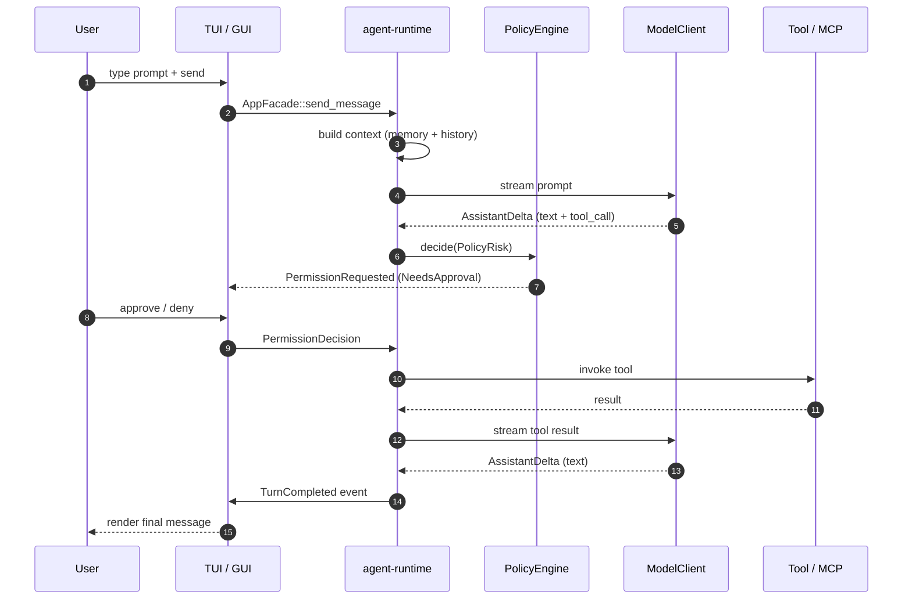

<script setup>
import { withBase } from "vitepress";
</script>

# 第一个 Session

本页会带你端到端走一遍完整的 Kairox session——在 TUI 和 GUI 里都跑一次,用真实的模型、真实的 tool 调用,以及真实的 permission 提示。读完之后,你会亲眼见过 Agent loop、trace 时间线、session 中途的模型切换,以及一次自动的 context compaction。

开始之前,请确认你已经跟过 [快速开始](./getting-started)(或者完整的 [安装](./installation) 流程),并且在 `.kairox/config.toml` 里有一个可用的 profile。如果还没有,把 `kairox.toml.example` 复制成 `.kairox/config.toml`,填上一个 API key,再回来。

## 你将看到什么

每一次 Kairox turn 的整体形状大致如下:

<div class="mermaid">



</div>

图里的每一根箭头,都会在 trace 时间线里成为一行。没有任何事情不是 event;UI 上没有任何东西不是从 event 渲染出来的。这就是这个模型。

## 第一部分 —— TUI 里的第一次 turn

打开 TUI:

```bash
just tui
```

你会看到一个三栏布局:左侧是 session 列表,中间是聊天区,右侧是 trace。底部的状态栏显示当前激活的 profile、当前的 `ApprovalPolicy` 与 `SandboxPolicy`,以及 context 使用率仪表。

### 选一个 profile

按 <kbd>Alt+P</kbd> 打开 profile 选择器。用方向键选一个 profile(只要不是 `fake`、并且你已经配置了真实 API key 就行)。按 <kbd>Enter</kbd>。

状态栏会刷新成新的 profile。这次模型切换是非破坏性的——现有 session 会继续用,但换上了新模型;聊天记录不会滚动,也不会被重置。

### 发一条消息

输入一段简短的消息——比如试试 `What files are in this directory?`——然后按 <kbd>Ctrl+Enter</kbd> 发送。

你会依次看到:

1. 你的消息出现在聊天区。
2. trace 区出现一行 `TurnStarted`。
3. 随着模型开始流式输出,trace 区出现 `AssistantDelta` 行,聊天区里的文本一个字符一个字符地累积出来。
4. 如果模型决定调用一个 tool(对于这条 prompt,很可能是 `shell.exec`),会弹出一个 permission 提示浮层。

### 处理 permission 提示

浮层会显示 tool 名(`shell.exec`)、确切的参数(`ls .`),以及风险等级(High,因为 shell 可以执行任何东西)。有三个选项:

- <kbd>Y</kbd> —— 仅允许这一次调用。
- <kbd>N</kbd> —— 仅拒绝这一次调用。模型会感知到拒绝并可以重新规划。
- <kbd>D</kbd> —— 在本次 session 内,拒绝所有同类型的后续调用。

这次演练请按 <kbd>Y</kbd>。

trace 里会出现一条 `PermissionGranted` event;tool 会执行;接着出现一条带有输出内容的 `ToolCompleted` event;模型继续流式输出最终答案;turn 以 `TurnCompleted` 结束。

你刚刚见到了 [Permissions & Tools](../concepts/permissions-and-tools) 所描述的全部流程。

### Session 中途切换模型

按 <kbd>Alt+P</kbd> 切到另一个 profile(比如从一个快模型切到一个更重的模型)。再发一条消息。新的请求会发到新模型,但聊天历史保留下来。runtime 会通过 session actor 把切换串行化,确保它不会和正在进行的 turn 竞争——见 [Runtime & Sessions](../concepts/runtime-and-sessions)。

### 观察 context 填充

每一次 turn 都会向 context 追加内容。状态栏的仪表显示当前用量占活跃 profile 的 `context_window` 的比例。当用量越过 `auto_compact_threshold`(默认 0.85)时,runtime 会触发一次自动 compaction:最老的那一层历史会被折叠成一条摘要消息。你会在 trace 里看到 `ContextCompacted` event,仪表也会跟着回落。

要手动触发 compaction,打开命令面板(<kbd>Ctrl+P</kbd>)并执行 “Compact context”。完整的流水线见 [Memory & Context](../concepts/memory-and-context)。

### 退出

按 <kbd>Ctrl+C</kbd> 可以中断当前 turn(如果没有 turn 在进行,则直接退出)。session 已经持久化到 `~/.kairox/` 下的 SQLite——下次再打开 TUI 时,session 列表里会包含它。

## 第二部分 —— GUI 里的第一个 session

GUI 给的是同一套模型,但交互方式不同:可点击的界面、常驻面板,以及更完整的设置入口。

```bash
just tauri-dev
```

桌面窗口会打开。下面的截图展示了默认的 workbench 布局:左侧是 session 列表,中间是聊天区,右侧是 trace 加 tasks。

<figure class="screenshot">
  
  <figcaption>桌面 workbench:session 列表、聊天、trace 和 task graph 集中在一个窗口里。</figcaption>
</figure>

### 在设置里配置

点击右上角的设置图标。设置按关注点分组:

- **Models** —— profile 列表以及当前默认 profile。
- **Agents** —— 多 Agent strategy 的配置。
- **MCP** —— server 生命周期和 marketplace。
- **Skills** —— 各作用域下启用的 skill。
- **Plugins** —— 已安装的 plugin 以及它们贡献的内容。
- **Hooks** —— hook 脚本和触发条件。
- **Instructions** —— 用户指令与项目指令。

<figure class="screenshot">
  
  <figcaption>设置把每一处可配置的能力都暴露出来——models、agents、MCP、skills、plugins、hooks、instructions。</figcaption>
</figure>

点击 **Models**,确认你的 profile 出现在列表里。点击 profile 把它设为新 session 的默认值。

### 开启一个 session

回到 workbench,点击 **+ New session**。一个 session 会被创建出来;event 被追加到 SQLite。输入一段 prompt,按 <kbd>Enter</kbd> 发送(<kbd>Shift+Enter</kbd> 用于换行)。

### 内联式 permission 流程

当模型请求 tool 时,GUI 会把 permission 提示*内联*渲染到聊天流里,而不是弹模态框。你会看到 tool 名、参数,以及带 **Allow** / **Deny** / **Always allow** 按钮的风险等级。

“Always allow” 会把决策持久化为一条 workspace 作用域的规则(比如“在本 workspace 里始终允许 `fs.read`”)。runtime 会记住它;未来同形态的调用就不会再弹提示了。

### 观察 trace

右侧的 trace 时间线实时更新。每个 event 都有一行;你可以搜索 trace(`/`)、按 event 类型过滤,点一行就能查看 payload。你在 TUI 里看到的 `PermissionGranted` / `ToolCompleted` / `AssistantDelta` 行,在这里也会出现,只是展示更丰富。

### Session 中途切换模型

用 session 头部的 profile 下拉框选一个不同的 profile。runtime 会把切换排队(以免与正在进行的 turn 竞争),然后把后续请求路由到新模型。actor 模型详见 [Runtime & Sessions](../concepts/runtime-and-sessions)。

### 触发 compaction

打开命令面板(<kbd>Ctrl/Cmd+P</kbd>),搜索 “compact context” 并执行。trace 里会出现一条 `ContextCompacted` event;context 仪表归位;聊天记录在外观上没有变化,但最老的几条消息在内部已被一条摘要替换。

### 持久化状态

关闭窗口,再用 `just tauri-dev` 重开。session 列表、聊天历史、trace 以及 task graph 都会从 event store 中恢复。GUI 里没有任何东西是只存在于内存里的——所有状态都从 event 重建。

## 第三部分 —— 试一下 MCP

marketplace 视图(顶层导航里)列出了精挑细选过的 MCP server——git、GitHub、filesystem、fetch 等等。安装其中一个(marketplace 会处理 runtime 依赖检查、下载 server 并完成注册)。

安装完成后,server 的 tool 会出现在 registry 里。模型可以调用它们;它们会和内置 tool 一样,经过同一个 policy engine。trace 会标记 tool 调用的来源 server,让你能审计谁在与谁通信。

完整的扩展能力故事——MCP、skill、plugin——见 [Extensibility: MCP / Skills / Plugins](../concepts/extensibility)。

## 你学到了什么

走完这一遍,你对以下内容已经有了上手的直觉:

- Agent loop 以及驱动每一个 UI 的 event 流。
- 正交的 `ApprovalPolicy` × `SandboxPolicy` 模型以及内联式 permission 流程。
- 在不丢失历史的前提下,中途切换 profile。
- 自动和手动的 context compaction。
- 跨重启的持久化 session。
- marketplace 和 MCP 生命周期。

更深的概念阅读:

- [架构](../concepts/architecture) —— 分层设计、依赖方向规则、facade trait。
- [Runtime & Sessions](../concepts/runtime-and-sessions) —— actor 模型、Agent loop、DAG 执行、多 Agent strategy。
- [Memory & Context](../concepts/memory-and-context) —— `<memory>` 协议、context 装配、compaction 内部机制。
- [Permissions 与 Tools](../concepts/permissions-and-tools) —— 两条策略轴、每一个内置 tool,以及决策流。

## 本页不涉及的内容

本页在每个 UI 里都走了一遍 happy-path session。它不涉及每一个按键([CLI & Keyboard](../reference/cli-and-keyboard))、每一个配置字段([Configuration](../reference/configuration)),也不涉及出问题时该怎么办([Troubleshooting & FAQ](./troubleshooting))。
