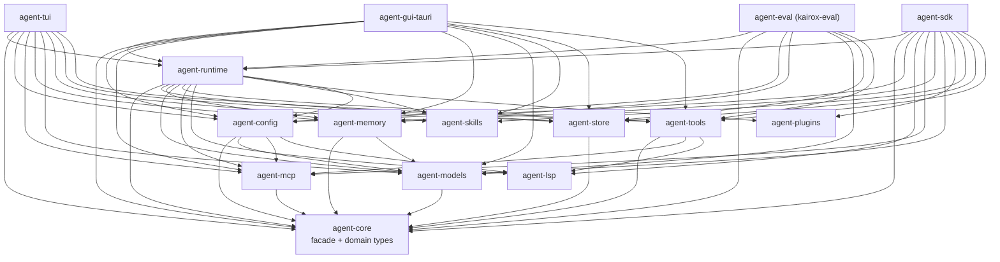

# Crate 索引

Kairox 是一个 Cargo workspace,包含十四个 crate 以及一个 Tauri 应用 crate。本页是一张速查地图:每个 crate 一行,说明它拥有什么、你最常会遇到哪些类型,以及谁依赖它。背后拆分的架构理由请见 [Architecture](../concepts/architecture)。

## 依赖方向规则

下面的箭头读作“依赖于”:

```text
agent-core 没有 workspace 依赖。
领域 crate 可以依赖 agent-core 以及更底层的协议/模型 crate。
agent-runtime 组合领域 crate。
agent-tui、agent-gui-tauri、agent-eval 和 agent-sdk 组合 runtime。
```

领域 crate 不知道 runtime 或 consumer crate 的存在。consumer crate 可以依赖 runtime 以及它们为 storage、config 或 IPC 接线所需的领域 crate。

<div class="mermaid">



</div>

## 领域 crate

### `agent-core`

| 项目     | 说明                                                                                                                                                                  |
| -------- | --------------------------------------------------------------------------------------------------------------------------------------------------------------------- |
| 仓库路径 | [`crates/agent-core`](https://github.com/Z-Only/kairox/tree/main/crates/agent-core)                                                                                   |
| 用途     | 领域类型、event、`AppFacade` 与 `AutonomousFacade` trait、build-info 相关基础设施、trajectory DTO、autonomous task 类型,以及 advisor review 类型。                    |
| 关键类型 | `AppFacade`、`AutonomousFacade`、`EventPayload`、`DomainEvent`、`SessionId`、`TaskSnapshot`、`BuildInfo`、`TrajectoryId`、`AutonomousTaskId`、`AdvisorMode`           |
| 被谁依赖 | `agent-config`、`agent-eval`、`agent-gui-tauri`、`agent-mcp`、`agent-memory`、`agent-models`、`agent-runtime`、`agent-sdk`、`agent-store`、`agent-tools`、`agent-tui` |

`agent-core` 刻意保持小巧。它不知道如何持久化 event,不知道怎么调用模型,也不知道如何运行一个 tool —— 它只定义契约。其中 `AppFacade` trait 是 UI 与 runtime 之间唯一的接缝,`EventPayload` 枚举则是 runtime 与任何观察者之间唯一的接缝。

### `agent-store`

| 项目     | 说明                                                                                               |
| -------- | -------------------------------------------------------------------------------------------------- |
| 仓库路径 | [`crates/agent-store`](https://github.com/Z-Only/kairox/tree/main/crates/agent-store)              |
| 用途     | 基于 SQLite 的 event store、元数据表与 trajectory 持久化,session 的单一权威数据源。                |
| 关键类型 | `EventStore`(trait)、`SqliteEventStore`、`SessionMeta`、`TrajectoryStore`、`SqliteTrajectoryStore` |
| 被谁依赖 | `agent-runtime`、`agent-eval`、`agent-tui`、`agent-gui-tauri`、`agent-sdk`                         |

event sourcing 都集中在这里。event 流仅追加;`agent-store` 中没有任何代码会在 event 写入后再去改它。GUI 的 task 面板这类投影会通过回放读取 event;归档则只是翻转元数据上的一个标志位。同一个 crate 也会保存按任务划分的 trajectory step,并能导出 JSON 用于 replay、debug 和 eval。

### `agent-memory`

| 项目     | 说明                                                                                                      |
| -------- | --------------------------------------------------------------------------------------------------------- |
| 仓库路径 | [`crates/agent-memory`](https://github.com/Z-Only/kairox/tree/main/crates/agent-memory)                   |
| 用途     | memory store、`<memory>` 标记提取、在 token 预算下做 context 组装、image pruning,以及 compaction。        |
| 关键类型 | `MemoryStore`(trait)、`SqliteMemoryStore`、`ContextAssembler`、`ContextCompactor`、`ImagePruningStrategy` |
| 被谁依赖 | `agent-runtime`、`agent-eval`、`agent-tui`、`agent-gui-tauri`、`agent-sdk`                                |

`<memory scope="...">` 协议与 runtime 的对接点就在本 crate 中的 `extract_memory_markers` 函数。context assembler 通过 `tiktoken-rs` 做 token 计算;当预算紧张时,compactor 会把最旧的一层历史压缩成一条 summary 消息。详情见 [Memory & Context](../concepts/memory-and-context)。

### `agent-models`

| 项目     | 说明                                                                                                       |
| -------- | ---------------------------------------------------------------------------------------------------------- |
| 仓库路径 | [`crates/agent-models`](https://github.com/Z-Only/kairox/tree/main/crates/agent-models)                    |
| 用途     | LLM provider 客户端、流式的 `ModelClient` trait,以及 `ModelRouter` 多路复用器。                            |
| 关键类型 | `ModelClient`、`ModelRouter`、`ModelRegistry`、`ProfileDef`                                                |
| 被谁依赖 | `agent-config`、`agent-memory`、`agent-runtime`、`agent-eval`、`agent-tui`、`agent-gui-tauri`、`agent-sdk` |

每个 provider 一个文件(Anthropic、OpenAI 兼容、Ollama、Fake)。`ModelRegistry` 保存精心整理过的 context window 与能力元数据;router 为 session 当前 profile 挑选合适的客户端,并通过 `ModelTokenDelta` 与 `AssistantMessageCompleted` event 转发 stream chunk 和终态消息。

### `agent-tools`

| 项目     | 说明                                                                                                                                                                                                                                      |
| -------- | ----------------------------------------------------------------------------------------------------------------------------------------------------------------------------------------------------------------------------------------- |
| 仓库路径 | [`crates/agent-tools`](https://github.com/Z-Only/kairox/tree/main/crates/agent-tools)                                                                                                                                                     |
| 用途     | `Tool` trait、`ToolRegistry`、正交的 Approval × Sandbox `PolicyEngine`,以及内置 tool。                                                                                                                                                    |
| 关键类型 | `Tool`、`ToolRegistry`、`PolicyEngine`、`ApprovalPolicy`、`SandboxPolicy`、`PolicyDecision`、`PolicyRisk`、`ApprovalReason`、`ShellExecTool`、`PatchApplyTool`、`RipgrepSearchTool`、`BrowserTool`、`BrowserBatchTool`、`ComputerUseTool` |
| 被谁依赖 | `agent-runtime`、`agent-eval`、`agent-tui`、`agent-gui-tauri`、`agent-sdk`                                                                                                                                                                |

内置 tool 包括:`shell.exec`、`fs.read`、`fs.write`、`fs.list`、`patch.apply`、`search.ripgrep`、`monitor.start`、`monitor.list`、`monitor.stop`、`browser.action`、`browser.batch` 和 `computer.use`。动态 tool provider 在运行时注册额外 tool：`McpToolAdapter` 用于 MCP server，`LspToolProvider` 用于 LSP server，`DapToolProvider` 用于 DAP server。`PolicyEngine::decide(PolicyRisk)` 返回 `PolicyDecision`:`Allowed`、`DeniedBySandbox { reason }` 或 `NeedsApproval { reason }`;runtime 把后者转换成 permission event。旧的单轴 `PermissionMode` 枚举已在 v0.31.0 端到端移除。详情见 [Permissions & Tools](../concepts/permissions-and-tools)。

### `agent-mcp`

| 项目     | 说明                                                                                                                                       |
| -------- | ------------------------------------------------------------------------------------------------------------------------------------------ |
| 仓库路径 | [`crates/agent-mcp`](https://github.com/Z-Only/kairox/tree/main/crates/agent-mcp)                                                          |
| 用途     | MCP 客户端、transport(stdio + SSE + Streamable HTTP)、生命周期状态机、健康检查、协议类型,以及 marketplace 目录。                           |
| 关键类型 | `McpClient`、`Transport`、`StdioTransport`、`SseTransport`、`StreamableHttpTransport`、`ServerLifecycle`、`McpToolAdapter`、`CatalogEntry` |
| 被谁依赖 | `agent-config`、`agent-tools`、`agent-runtime`、`agent-tui`、`agent-gui-tauri`、`agent-sdk`                                                |

`McpToolAdapter` 把 MCP 暴露出来的 tool 包装进 `Tool` trait,让 runtime 像对待内置 tool 一样使用它。marketplace 目录支持扩展(内置静态列表加上远程 `CatalogSource`)。详情见 [Extensibility](../concepts/extensibility)。

### `agent-lsp`

| 项目     | 说明                                                                                                                 |
| -------- | -------------------------------------------------------------------------------------------------------------------- |
| 仓库路径 | [`crates/agent-lsp`](https://github.com/Z-Only/kairox/tree/main/crates/agent-lsp)                                    |
| 用途     | LSP 和 DAP 客户端实现，JSON-RPC transport，server 生命周期管理，用于代码智能与调试器集成。                           |
| 关键类型 | `LspClient`、`DapClient`、`LspServerDef`、`DapServerDef`、`LspServerLifecycle`、`DapServerLifecycle`、`ServerStatus` |
| 被谁依赖 | `agent-config`、`agent-tools`、`agent-runtime`、`agent-sdk`                                                          |

LSP 集成提供 go-to-definition、references、completions 和 diagnostics，通过管理 language server 进程实现。DAP 集成支持 debugger 的 launch/attach 工作流。两者都通过各自的 tool provider 注册动态 tool，让 agent 能在工作流中使用代码智能。

### `agent-skills`

| 项目     | 说明                                                                                                         |
| -------- | ------------------------------------------------------------------------------------------------------------ |
| 仓库路径 | [`crates/agent-skills`](https://github.com/Z-Only/kairox/tree/main/crates/agent-skills)                      |
| 用途     | 原生 skill 系统。把带 YAML frontmatter 的 markdown skill 解析成 `SkillDef`,再通过 scoped registry 暴露出来。 |
| 关键类型 | `SkillRegistry`、`SkillDef`、`SkillFrontmatter`、`SkillScope`                                                |
| 被谁依赖 | `agent-runtime`、`agent-tui`、`agent-gui-tauri`、`agent-sdk`                                                 |

发现机制由文件系统驱动:`~/.kairox/skills/`、`.kairox/skills/`,以及配置中声明的任意目录。workspace 级 skill 覆盖用户级 skill;session 级 skill 又覆盖前两者。

### `agent-plugins`

| 项目     | 说明                                                                                      |
| -------- | ----------------------------------------------------------------------------------------- |
| 仓库路径 | [`crates/agent-plugins`](https://github.com/Z-Only/kairox/tree/main/crates/agent-plugins) |
| 用途     | 解析 plugin manifest,并以扁平 inventory 的形式暴露 skill、tool、hook 与 MCP server 声明。 |
| 关键类型 | `PluginManifest`、plugin inventory 辅助工具                                               |
| 被谁依赖 | `agent-runtime`、`agent-sdk`                                                              |

一个 plugin 可以把多种 contribution 打包到一次安装里。runtime 会把每种 contribution 路由到它所属的 crate(skill → `SkillRegistry`,tool → `ToolRegistry`,MCP server → `McpServerManager`,hook → runtime 的 hook registry)。

### `agent-config`

| 项目     | 说明                                                                                                    |
| -------- | ------------------------------------------------------------------------------------------------------- |
| 仓库路径 | [`crates/agent-config`](https://github.com/Z-Only/kairox/tree/main/crates/agent-config)                 |
| 用途     | TOML 配置解析、profile 发现、`.kairox/` 发现、advisor 策略、instructions,以及 skill 与 MCP 配置的接线。 |
| 关键类型 | `ProfileDef`、`McpServerConfig`、`ContextSettings`、`AdvisorConfig`、`build_router(...)`                |
| 被谁依赖 | `agent-runtime`、`agent-eval`、`agent-tui`、`agent-gui-tauri`、`agent-sdk`                              |

runtime 在启动时调用 `build_router(...)`,拿到一个配置好的 `ModelRouter` 以及其它静态配置。发现逻辑从 cwd 起最多回溯 5 层父目录找 `.kairox/config.toml`,然后回退到 `~/.kairox/config.toml`,再回退到内置默认值。详情见 [Configuration](./configuration)。

## 组合 crate

### `agent-runtime`

| 项目     | 说明                                                                                                                                                               |
| -------- | ------------------------------------------------------------------------------------------------------------------------------------------------------------------ |
| 仓库路径 | [`crates/agent-runtime`](https://github.com/Z-Only/kairox/tree/main/crates/agent-runtime)                                                                          |
| 用途     | agent loop、session actor、context 预算、compaction、模型切换、agent 策略、DAG 执行、advisor review、autonomous checkpoint、trajectory capture,以及 MCP 生命周期。 |
| 关键类型 | `LocalRuntime<S, M>`、`DagExecutor`、`AgentStrategy`、`McpServerManager`、`advisor::review_tool_calls`,以及 autonomous controller / session actor 类型             |
| 被谁依赖 | `agent-tui`、`agent-gui-tauri`、`agent-eval`、`agent-sdk`                                                                                                          |

`LocalRuntime<S, M>` 在 event store `S` 和 model client `M` 上是泛型的。生产环境接上 `SqliteEventStore` 和真实的 `ModelRouter`;测试环境用 `:memory:` 的 SQLite 和 `FakeModelClient`。session actor(PR [#531](https://github.com/Z-Only/kairox/pull/531)、[#532](https://github.com/Z-Only/kairox/pull/532)、[#533](https://github.com/Z-Only/kairox/pull/533))会把同一个 session 上的 turn、模型切换与 compaction 串行化。同一个 runtime 现在也会记录 trajectory、通过 advisor 层 review tool call,并通过 facade 方法暴露 autonomous task 控制。详情见 [Runtime & Sessions](../concepts/runtime-and-sessions)。

## Consumer crate

### `agent-tui`

| 项目     | 说明                                                                                     |
| -------- | ---------------------------------------------------------------------------------------- |
| 仓库路径 | [`crates/agent-tui`](https://github.com/Z-Only/kairox/tree/main/crates/agent-tui)        |
| 用途     | 基于 `ratatui` 的 TUI。订阅 runtime 的 event,渲染 chat、trace、session、MCP 状态等界面。 |
| 关键类型 | `App`(顶层),以及各屏模块                                                                 |
| 被谁依赖 | `kairox` 二进制本身。                                                                    |

TUI 只是 `AppFacade` 之上一层很薄的壳。每次渲染时都从 event 重建状态;不存在需要预先 hydrate 的 per-session 内存缓存。

### `agent-gui-tauri`

| 项目     | 说明                                                                                              |
| -------- | ------------------------------------------------------------------------------------------------- |
| 仓库路径 | [`apps/agent-gui/src-tauri`](https://github.com/Z-Only/kairox/tree/main/apps/agent-gui/src-tauri) |
| 用途     | GUI 的 Tauri command 表面,通过 IPC 把 runtime 暴露给 Vue 前端,并把类型化 event 反向发送出去。     |
| 关键类型 | `commands.rs` 中的 `#[tauri::command]` handler,以及 `specta.rs` 中的类型桥接                      |
| 被谁依赖 | 桌面应用的 Tauri 构建产物。                                                                       |

Vue 前端(`apps/agent-gui/src`)消费的是 `apps/agent-gui/src/generated/{commands,events}.ts` 中由代码生成的 TypeScript。每次 `EventPayload` 或 command 签名变更后,这些文件都会由 `just gen-types` 重新生成,而**不**手工编辑。

### `agent-sdk`

| 项目     | 说明                                                                                                          |
| -------- | ------------------------------------------------------------------------------------------------------------- |
| 仓库路径 | [`crates/agent-sdk`](https://github.com/Z-Only/kairox/tree/main/crates/agent-sdk)                             |
| 用途     | 可嵌入 SDK，将 Kairox 运行时作为编程 API 暴露给外部测试工具、CI/CD 管线和自定义 UI。                          |
| 关键类型 | `KairoxSdk`、`SdkBuilder`、`SdkSession`、`MessageStream`、`StreamEvent`、`CollectedResponse`、`SdkHook` trait |
| 被谁依赖 | 嵌入 Kairox 运行时的外部消费者。                                                                              |

SDK 封装 `LocalRuntime` 并提供 builder 模式进行配置。会话产生 `MessageStream`（`StreamEvent` 值的流），调用方可异步消费或收集为 `CollectedResponse`。`SdkHook` trait 允许调用方以编程方式拦截审批和沙箱决策。

## 评测 crate

### `agent-eval`

| 项目     | 说明                                                                                                          |
| -------- | ------------------------------------------------------------------------------------------------------------- |
| 仓库路径 | [`crates/agent-eval`](https://github.com/Z-Only/kairox/tree/main/crates/agent-eval)                           |
| 用途     | `kairox-eval` CLI。一个 headless 评测脚手架 —— 对配置好的 runtime 运行 JSONL 场景并收集指标。                 |
| 关键类型 | `EvalHarness`、`EvalScenario`、`EvalExpectation`、`EvalRunOptions`、`EvalResult`、`EvalSummary`、`EvalReport` |
| 被谁依赖 | 独立的二进制。                                                                                                |

eval 对 runtime 和领域 crate 的依赖方式与 GUI 一致,只是输出的是机器可读的结果而非像素。它支持 scenario list、tag filter、fail-fast run、JSONL 结果、summary JSON、组合 report JSON,以及针对必需/禁止事件、tool 数量、失败数、耗时和 context-token budget 的 expectation 检查。

## 一览

| Crate             | API 表面规模 | 稳定性                                                                                    |
| ----------------- | ------------ | ----------------------------------------------------------------------------------------- |
| `agent-core`      | 小           | facade 与 `EventPayload` 的版本演进非常保守。新增是非破坏性的,改名会走 deprecation 流程。 |
| `agent-store`     | 小           | 稳定。schema 迁移是显式的,在 `crates/agent-store/tests` 中有测试覆盖。                    |
| `agent-memory`    | 中           | memory 协议稳定;compaction 的内部实现仍在演进。                                           |
| `agent-models`    | 中           | provider 客户端会随上游新增能力而演进。                                                   |
| `agent-tools`     | 小           | 内置 tool 集刻意保持固定(参见 [Permissions & Tools](../concepts/permissions-and-tools))。 |
| `agent-mcp`       | 中           | 紧跟上游 MCP spec;transport 稳定。                                                        |
| `agent-skills`    | 小           | frontmatter 稳定;发现规则可能扩展。                                                       |
| `agent-plugins`   | 小           | manifest 稳定;contribution 种类可能扩展。                                                 |
| `agent-config`    | 中           | TOML schema 的新增是非破坏性的;移除字段会触发迁移警告。                                   |
| `agent-runtime`   | 大           | 内部类型可自由 refactor;对外可观察的行为(event、facade)保持稳定。                         |
| `agent-tui`       | 中           | UI 变更不属于 API;键位绑定保持稳定。                                                      |
| `agent-gui-tauri` | 中           | Tauri command 是与 Vue 前端的 API 契约,变更需走 `just gen-types`。                        |
| `agent-eval`      | 小           | CLI 参数稳定;脚手架仍在演进。                                                             |
| `agent-sdk`       | 小           | 公共 API 较新且仍在演进；builder + stream 模式已稳定。                                    |

## 本页不涉及的内容

本页只列出 crate 及其角色。它不解释一次 turn 如何在它们之间流转(见 [Runtime & Sessions](../concepts/runtime-and-sessions))、整体的分层架构是什么(见 [Architecture](../concepts/architecture))、配置 schema 长什么样(见 [Configuration](./configuration))。
